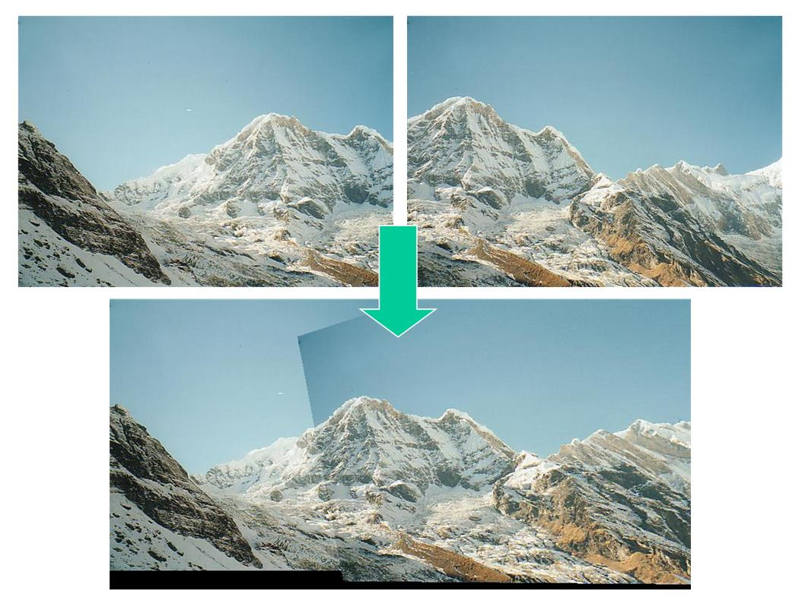
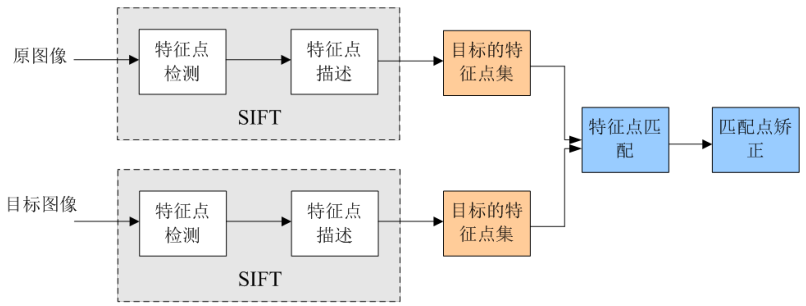
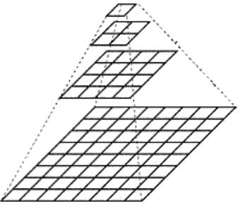
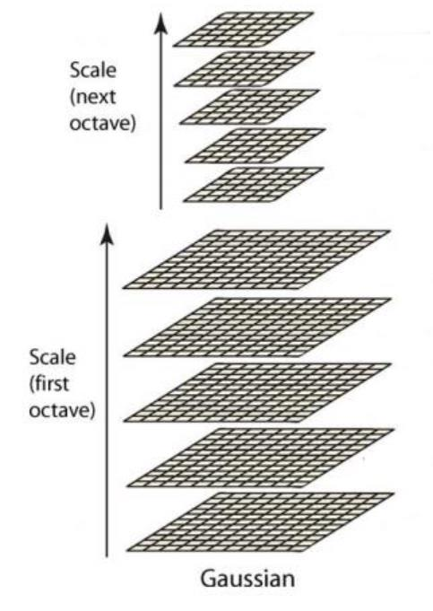
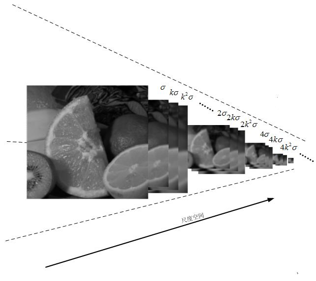
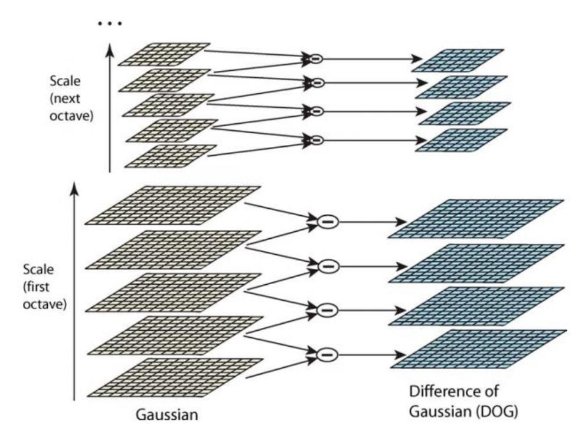
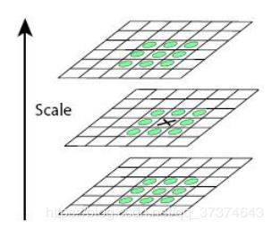
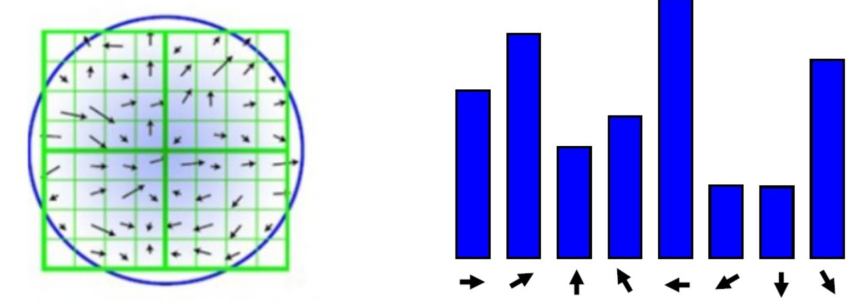
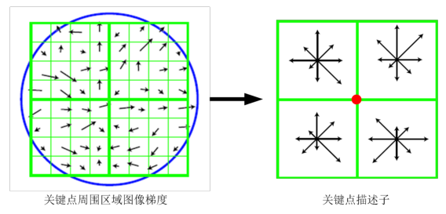
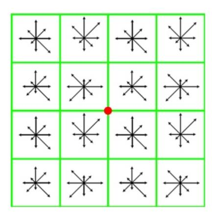

# SIFT(尺度不变特征变换)

## 1. 概述

> Sift（尺度不变特征变换），全称是Scale Invariant Feature Transform
>
> Sift提取图像的局部特征，在尺度空间寻找极值点，并提取出其位置、尺度、方向信息。
>
> Sfit的应用范围包括物体辨别、机器人地图感知与导航、影像拼接、3D模型建立、手势识别、影像追踪等。

***Sfit算法的实质**是在不同的尺度空间上查找关键点（特征点），计算关键点的大小、方向、尺度信息，利用这些信息组成关键点对特征点进行描述的问题。Sift所查找的关键点都是一些十分突出，不会因光照，仿射变换和噪声等因素而变换的“稳定”特征点，如角点、边缘点、暗区的亮点以及亮区的暗点等。匹配的过程就是对比这些特征点的过程：*

## 2.算法流程

### 1. 算法流程

- 生成高斯差分金字塔（DOG金字塔），尺度空间构建
- 空间极值点检测（关键点的初步查探）
- 稳定关键点的精确定位
- 稳定关键点方向信息分配
- 关键点描述
- 特征点匹配

### 2. 图像金字塔&尺度空间

#### 1. 尺度空间

在现实人类的世界中，人们可以通过肉眼观察出远近距离不同的同一物体，这是因为我们的大脑中已经对这个观察的物体有了基本的概念，在距离观察物体近的时候，能够观察到更多的细节特性，距离远时，尽管不能观察到足够多的细节，但仍能确认出是该物体。

而在摄像头成像的二维图片中，若想达到类似人眼观察的效果，需要将图片弄成不同的分辨率，制作成图像金字塔来模拟人眼共嗯那个，从而在对其他图片进行特征识别时，在尺寸不同的时候，仍然可以识别出该物体。

**尺度空间**，即，试图在图像领域中模拟人眼观察物体的概念与方法。例如：观察一棵树，关键在于我们想要观察是树叶子还是整棵树：如果是一整棵树(相当于大尺度情况下观察)，那么就应该去除图像的细节部分。如果是树叶(小尺度情况下观察)，那么就该观察局部细节特征。**通俗的说，尺度空间，就相当于一个图片需要获得多少分辨率的量级。**

#### 2. 图像金字塔

**概述：** *如果把一个图片从原始分辨率不停的对其分辨率进行减少，然后将这些图片摞在一起，可以看成一个四棱锥的样式，这个东西就叫做图像金字塔。*

> 图像金字塔是一种以多分辨率来解释图像的结构，通过对原始图像进行多尺度像素采样的方式，生成N个不同分辨率的图像。把具有最高级别分辨率的图像放在底部，以金字塔形状排列，往上是一系列像素（尺寸）逐渐降低的图像，一直到金字塔的顶部只包含一个像素点的图像，这就构成了传统意义上的图像金字塔。

**图像金字塔的构建思想：**

> 通过对原始图像进行尺度变换，获得图像多尺度下的尺度空间表示序列，对这些序列进行尺度空间主轮廓的提取，并以该主轮廓作为一种特征向量，实现边缘、角点检测不同分辨率上的关键点提取等。各尺度下图像的模糊度逐渐变大，能够模拟人在距离目标由近到远时目标物体在视网膜上的形成过程。

**图像金字塔的构建流程：**

- 利用滤波器平滑图像（高斯滤波）
- 对平滑图像进行抽样（采样）

> 注：采样有两种方式：
>
> 1. 分辨率逐级增大的上采样
>
> 2. 分辨率逐级减小的下采样

### 3.  生成高斯差分金字塔（DOG金字塔），尺度空间构建

#### 1. 高斯金字塔

> 高斯金字塔是在SIFT中提出来的概念，首先高斯金字塔并不是一个金字塔，而是有很多组（Octave）金字塔构成，并且每组金字塔都包含若干层（Interval）。

**高斯金字塔的构建过程：**

1.  先将原图像扩大一倍之后作为高斯金字塔的第1组第1层，将第1组第1层图像经高斯卷积（其实就
   是高斯平滑或称高斯滤波）之后作为第1组金字塔的第2层。
2. 将σ乘以一个比例系数k，得到一个新的平滑因子σ=k*σ，用它来平滑第1组第2层图像，结果图像作为第3层。
3.  如此这般重复，最后得到L层图像，在同一组中，**每一层图像的尺寸都是一样的，只是平滑系数不一样。**它们对应的平滑系数分别为：0，σ，kσ，k^2σ,k^3σ……k^(L-2)σ。
4. 将第1组倒数第三层图像作比例因子为2的降采样（尺寸减半），得到的图像作为第2组的第1层，
   然后对第2组的第1层图像做平滑因子为σ的高斯平滑，得到第2组的第2层，就像步骤2中一样，如
   此得到第2组的L层图像，同组内它们的尺寸是一样的，对应的平滑系数分别为：0，σ，kσ，
   k^2σ,k^3σ……k^(L-2)σ。**但是在尺寸方面第2组是第1组图像的一半。**

$$
G(x,y)=\frac{1}{2\pi\sigma^2}e^{-\frac{(x-x_0)^2+(y-y_0)^2}{2\sigma^2}}
$$

执行的最终结果得到O组L层的图像，构成了高斯金字塔，其有如下特点：

- 在同一组内，不同层图像的尺寸是一样的，后一层图像的高斯平滑因子$\sigma$是前一层图像平滑因子的k倍；
- 在不同组间，后一组第一个图像尺寸是前一组倒数第三个图像的一半，也即二分之一采样；

**尺度空间的构建：** *在高斯金字塔中一共生成O组L层不同尺度的图像，这两个量合起来（O，L）就构成了高斯金字塔的尺度空间，也就是说以高斯金字塔的组O作为二维坐标系的一个坐标，不同层L作为另一个坐标，则给定的一组坐标（O,L）就可以唯一确定高斯金字塔中的一幅图像。*

#### 2. 生成DOG&构建尺度空间

**构建尺度空间：** *SIFT算法在构建尺度空间时候采取高斯核函数进行滤波，使原始图像保存最多的细节特征，经过高斯滤波后细节特征逐渐减少来模拟大尺度情况下的特征表示。*

> 其实尺度空间图像生成就是当前图像与不同尺度核参数$\sigma$进行卷积运算后产生的图像。即，
>
> $L(x,y,\sigma)$定义为原始图像$I(x,y)$与一个可变尺度的二维高斯函数$G(x,y,\sigma)$卷积运算。

$$
G(x_i,y_i,\sigma)=\frac{1}{2\pi\sigma^2}exp(-\frac{(x-x_i)^2+(y-y_i)^2}{2\sigma^2})\\
L(x,y.\sigma)=G(x,y,\sigma)*I(x,y)
$$

**构建差分金字塔：** *差分金字塔，DOG（Difference of Gaussian）金字塔是在高斯金字塔的基础上构建起来的，其实生成高斯金字塔的目的就是为了构建DOG金字塔。DOG金字塔的第1组第1层是由高斯金字塔的第1组第2层减第1组第1层得到的。以此类推，逐组逐层生成每一个差分图像，所有差分图像构成差分金字塔。*

> 概括为DOG金字塔的第o组第l层图像是由高斯金字塔的第o组第l+1层减第o组第l层得到的。

> **尺度空间构建的基础是DOG金字塔，DOG金字塔构建的基础是高斯金字塔。**

### 4. 空间极值点检测

#### 1. 尺度空间极值检测

特征点是由DOG空间的局部极值点组成的。为了寻找DOG的极值点，需要采用邻域处理的办法，即每一个像素点要和它所有的相邻点比较，看其是否比它的图像域和尺度域的相邻点大或者小。
如下图，中间的检测点和它同尺度的8个相邻点和上下相邻尺度对应的9×2个点共26个点比较，以确保
在尺度空间和二维图像空间都检测到极值点。

> 注意，局部极值点都是在同一个组当中进行的，所以肯定有这样的问题，某一组当中的第一个图和最后一个图层没有前一张图和下一张图，那该怎么计算？ 解决办法是，再用高斯模糊，在高斯金字塔多“模糊”出三张来凑数，所以在DOG中多出两张。

#### 2. 高斯金字塔的k值

参数k的确定遵循以下原则：
$$
k=2^{\frac{1}{s}}
$$
其中s为每组图像中检测s个尺度的极值点（一般在实际使用中取3~5），也即在高斯金字塔中求极值点的时候，要求s层点。

SIft算法中生成高斯金字塔的规则（M,N为原始图像的行数和列数）：

设高斯金字塔共包含O组图像，每组图像有S+3层，
$$
O=log_2(min\{M,N\})-3
$$

### 5.稳定关键点的精确定位

由于DOG值对于噪声和边缘比较敏感，所以在第二步的尺度空间中检测到的局部极值点还要经过进一步的筛选，去除不稳定和错误检测出的极值点。

**利用阈值的方式来限制，在OpenCV中为contrastThreshold。**

### 6. 稳定关键点方向信息分配

稳定的极值点是在不同尺度空间下提取的，这保证了关键点的尺度不变性。为关键点分配方向信息所要解决的问题是**关键点对图像角度和旋转具有不变性**

**方法：** *获取关键点所在尺度空间的邻域，然后计算该区域的梯度和方向，根据计算得到的结果创建方向直方图。可以做如下设：直方图的峰值为主方向的参数，其他高于主方向百分之80的方向被判定为辅助方向。*

**梯度幅值描述：** *对于任一关键点，其梯度幅值表述为：*
$$
m(x,y)=\sqrt{(L(x+1,y)-L(x-1,y))^2+(L(x,y+1)-L(x,y-1))^2}
$$
**梯度方向：**
$$
\theta(x,y)=tan^{-1}\left[\frac{L(x,y+1)-L(x,y-1)}{L(x+1,y)-L(x-1,y)}\right]
$$

### 7. 关键点描述

> 对于每一个关键点，都拥有位置、尺度以及方向三个信息。所以具备平移、缩放、和旋转不变性。为每个关键点建立一个描述符，用一组向量将这个关键点描述出来，使其不随各种变化而改变，比如光照变化、视角变化等等描述子不但包含关键点，也包括关键点周围对其有贡献的邻域点。

**描述思想：** *对关键点周围像素区域分块，计算块内梯度直方图，生成具有独特性的向量，这个
向量是该区域图像信息的一种抽象表述。*

如下图，对于2\*2块，每块最终取8个方向，即可以生成2\*2\*8维度的向量，以这2\*2\*8维向量作为中
心关键点的数学描述。

实验结果表明：对于每个关键点采用4×4×8＝128维向量表征，综合效果最优（不变性与独特性）。

### 8. 特征点匹配

> 特征点的匹配是通过计算两组特征点的128维的关键点的欧式距离实现的。
> 欧式距离越小，则相似度越高，当欧式距离小于设定的阈值时，可以判定为匹配成功。

**处理流程：**

- 分别对模板图（又称参考图reference image）和实时图（又称观测图observation image）建立关键点描述子集合。目标的识别是通过两点集内关键点描述子的比对来完成。具有128维的关键点描述子的相似性度量采用欧式距离。
- 匹配可采取穷举法完成。

## 3. SIFT的特点

1. 对旋转、尺度缩放、亮度变化保持不变性，对视角变化、噪声等也存在一定程度的稳定性；

2. 独特性，信息量丰富，适用于在海量特征数据中进行快速，准确的匹配；
3. 多量性，即使少数几个物体也可以产生大量的Sfit特征向量；
4. 可扩展性，可以很方便的与其他形式的特征向量进行联合；

**注：** *SIFT函数注册了专利，在商业用途上是收费的。将在opencv > 3.4.3中，不再提供。*

> 解决办法：
> 安装opencv-python 3.4.2.16
> 以及opencv-contrib-python 3.4.2.16
> 使用conda和pip安装
> pip install opencv-python==3.4.2.16
> pip install opencv-contrib-python==3.4.2.16