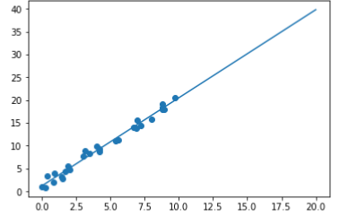
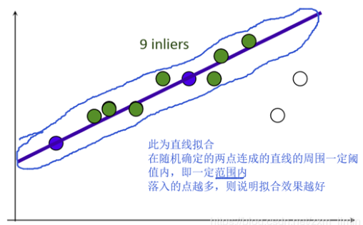
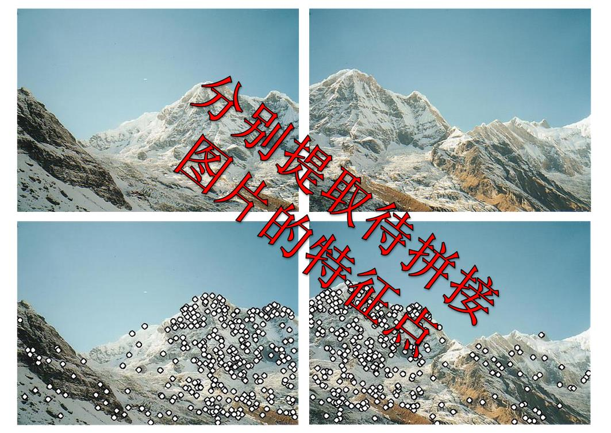
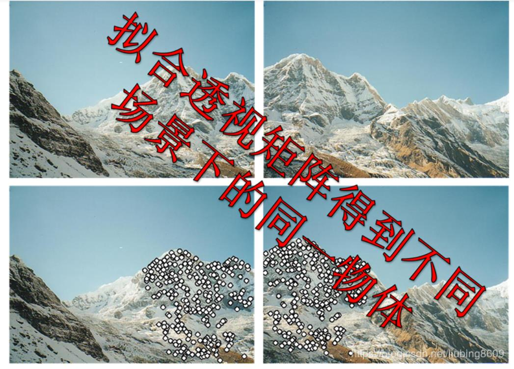
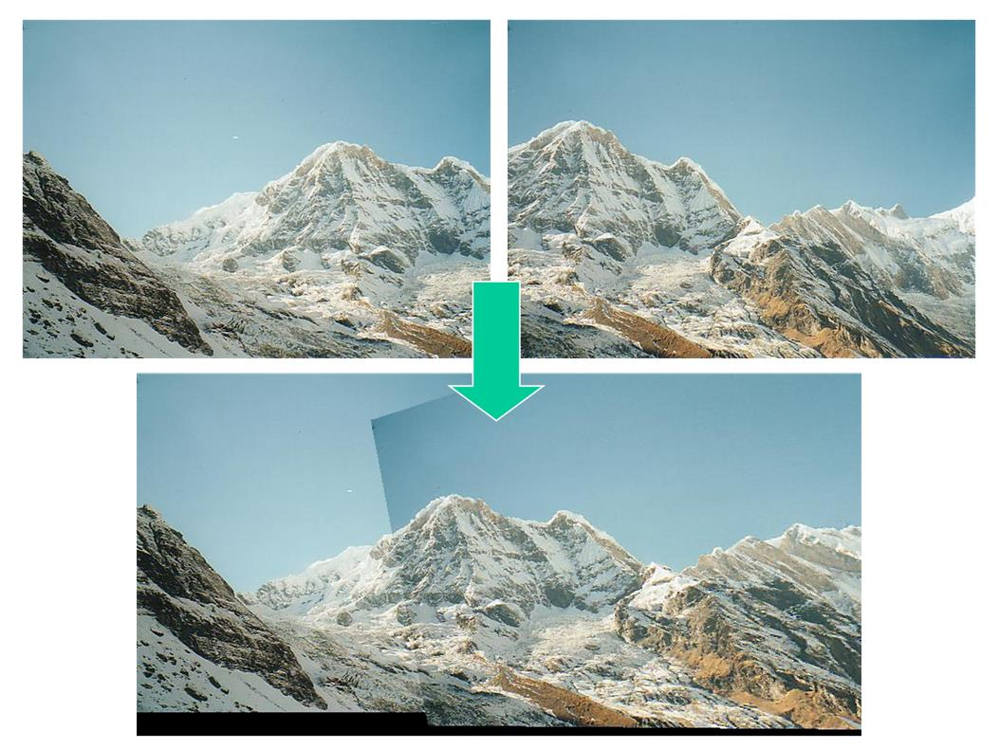

# RANSAC&图像相似度比较Hash

## 1. RANSAC

### 1. 线性回归

> 什么是线性回归？
> 举个例子，某商品的利润在售价为2元、5元、10元时分别为4元、10元、20元，
> 我们很容易得出商品的利润与售价的关系符合直线：y=2x.
> 在上面这个简单的一元线性回归方程中，我们称“2”为回归系数，即斜率为其回归系数。
> 回归系数表示商品的售价(x)每变动一个单位，其利润(y)与之对应的变动关系。

**线性回归表示这些离散点在总体上“最逼近”哪条直线**

### 2. 最小二乘法

**定义：** *最小二乘法（又称最小平方法）是一种数学优化技术。它通过最小化误差的平方和寻找数据的最佳函数匹配。利用最小二乘法可以简便地求得未知的数据，并使得这些求得的数据与实际数据之间误差的平方和为最小。*

> 利用最小二乘法可以简便地求得未知的数据，并使得这些求得的数据与实际数据之间**误差的平方和**为最小。

**残差：** *假设我们现在有一系列的数据点$(x_i,y_i)(i=1,...,m)$，那么由我们给出的拟合函数$h(x)$得到的估计量就是$h(x_i)$：*
$$
r_i=h(x_i)-y_i
$$
**三种范数：**

- $\infty$-范数：残差绝对值的最大值，即所有数据点中残差距离的最大值：$max|r_i|\quad(1\leq i\leq m)$
- 1-范数：绝对残差和，即所有数据点残差距离之和：$\sum^{m}_{i=1}|r_i|$
- 2-范数：残差平方和：$\sum_{i=1}^{m}r_i^2$

> 2-范数越小，拟合程度越高。

**数学定义(参照2范数)：**
$$
\mathop {min}_{a,b} \sum_{n=1}^{N}(y_n-(k\times x+b))^2
$$
这是一个无约束的优化问题，分别对k和b求偏导，然后令偏导数为0，即可获得极值点。
$$
k=\frac{N\sum_{n=1}^{N}x_n\times y_n-(\sum_{n=1}^{N}x_n)(\sum_{n=1}^{N}y_n)}{(N\sum_{n=1}^{N}x_n^2-(\sum_{n=1}^{N}x_n)^2)}\\
b=\frac{\sum_{n=1}^{N}y_n}{N}-k\times\frac{\sum_{n=1}^{N}x_n}{N}
$$

### 3. RANSAC

**概述：** *随机采样一致性（random sample consensus）*

**作用（*）：** *RANSAC是一种思想，一个求解已知模型的参数的框架。它不限定某一特定的问题，可以是计算机视觉的问题，同样也可以是统计数学，甚至可以是经济学领域的模型参数估计问题。*

**原理：** *RANSAC的基本假设是 “内群”数据可以通过几组模型参数来叙述其数据分布，而“离群”数据则
是不适合模型化的数据。 数据会受噪声影响,噪声指的是离群，例如从极端的噪声或错误解释
有关数据的测量或不正确的假设。 RANSAC假定，给定一组（通常很小的）内群，**存在一个
程序，这个程序可以估算最佳解释或最适用于这一数据模型的参数。***

> 它是一种迭代的方法，用来在一组包含离群的被观测数据中估算出数学模型的参数。 RANSAC
> 是一个非确定性算法，在某种意义上说，它会产生一个在一定概率下合理的结果，其允许使用
> 更多次的迭代来使其概率增加。

由于现实中的数据往往有偏差，而最小二乘法只适用于误差较小的情况，且由于一张图片中像素点数量大，采用最小二乘法运算量大，计算速度慢。在模型确定以及最大迭代次数允许的情况下，RANSAC总是能找到最优解。（对于包含80%误差的数据集，RANSAC的效果远优于直接的最小二乘法。）

### 4. RANSAC算法流程

1. 在数据中随机选择几个点设定为内群
2. 计算适合内群的模型 y=ax+b ->y=2x+3 y=4x+5
3. 把其它刚才没选到的点带入刚才建立的模型中，计算是否为内群 hi=2xi+3，ri
4. 记下内群数量
5. 重复以上步骤
6. 比较哪次计算中内群数量最多,内群最多的那次所建的模型就是我们所要求的解

**RANSAC算法的输入：**

- 一组观测数据（往往含有较大的噪声或无效点）
- 一个用于解释观测数据的参数化模型，比如y=ax+b
- 一些可信的参数。

> 注意：不同问题对应的数学模型不同，因此在计算模型参数时方法必定不同，RANSAC的作用不在于计算模型参数。（这导致RANSAC的缺点在于要求数学模型已知）

**待定参数n、k：**

- 一开始的时候随机选择的点的数量（n）
- 算法重复次数（k）

假设每个点是真正内群的概率为 $w$：
$$
w=\frac{[内群的数目]}{[内群数目]+[外群数目]}
$$
通常我们不知道 $w$是多少, $w^n$是所选择的n个点都是内群的机率, $1-w^n$ 是所选择的n个点至少有一个
不是内群的机率, $(1 − w^n)^k$ 是表示重复 k 次都没有全部的n个点都是内群的机率, 假设算法跑 k 次以后成功的机率是p，那么,
$$
1 − p = (1 − w^n)^k\\
p = 1 − (1 − w^n)^k
$$
我们可以通过P反算得到抽取次数$K$，$K=log(1-P)/log(1-w^n)$

所以如果希望成功概率高：
• 当n不变时，k越大，则p越大； 当w不变时，n越大，所需的k就越大。
• 通常w未知，所以n 选小一点比较好。

### 5. RANSAC的应用举例

全景拼接：

流程
1、针对某个场景拍摄多张/序列图像
2、通过匹配特征（sift匹配）计算下一张图像与上一张图像之间的变换结构。
3、图像映射，将下一张图像叠加到上一张图像的坐标系中
4、变换后的融合/合成

### 6. RANSCA的优缺点

**优点：**

- 它能鲁棒的估计模型参数。例如，它能从包含大量局外点的数据集中估计出高精度的参数。

**缺点：**

- 它计算参数的迭代次数没有上限；如果设置迭代次数的上限，得到的结果可能不是最优的结果，甚至可能得到错误的结果。
- RANSAC只有一定的概率得到可信的模型，概率与迭代次数成正比。

- 它要求设置跟问题相关的阀值。

- RANSAC只能从特定的数据集中估计出一个模型，如果存在两个（或多个）模型，RANSAC不能找到别的模型。

- 要求数学模型已知

## 2. 哈希算法

### 1. 哈希概述

**哈希：** *散列函数（或散列算法，又称哈希函数，英语：Hash Function）是一种从任何一种数据中创建小的数字“指纹”的方法。散列函数把消息或数据压缩成摘要，使得数据量变小，将数据的格式固定
下来。该函数将数据打乱混合，重新创建一个叫做散列值（hash values，hash codes，hash sums，
或hashes）的指纹。散列值通常用一个短的随机字母和数字组成的字符串来代表。*

**特点：** 

- 不可逆性。输入信息得出输出的那个看似乱码的字符串（哈希值）非常容易，但是从输出的字符
  串反推出输入的结果却是却非常非常难。
- 输出值唯一性和不可预测性。只要输入的信息有一点点区别，那么根据哈希算法得出来的输出值
  也相差甚远。

### 2. 均值哈希算法

**汉明距离：** *两个整数之间的汉明距离指的是这两个数字对应二进制位不同的位置的数目。*

**算法步骤：** 

1. 缩放：图片缩放为8*8，保留结构，除去细节。
2. 灰度化：转换为灰度图。
3. 求平均值：计算灰度图所有像素的平均值。
4. 比较：像素值大于平均值记作1，相反记作0，总共64位。
5. 生成hash：将上述步骤生成的1和0按顺序组合起来既是图片的指纹（hash）。
6. 对比指纹：将两幅图的指纹对比，计算汉明距离，即两个64位的hash值有多少位是不一样的，不
相同位数越少，图片越相似。

### 3. 差值哈希算法

差值哈希算法相较于均值哈希算法，前期和后期基本相同，只有中间比较hash有变化。

**算法步骤：**

1. 缩放：图片缩放为8*9，保留结构，除去细节。
2. 灰度化：转换为灰度图。
3. 比较：像素值大于后一个像素值记作1，相反记作0。本行不与下一行对比，每行9个像素，
  八个差值，有8行，总共64位
4. 生成hash：将上述步骤生成的1和0按顺序组合起来既是图片的指纹（hash）。
6. 对比指纹：将两幅图的指纹对比，计算汉明距离，即两个64位的hash值有多少位是不一样
的，不相同位数越少，图片越相似。

### 4. 感知哈希算法

均值哈希算法过于严格，不够精确，更适合搜索缩略图，为了获得更精确的结果可以选择感知哈希
算法，它采用的是DCT（离散余弦变换）来降低频率的方法。
**算法步骤：**

1. 缩小图片：32 * 32是一个较好的大小，这样方便DCT计算
2. 转化为灰度图：把缩放后的图片转化为灰度图。
3. 计算DCT:DCT把图片分离成分率的集合
4. 缩小DCT：DCT计算后的矩阵是32 * 32，保留左上角的8 * 8，这些代表图片的最低频率。
5. 计算平均值：计算缩小DCT后的所有像素点的平均值。
6. 进一步减小DCT：大于平均值记录为1，反之记录为0.
7. 得到信息指纹：组合64个信息位，顺序随意保持一致性。
8. 最后比对两张图片的指纹，获得汉明距离即可。

 **DCT：** *离散余弦变换(Discrete Cosine Transform)，主要用于将数据或图像的压缩，能够将空域的信号转换到频域上，具有良好的去相关性的性能。*

*DCT的特点：* 

- DCT变换本身是无损的，同时，由于DCT变换是对称的，所以，我们可以在量化编码后利用DCT反变换，在接收端恢复原始的图像信息。

*DCT的应用：*

- DCT变换在当前的图像分析以及压缩领域有着极为广大的用途，我们常见的JPEG静态图像编码以及MJPEG、MPEG动态编码等标准中都使用了DCT变换。

### 5. 三种图像相似度比较哈希算法比较

- aHash：均值哈希。速度比较快，但是有时不太精确。
-  pHash：感知哈希。精确度较高，但是速度方面较差一些。
-  dHash：差值哈希。精确度较高，且速度也非常快。