# 深度学习

## 1. 神经网络

### 1. 概述

**引例：生物神经网络作用机理**

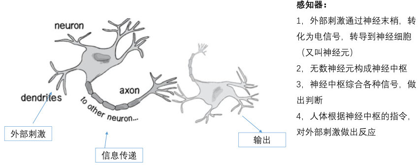

生物神经网络的基本工作原理：
一个神经元的输入端有多个树突，主要是用来接收输入信息的。输入信息经过突触处理，将输入的信
息累加，当处理后的输入信息大于某一个特定的阈值，就会把信息通过轴突传输出去，这时称神经元
被激活。相反，当处理后的输入信息小于阈值时，神经元就处于抑制状态，它不会像其他神经元传递
信息。或者传递很小的信息。

**人工神经网络：**

人工神经网络分为两个阶段：

- 接收来自其他n个神经元传递过来的信号，这些输入信号通过与相应的权重进行
  加权求和传递给下个阶段。（预激活阶段）*即下图的sum*
- 把预激活的加权结果传递给激活函数*即下图的f*

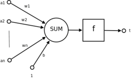

**人工神经网络与生物神经网络中的概念对应：**

| 生物神经网络 | 人工神经网络 |
| :----------: | :----------: |
|    细胞核    |    神经元    |
|     树突     |     输入     |
|     轴突     |     输出     |
|     突触     |     权重     |

**人造神经元：**

输入：$x_1,x_2,x_3$

输出：output

简化模型：约定每种输入只有两种可能（1或0）

- 所有输入均为1，表示输入条件均成立，输出为1
- 所有输入均为0，表示输入条件均不成立，输出就是0

【例】判断西瓜好坏

输入：[颜色:青绿，根蒂:蜷缩，敲声:浊响]

输出：好瓜(1)

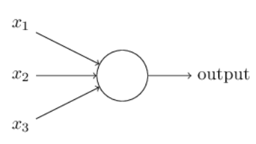

**神经网络：** *它由相互联系的神经元形成，这些神经元具有权重和在网络训练期间根据错误
来进行更新的偏差，目标是找到一个未知函数的近似值。其原理是受我们大脑的生理结构——互相交叉相连的神经元启发。但与大脑中一个神经元可以连接一定距离内的任意神经元不同，
人工神经网络具有离散的层、连接和数据传播的方向。*

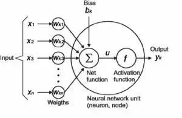

### 2. 神经网络的种类

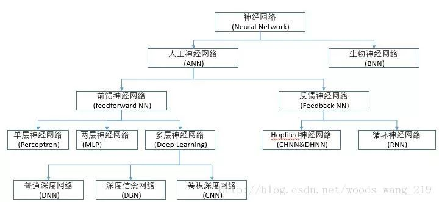

### 3. 神经元

神经元是组成神经网络的最基本单位，它起初来源于人体，模仿人体的神经元，功能也与人体的神
经元一致，得到信号的输入，经过数据处理，然后给出一个结果作为输出或者作为下一个神经元的
输入。

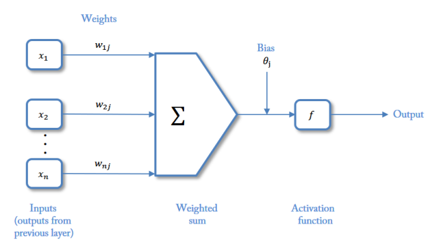

### 4. 神经网络中的参数

**输入：** *是特征向量。特征向量代表的是变化的方向。或者说，是最能代表这个事物的特征的方
向。*

**权重（权值）：** *就是特征值。有正有负，加强或抑制，同特征值一样。权重的绝对值大小，代
表了输入信号对神经元的影响的大小。*

**实质：** *当向量为n维空间时，即输入向量与权重向量为n维，也即有n个输入、权值时，有*
$$
h=(x_1,x_2,...)(\omega_1,\omega_2,...)^T+b
$$
神经元就是当h大于0时输出1，h小于0时输出0这么一个模型，它的实质就是把特征空间一切两半，认为两半分别属于两个类。

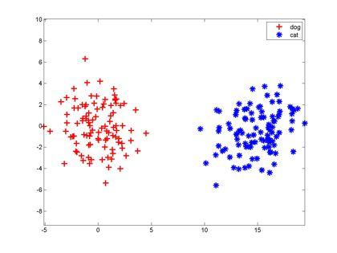

### 5. 多层神经网络

> 由于神经元只能将特征空间一分为二，面对复杂的问题时，这种方式显然不能满足需求，故提出多层神经网络。

神经网络是一种运算模型，由大量的节点（神经元）和之间相互的联接构成。每两个节点间的联接都代表一个对于通过该连接信号的加权值，称之为权重，这相当于人工神经网络的记忆。
网络的输出则依网络的连接方式，权重值和激励函数的不同而不同。而网络自身通常都是对自然界某种算法或者函数的逼近，也可能是对一种逻辑策略的表达。

> 单层神经网络（感知器） 

**多层神经网络：** *神经网络是由多个神经元组合而成，前一个神经元的结果作为后一个神经元的输入，依次组合而成。神经网络一般分为三层，第一层作为输入层，最后一层作为输出层，中间的全部是隐含层。*

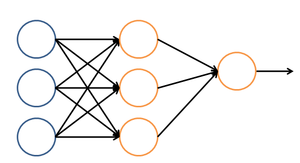

> 理论证明，任何多层网络可以用三层网络近似地表示。
> 一般凭经验来确定隐藏层到底应该有多少个节点，在测试的过程中也可以不断调整节点数以取得最佳效果。

### 6. 前馈神经网络

人工神经网络模型主要考虑网络链接的拓扑结构、神经元特征、学习规则等。

**前馈神经网络：** *前馈神经网络(FNN)是人工智能领域中最早发明的简单人工神经网络类型。在它内部，参数从输入层经过隐含层向输出层单向传播。与递归神经网络不同，在它内部不会构成有向环。下图为一个简单前馈神经网络示意图：*

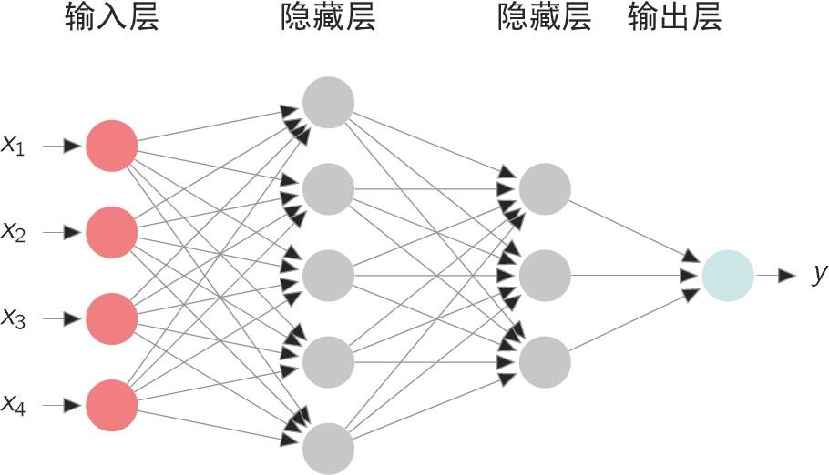

FNN由一个输入层、一个（浅层网络）或多个（深层网络，因此叫作深度学习）隐藏层，和一个输出层构成。每个层（除输出层以外）与下一层连接。这种连接是 FNN 架构的关键，具有两个主要特征：加权平均值和激活函数。

**前馈神经网络的分类：**

- （单层）感知器

> 只有一个单层的神经元网络，被视为一种最简单形式的前馈神经网络，是一种二元线性分类器。

- 多层感知器

> 是一种前向结构的人工神经网络，可以被看作是一个有向图，由多个的节点层所组成，每一层都全连接到下一层。除了输入节点，每个节点都是一个带有非线性激活函数的神经元（或称处理单元），是单层感知器的推广，克服了感知器不能对线性不可分数据进行识别的弱点。

### 7. 设计神经网络

1. 使用神经网络训练数据之前，必须确定神经网络的层数，以及每层单元的个数
2. 特征向量在被传入输入层时通常要先标准化到0-1之间（为了加速学习过程）
3. 离散型变量可以被编码成每一个输入单元对应一个特征值可能赋的值
   比如：特征值A可能取三个值$(a_0,a_1,a_2)$, 可以使用3个输入单元来代表A。
   如果A=$a_0$, 那么代表$a_0$的单元值就取1, 其他取0；1，0，0
   如果A=$a_1$, 那么代表$a_1$的单元值就取1，其他取0，以此类推 0,1,0
4. 神经网络既可以用来做分类（classification）问题，也可以解决回归（regression）问题
   - 对于分类问题，如果是2类，可以用一个输出单元表示（0和1分别代表2类）；如果多于2类，则每
     一个类别用一个输出单元表示 如001
   - 没有明确的规则来设计最好有多少个隐藏层，可以根据实验测试和误差以及精准度来实验并改进。

### 8. 对于隐含层的感性认识

例如对于人脸识别的问题：

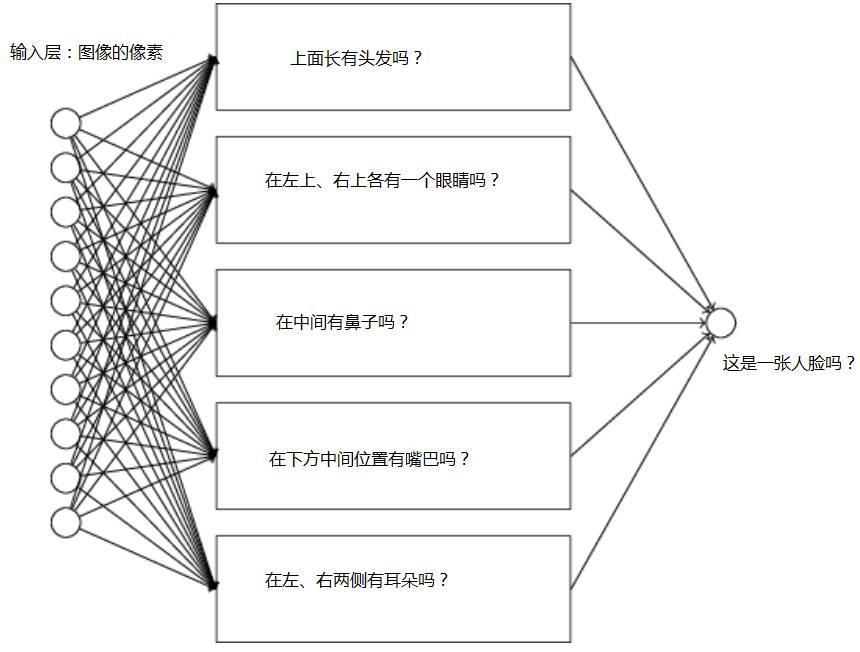

以上每个子网络，还可以进一步分解为更小的问题，比如判断左上是一个眼睛吗的问题，可以分
解为：

- 有眼球吗？
- 有眼睫毛吗？
- 有虹膜吗？
- ......

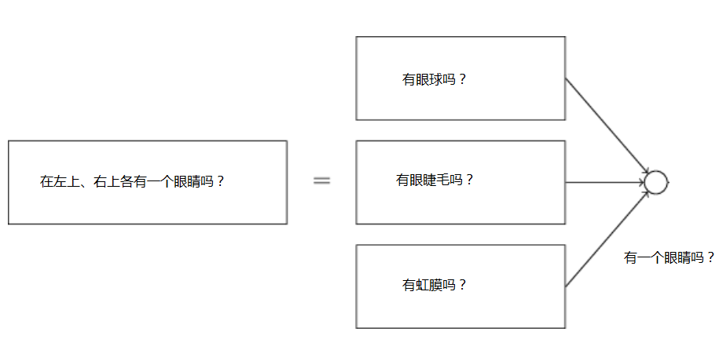

这个子网络还可以进一步分解，.一层又一层地分解，直到回答的问题简单到能在一个单独的神经元上被回答。

## 2. 激活函数

### 1. 概述

**神经元的状态：** *在神经网络中，把处于在活跃状态的神经元称为激活态，处于非活跃状态的神经元称为抑制态。激活函数赋予了神经元自我学习和适应的能力。*

**激活函数的作用：** *激活函数的作用是为了在神经网络中引入非线性的学习和处理能力。激活函数是神经网络设计的一个核心单元。*

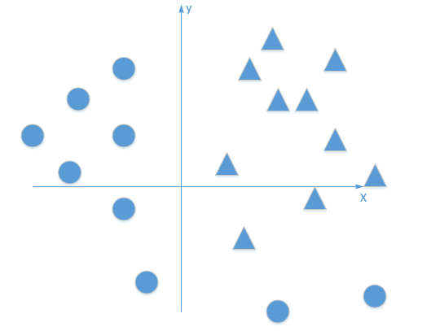

以sigmoid激活函数$y=\frac{1}{1+e^{-x}}$为例：

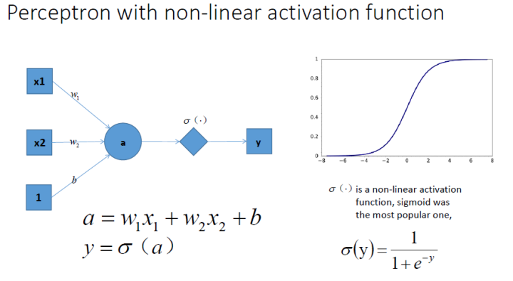

### 2. 常用激活函数

激活函数的条件有三

- 非线性
- 可微
- 单调

1. **sigmoid函数**

$$
y=logsig(x)=\frac{1}{1+e^{-x}}
$$

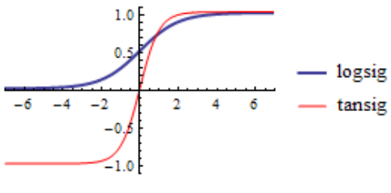

> sigmoid主要有两个缺点:
>
> - 梯度饱和，看图可知，两边数值的梯度都为0；
> - 结果的平均值不为0，这是我们不希望的，因为这会导致后层的神经元的输入是非
>   0均值的信号，这会对梯度产生影响。

2. **tanh函数**

$$
y=tansig(x)=\frac{e^x-e^{-x}}{e^x+e^{-x}}
$$

$$
tanh(x)=2\sigma(2x)-1
$$

3. **ReLU函数(线性整流层)**

$$
f(x)=max(0,x)
$$

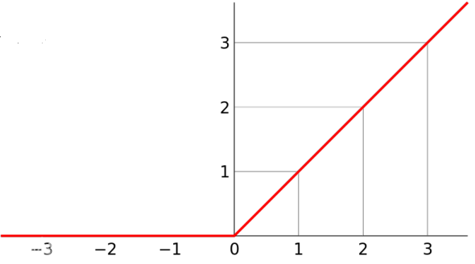

### 3. 激活函数的比较

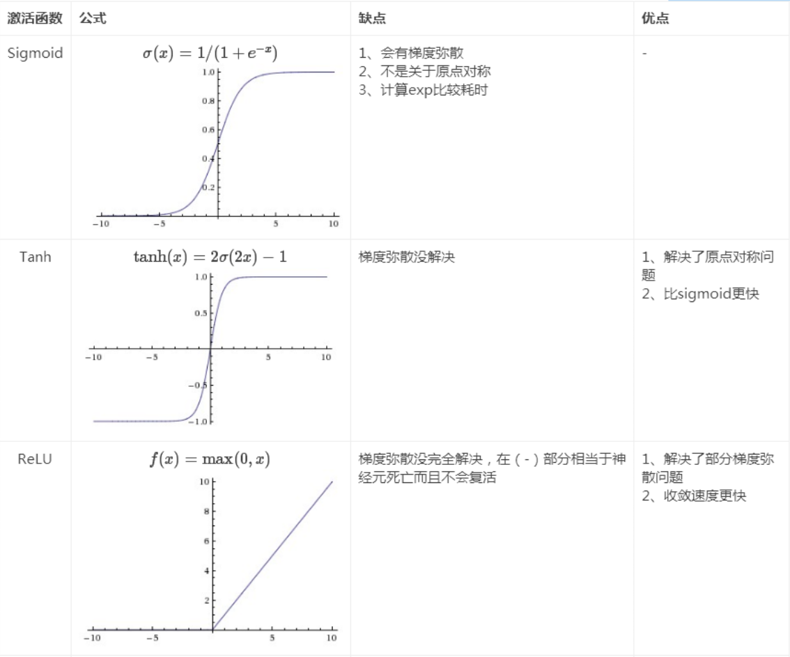

### 4. 神经元稀疏

**单侧抑制：** *ReLU函数其实是分段线性函数，把所有的负值都变为0，而正值不变，这种操作被称为单侧抑制。*

正因为有了这单侧抑制，才使得神经网络中的神经元也具有了**稀疏激活性**。（模拟人脑的特性，在同一时刻，人脑的神经元只有1%~4%被激活，大部分处于抑制状态）

**当模型增加N层之后，理论上ReLU神经元的激活率将降低2的N次方倍。**

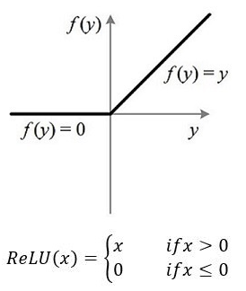

## 3. 深度学习

**机器学习&人工智能&深度学习：**

> 机器学习是人工智能的核心，研究如何使用机器来模拟人类学习活动的一门学科。
> 深度学习（多层人工神经网络）是机器学习的分支，对数据进行表征学习的方法。

**深度神经网络&深度学习：** *传统的神经网络发展到了多隐藏层的情况，具有多个隐藏层的神经网络被称为深度神经网络，基于深度神经网络的机器学习研究称之为深度学习。如果需要细化和区分区别，那么，深度神经网络可以理解为对传统多层网络进行了结构、方法等方面的优化。*

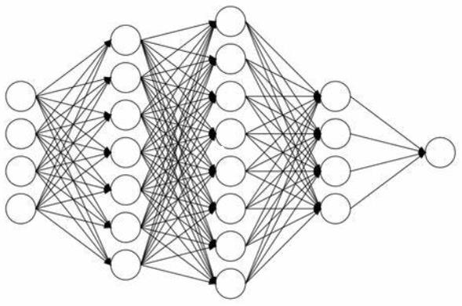

> 深度学习，就是多层人工神经网络

