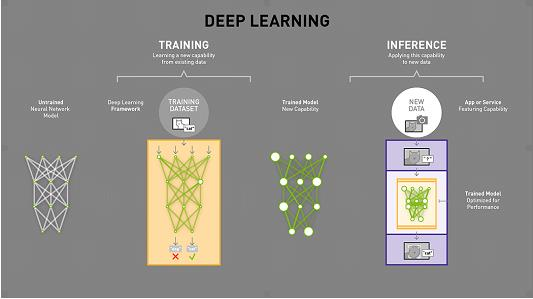
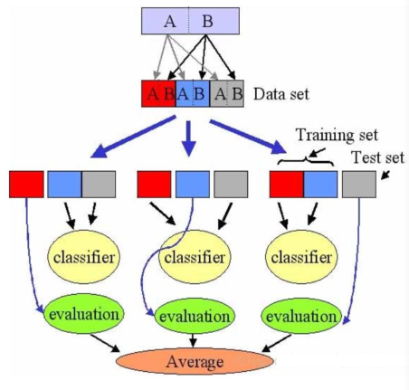
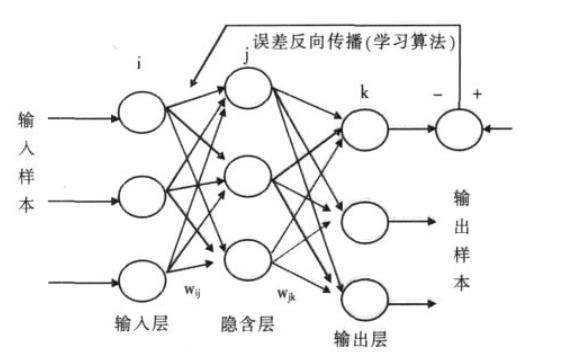
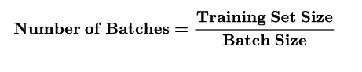
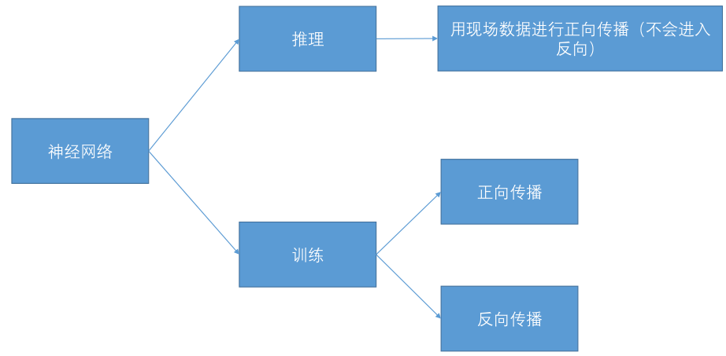
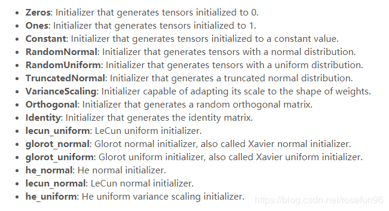
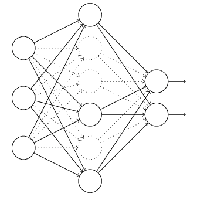

# 推理和训练

## 1. 概述

**训练（Training）：** *一个初始神经网络通过不断的优化自身参数，来让自己变得准确。这整个过程就称之为训练（Training）*

**推理（Inference）：** *你训练好了一个模型，在训练数据集中表现良好，但是我们的期望是它可以对以前没看过的图片进行识别。你重新拍一张图片扔进网络让网络做判断，这种图片就叫做现场数据（livedata），如果现场数据的区分准确率非常高，那么证明你的网络训练的是非常好的。这个过程，称为推理（Inference）。*

**Supervised Learning有监督式学习：** *输入的数据被称为训练数据，一个模型需要通过一个训练过程，在这个过程中进行预期判断，如果错误了再进行修正，训练过程一直持续到基于训练数据达到预期的精确性。其关键方法是分类和回归，比如逻辑回归(Logistic Regression)和BP神经网络(Back
Propagation Neural Network)。*

**Unsupervised Learning无监督学习：** *没有任何训练数据，基于没有标记的输入数据采取推导结构的模型，其关键方式是关联规则学习和聚合，比如k-means.*

**优化（optimization）：** *是指调节模型以在训练数据上得到最佳性能（即机器学习中的学习）。*

**泛化（generalization）：** *是指训练好的模型在前所未见的数据上的性能好坏。*

> 深度学习的根本问题是优化和泛化之间的对立。

## 2. 数据集的分类

### 1. 分类

数据集可以分为：

- 训练集：实际训练算法的数据集；用来计算梯度，并确定每次迭代中网络权值的更新；

- 验证集：用于跟踪其学习效果的数据集；是一个指示器，用来表明训练数据点之间所形成的网络函数发生了什么，并且验证集上的误差值在整个训练过程中都将被监测；

- 测试集：用于产生最终结果的数据集 。

**测试集特点（目的是确保测试集可以有效反映网络的泛化能力）：**

1. 测试集绝不能以任何形式用于训练网络，即使是用于同一组备选网络中挑选网络。测试集只能在所有的训练和模型选择完成后使用；
2. 测试集必须代表网络使用中涉及的所有情形。

### 2. 交叉验证

这里有一堆数据，我们把他切成3个部分（当然还可以分的更多）
第一部分做测试集，二三部分做训练集，算出准确度；
第二部分做测试集，一三部分做训练集，算出准确度；
第三部分做测试集，一二部分做训练集，算出准确度；
之后算出三个准确度的平局值，作为最后的准确度。

## 3.BP神经网络

### 1. 概述

**BP网络（Back-Propagation Network）：** *1986年被提出的，是一种按误差逆向传播算法训练的
多层前馈网络，是目前应用最广泛的神经网络模型之一，用于函数逼近、模型识别分类、数据压
缩和时间序列预测等。*

**特点：** *BP网络又称为反向传播神经网络，它是一种有监督的学习算法，具有很强的自适应、自学习、非线性映射能力，能较好地解决数据少、信息贫、不确定性问题，且不受非线性模型的限制。一个典型的BP网络应该包括三层:输入层、隐藏层和输出层。各层之间全连接，同层之间无连接。
隐藏层可以有很多层。*

### 2. 神经网络的训练

#### 1. 概述

通俗来讲，我们利用神经网络去解决图像分割，边界探测等问题时候，我们的输入（假设为x），与期望的输出（假设为y）之间的关系究竟是什么？也就是**y=f(x)**中，**f是什么**，我们也不清楚，但是我们
对一点很确信，那就是**f不是一个简单的线性函数**，应该是一个抽象的复杂的关系，那么利用神
经网络就是去学习这个关系，存放在model中，利用得到的model去推测训练集之外的数据，得
到期望的结果。

#### 2. 训练过程中的一些概念

**正向传播：** *输入信号从输入层经过各个隐藏层向输出层传播。在输出层得到实际的响应值，若实际值与期望值误差较大，就会转入误差反向传播阶段。*

**反向传播：** *按照梯度下降的方法从输出层经过各个隐含层并逐层不断地调整各神经元的连接权值和阈值，反复迭代，直到网络输出的误差减少到可以接受的程度，或者进行到预先设定的学习次数。*

**代（Epoch）：** *使用训练集的全部数据对模型进行一次完整训练，被称为“一代训练”。*

**批大小（Batch size）：** *使用训练集的一小部分样本对模型权重进行一次反向传播的参数更新，这一小部分样本被称为“一批数据”*

**迭代（Iteration）：** *使用一个Batch数据对模型进行一次参数更新的过程，被称为“一次训练”（一次迭代）。每一次迭代得到的结果都会被作为下一次迭代的初始值。一个迭代=一个正向通过+一个反向通过。*

> 比如训练集有500个样本，batchsize = 10 ，那么训练完整个样本集：iteration=50，epoch=1.

#### 3. 训练（学习）过程

下面由抽象到具体来描述神经网络的训练过程：

**流程描述（概述）：**

- 提取特征向量作为输入。
- 定义神经网络结构。包括隐藏层数，激活函数等等。
- 通过训练利用反向传播算法不断优化权重的值，使之达到最合理水平。
- 使用训练好的神经网络来预测未知数据(推理)，这里训练好的网络就是指权重达到最优的情
  况。

**流程描述（数据角度）：**

- 选择样本集合的一个样本$(A_i,B_i)$，$A_i$为数据、$B_i$为标签（所属类别）
- 送入网络，计算网络的实际输出$Y$，（此时网络中的权重应该都是随机量）
- 计算$D=B_i-Y$（即预测值与实际值相差多少）
- 根据误差$D$调整权重矩阵$W$
- 对每个样本重复上述过程，直到对整个样本集来说，误差不超过规定范围

**流程描述（具体实现）：**

- 参数的随机初始化
- 前向传播计算每个样本对应的输出节点激活函数值
- 计算损失函数
- 反向传播计算偏导数
- 使用梯度下降或者先进的优化方法更新权值

#### 4. 参数的随机初始化

**参数随机初始化的问题背景：** *对于所有的参数我们必须初始化它们的值，而且它们的初始值不能设置成一样，比如都设置成0或1。如果设置成一样那么更新后所有参数都会相等。即所有神经元的功能都相等，造成了高度冗余。所以我们必须随机化初始参数。*

> 特别的，如果神经网络没有隐藏层，则可以把所有参数初始化为0。（但这也不叫深度神经网络了）

**参数随机初始化的方法：** *权重初始化并不是简单的随机初始化，而是一项会影响训练性能的关键一步，而且有时候会依赖于选择的激活函数。如果仅仅是将权重随机初始化为一些很小的随机数，它会打破梯度更新对称性*

- 权重参数初始化从区间均匀随机取值。
- XAvier初始化（sigmoid、tanh）$w\sim U[-\frac{\sqrt6}{\sqrt{n_{in}+n_{out}}},\frac{\sqrt{6}}{\sqrt{n_{in}+n_{out}}{}}]$
- 初始化为小的随机数（小型网络）：比如，可以初始化为均值为0,方差为0.01的高斯分布
-  权重初始化为正态分布（relu）
-  MSRA Filler（relu）：用均方差为0，方差为 $\sqrt{\frac{4}{n_{in}+n_{out}}}$的高斯分布
-  偏置bias的初始化：一般初始化为0

**标准化（Normailization）：** 

背景：由于进行分类器或模型的建立与训练时，输入的数据范围可能比较大，同时样本中各数据可
能量纲不一致，这样的数据容易对模型训练或分类器的构建结果产生影响，因此需要对其进行标准
化处理，去除数据的单位限制，将其转化为无量纲的纯数值，便于不同单位或量级的指标能够进行
比较和加权。

- 其中最典型的就是数据的归一化处理，即将数据统一映射到[0,1]区间上。

$$
y=\frac{x-min}{max-min}
$$

- z-score标准化（零均值归一化zero-mean normalization）：

  - 经过处理后的数据均值为0，标准差为1（正态分布）

  - 其中μ是样本的均值， σ是样本的标准差
    $$
    y=\frac{x-\mu}{\sigma}
    $$

#### 5. 损失函数

损失函数用于描述模型预测值与真实值的差距大小。一般有有两种常见的算法——均值平方差
（MSE）和交叉熵。

- 均值平方差（Mean Squared Error，MSE），也称“均方误差”：
  $$
  MSE=\sum_{i=1}^{n}\frac{1}{n}(f(x_i)-y_i)^2
  $$

- 交叉熵（cross entropy）也是loss算法的一种，一般用在分类问题上，表达意思为预测输入
  样本属于哪一类的概率。值越小，代表预测结果越准。（y代表真实值分类（0或1），a代
  表预测值）：
  $$
  C=-\frac{1}{n}\sum_{x}[ylna+(1-y)ln(1-a)]
  $$

损失函数的选取取决于输入标签数据的类型：

- 如果输入的实数、无界的值，损失函数使用MSE。
- 如果输入标签是位矢量（分类标志），使用交叉熵会更适合。

#### 6. 梯度下降法

**梯度：** 
$$
\nabla f=(\frac{\partial f}{\partial x_1},\frac{\partial f}{\partial x_2},...)
$$

> 梯度的方向表示函数值增大的方向，梯度的模表示函数值增大的速率。
>
> 那么只要不断将参数的值向着梯度的反方向更新一定大小，就能得到函数的最小值（全局最小值或者局部最小值）。

**学习率（learning rate）：** *学习率是一个重要的超参数，它控制着我们基于损失梯度调整神经网络权值的速度。从长远来看，这种谨慎慢行的选择可能还不错，因为可以避免错过任何局部最优解，但它也意味着我们要花更多时间来收敛，尤其是如果我们处于曲线的至高点。*

**新权值 = 当前权值 - 学习率 × 梯度**

> 学习率越小，我们沿着损失梯度下降的速度越慢。

**梯度参数的更新：** *一般利用梯度更新参数时会将梯度乘以一个小于1的学习速率（learning rate），这是因为往往梯度的模还是比较大的，直接用其更新参数会使得函数值不断波动，很难收敛到一个平衡点（这也是学习率不宜过大的原因）。*
$$
\theta_{t+1}=\theta_t-\alpha_t\nabla f(\theta_t)
$$
**梯度下降法：**
$$
\frac{\partial E}{\partial w_{jk}}=-(t_k-o_k)\cdot sigmoid(\sum_jw_{jk}\cdot o_j)(I-sigmoid(\sum_jw_{jk}\cdot o_j))\cdot o_j
$$
$-(t_k-o_k)$：正确结果与节点输出解果的差值，也就是误差

$sigmoid(\sum_jw_{jk}\cdot o_j)$：节点的激活函数，所有输入该节点的链路把经过其上的信号与链路权重做乘积后加总，再把加总结果进行激活函数运算;

$o_j$：链路$w_{jk}$前端节点输出的信号值。

#### 7. 泛化能力分类

- **欠拟合：** *模型没有能够很好的表现数据的结构，而出现的拟合度不高的情况。模型不能在训练集上获得足够低的误差；*
- **拟合：** *测试误差与训练误差差距较小；*
- **过拟合：** *模型过分的拟合训练样本，但对测试样本预测准确率不高的情况，也就是说模型泛化能力很差。训练误差和测试误差之间的差距太大；*
- **不收敛：** *模型不是根据训练集训练得到的。*

#### 8. 过拟合的解决办法

**过拟合现象：** *过拟合指的是给定一堆数据，这堆数据带有噪声，利用模型去拟合这堆数据，可能会把噪声数据也给拟合了。*

**过拟合的影响：**

- 一方面会造成模型比较复杂；
-  另一方面，模型的泛化性能太差了，遇到了新的数据，用所得到的过拟合的模型，正确率是很差的。

**过拟合出现的原因：**

- 建模样本选取了错误的选样方法、样本标签等，或样本数量太少，所选取的样本数据不足以代表预定的分类规则

- 样本噪音干扰过大，使得机器将部分噪音认为是特征从而扰乱了预设的分类规则

- 假设的模型无法合理存在，或者说是无法达到假设成立的条件

- 参数太多导致模型复杂度过高

- 对于神经网络模型：

  a)对样本数据可能存在分类决策面不唯一，随着学习的进行,，BP算法使权值可能收敛过于复杂的决策面；

  b)权值学习迭代次数足够多，拟合了训练数据中的噪声和训练样例中没有代表性的特征。

**过拟合的解决方法：**

- 减少特征：删除与目标不相关特征，如一些特征选择方法
- Early stopping
- 更多的训练样本。
- 重新清洗数据。
- Dropout

**Early Stopping：**

- 在每一个Epoch结束时，计算validation data的accuracy，当accuracy不再提高时，就停止训练。

> 那么该做法的一个重点便是怎样才认为validation accurary不再提高了呢？并不是说validation
> accuracy一降下来便认为不再提高了，因为可能经过这个Epoch后，accuracy降低了，但是随后的Epoch又让accuracy又上去了，所以不能根据一两次的连续降低就判断不再提高。一般的做法是，在训练的过程中，记录到目前为止最好的validation accuracy，当连续10次Epoch（或者更多次）没达到最佳accuracy时，则可以认为accuracy不再提高了。此时便可以停止迭代了（Early Stopping）。这种策略也称为“No-improvement-in-n”，n即Epoch的次数，可以根据实际情况取，如10、20、30

**Dropout：**

在神经网络中，dropout方法是通过修改神经网络本身结构来实现的：

-  在训练开始时，随机删除一些（可以设定为1/2，也可以为1/3，1/4等）隐藏层神经元，即
  认为这些神经元不存在，同时保持输入层与输出层神经元的个数不变。
- 然后按照BP学习算法对ANN中的参数进行学习更新（虚线连接的单元不更新，因为认为这
  些神经元被临时删除了）。这样一次迭代更新便完成了。下一次迭代中，同样随机删除一
  些神经元，与上次不一样，做随机选择。这样一直进行，直至训练结束

> Dropout方法是通过修改ANN中隐藏层的神经元个数来防止ANN的过拟合。

Dropout作用原理：

- 隐含节点都是以一定概率随机出现，因此不能保证每2个隐含节点每次都同时出现。
- Dropout是随机选择忽略隐层节点，在每个批次的训练过程，由于每次随机忽略的隐层节点都不同，这样就使每次训练的网络都是不一样的， 每次训练都可以当做一个“新”模型；

> 这样权值的更新不再依赖有固定关系隐含节点的共同作用，阻止了某些特征仅仅在其他特定特征下才有效果的情况。
>
> 总结：Dropout是一个非常有效的神经网络模型平均方法，通过训练大量的不同的网络，来平均预测概率。不同的模型在不同的训练集上训练（每个epoch的训练数据都是随机选择），最后在每个模型用相同的权重来“融合”。

经验：

- 经过交叉验证，隐藏节点dropout率等于0.5的时候效果最好。
- dropout也可以被用作一种添加噪声的方法，直接对input进行操作。输入层设为更接近1的数。使
  得输入变化不会太大（0.8）
- dropout的缺点就在于训练时间是没有dropout网络的2-3倍。