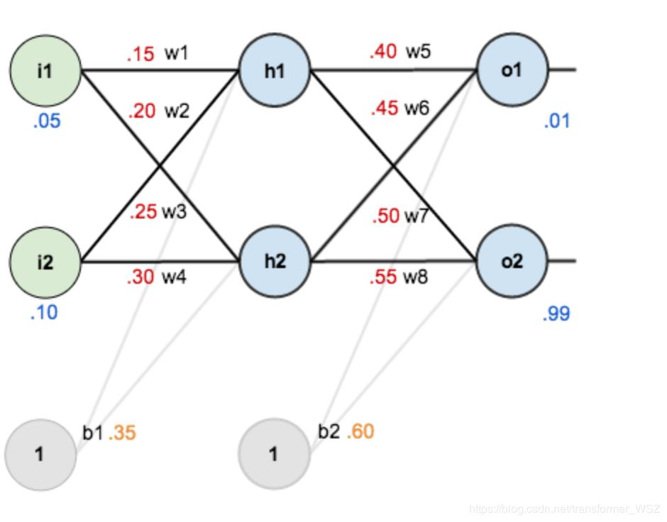
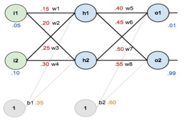
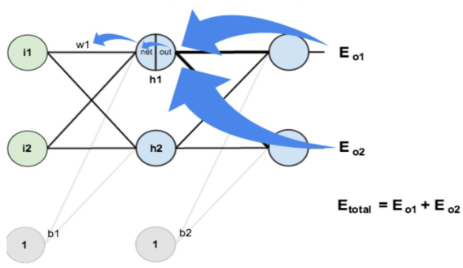

# BP神经网络训练实例

## 1. BP神经网络

关于BP神经网络在我的上一篇博客CV学习笔记-推理和训练中已有介绍，在此不做赘述。

**BP的算法基本思想：**

- 将训练集数据输入到神经网络的输入层，经过隐藏层，最后达到输出层并输出结果，这就是前
  向传播过程。
- 由于神经网络的输出结果与实际结果有误差，则计算估计值与实际值之间的误差，并将该误差
  从输出层向隐藏层反向传播，直至传播到输入层；
- 在反向传播的过程中，根据误差调整各种参数的值（相连神经元的权重），使得总损失函数减
  小。
- 迭代上述三个步骤（即对数据进行反复训练），直到满足停止准则。

## 2. 训练实例

### 1. 实例设计

绿色节点为第一层输入层，每个节点代表一个神经元，其中$i_1$、$i_2$表示输入值，$b_1$为偏置值，第二层包含$h_1$和$h_2$两个节点，为隐藏层，$h_1$和$h_2$为神经元的输入值，$b_2$为隐藏层的偏置值，第三层为输出层，包括$o_1$和$o_2$，$w_1$~$w_8$为各层之间的权重，激活函数使用sigmoid函数，输入值为$[i_1=0.05,i_2=0.10]$，正确的输出值为$[o_1=0.01,o_2=0.99]$。

> sigmoid函数是一种激活函数，在笔者上一篇博文《CV学习笔记-推理和训练》中已有介绍，此处不再赘述。

### 2. 训练过程

#### 1. 前向传播

**输入层->隐藏层：**

根据网络结构示意图，神经元$h_1$接收前一层$i_1$和$i_2$的加权求和结果作为输入，将此输入用$z_{h1}$表示，则有
$$
\begin{aligned}
z_{h1}&=w_1\times i_1+w_2\times i_2 +b_1\times 1\\&=0.15\times0.05+0.2\times0.1+0.35\times 1\\&=0.3775
\end{aligned}
$$
由于激活函数为sigmoid函数，故而神经元$h_1$的输出$a_{h1}$为
$$
a_{h1}=\frac{1}{1+e^{-z_{h1}}}=\frac{1}{1+e^{-0.3775}}=0.593269992
$$
同理可得，神经元$h_2$的输出$a_{h2}$为
$$
a_{h2}=0.596884378
$$
**隐藏层->输出层：**

根据网络结构示意图，神经元$o_1$的输入$z_{o1}$来源于前一层的$h_1$和$h_2$的加权求和结果，故
$$
\begin{aligned}
z_{o1}&=w_5\times a_{h1}+w_6\times a_{h2}+b_2\times1\\&=0.4\times 0.593269992+0.45\times 0.596884378+0.6\times 1\\&=1.105905967
\end{aligned}
$$
同理可以计算出$z_{o2}$

由于网络使用sigmoid函数为激活函数，那么$o_1$的输出$a_{o1}$为
$$
\begin{aligned}
a_{o1}&=\frac{1}{1+e^{-z_{o1}}}\\&=\frac{1}{1+e^{-1.105905967}}\\&=0.751365069
\end{aligned}
$$
同理可以计算出$a_{o2}=0.772928465$

至此，一个完整的前向传播过程结束输出值为$[0.751365069,0.772928465]$，与实际值$[0.01,0.99]$误差还比较大，需要对误差进行反向传播，更新权值后重新计算。

#### 2. 反向传播

**计算损失函数：**

传递误差需要经过损失函数的处理，来估计出合适的传递值进行反向传播并合理的更新权值。
$$
E_{total}=\sum\frac{1}{2}(target-output)^2\\
E_{o1}=\frac{1}{2}(0.01-0.751365069)^2=0.274811083\\
E_{o2}=\frac{1}{2}(0.99-0.772928465)^2=0.023560026\\
E_{total}=E_{o1}+E_{o2}=0.298371109
$$
**隐藏层->输出层的权值更新：**

以权重参数$w_5$为例，用整体损失对$w_5$求偏导后即可得到$w_5$对于整体损失的贡献，即
$$
\frac{\partial E_{total}}{\partial w_5}=\frac{\partial E_{total}}{\partial a_{o1}}\times\frac{\partial a_{o1}}{\partial z_{o1}}\times\frac{\partial z_{o1}}{\partial w_5}
$$
$\frac{\partial E_{total}}{\partial E_{a_{o1}}}$：由于总体损失是由两个输出($a_{o1}$和$a_o2$)计算得来，故总体损失可以对$a_{o1}、a_{o2}$求偏导。

$\frac{\partial a_{o1}}{\partial z_{o1}}$：由于输出$a_{o1}$是输入$z_{o1}$通过sigmoid函数激活得来，故$a_{o1}$可以对$z_{o1}$求偏导。

$\frac{\partial z_{o1}}{\partial w_5}$：由于$z_{o1}$是由前一层网络的$h_1$的输出根据权值$w_5$加权求和得来，故$z_{o1}$可以对$w_5$求偏导。

要捋清上述公式的关系，$w_5$贡献了$z_{o1}$，$z_{o1}$贡献了$a_{o1}$，而$a_{o1}$又贡献了$E_{total}$，所有层级关系均为唯一分支，故直接拆成上面公式的求法，而这种层级关系后面章节中所描述的隐藏层->隐藏层的权值更新过程中就会复杂一点。

经过上述推导，可以计算得：

$\frac{\partial E_{total}}{\partial a_{o1}}$ :
$$
\begin{aligned}
E_{total}&=\frac{1}{2}(target_{o1}-a_{o1})^2+\frac{1}{2}(target_{o2}-a_{o2})^2\\
\frac{\partial E_{total}}{\partial a_{o1}}&=2\times\frac{1}{2}(target_{o1}-a_{o1})\times(-1)\\&=-(target_{o1}-a_{o1})\\&=0.751365069-0.01\\&=0.741365069
\end{aligned}
$$
$\frac{\partial a_{o1}}{\partial z_{o1}}$：
$$
\begin{aligned}
a_{o1}&=\frac{1}{1+e^{-z_{o1}}}\\
\frac{\partial a_{o1}}{\partial z_{o1}}&=a_{o1}\times(1-a_{o1})\\&=0.751365069\times(1-0.751365069)\\&=0.186815602
\end{aligned}
$$
$\frac{\partial z_{o1}}{\partial w_5}$：
$$
\begin{aligned}
z_{o1}&=w_5\times a_{h1}+w_6\times a_{h2}+b_2\times1\\
\frac{\partial z_{o1}}{\partial w_5}&=a_{h1}\\&=0.593269992
\end{aligned}
$$
由上述的三个结果，可得：
$$
\frac{\partial E_{total}}{\partial w_5}=0.741365069\times0.186815602\times0.593269992=0.082167041
$$
如果我们将上述的步骤去除具体数值，抽象出来

则得到
$$
\frac{\partial E_{total}}{\partial w_5}=-(target_{o1}-a_{o1})\times a_{o1}\times(1-a_{o1})\times a_{h1}\\
\frac{\partial E}{\partial w_{jk}}=-(t_k-o_k)\cdot sigmoid(\sum_jw_{jk}\cdot o_j)(I-sigmoid(\sum_jw_{jk}\cdot o_j))\cdot o_j
$$

> 第二行的公式在笔者的上一篇博客中提到过，现作了推导。

为了表达的方便，用$\delta_{o1}$来表示输出层的误差：
$$
\delta_{o1}=\frac{\partial E_{total}}{\partial a_{o1}}\times\frac{\partial a_{o1}}{\partial z_{o1}}=\frac{\partial E_{total}}{\partial z_{o1}}\\
\delta_{o1}=-(target_{o1}-a_{o1})\times a_{o1}\times(1-a_{o1})
$$
因此整体损失对于$w_5$的偏导值可以简化的表示为
$$
\frac{\partial E_{total}}{\partial w_5}=\delta_{o1}\times a_{h1}
$$
则$w_5$的权值更新为：
$$
\begin{aligned}
w_5^+&=w_5-\eta\times\frac{\partial E_{total}}{\partial w_5}\\&=0.4-0.5\times0.082167041\\&=0.35891648
\end{aligned}
$$

> $\eta$为学习率，在笔者的上一篇博文《CV学习笔记-推理和训练》中介绍过，不再赘述。

同理，可更新$w_6,w_7,w_8$：
$$
w_6^+=0.408666186\\
w_7^+=0.511301270\\
w_8^+=0.561370121
$$
**隐藏层->隐藏层的权值更新：**

其思想大致相同，但不同的是$h_1$的输出$a_{h1}$对$E_{o1}、E_{o2}$都有贡献，故损失总体对$a_{h1}$求偏导时，根据全微分的准则，要分成对$E_{o1}、E_{o2}$对$a_{h1}$的偏导，即
$$
\frac{\partial E_{total}}{\partial w_1}=\frac{\partial E_{total}}{\partial a_{h1}}\times\frac{\part a_{h1}}{\part z_{h1}}\times\frac{\part z_{h1}}{\part w_1}\\
其中：\frac{\part E_{total}}{\part a_{h1}}=\frac{\part E_{o1}}{\part a_{h1}}\times\frac{\part E_{o2}}{\part a_{h1}}
$$

由上述推导，计算得：

$\frac{\partial E_{total}}{\partial a_{h1}}$：
$$
\frac{\part E_{total}}{\part a_{h1}}=\frac{\part E_{o1}}{\part a_{h1}}\times\frac{\part E_{o2}}{\part a_{h1}}
$$
$\frac{\partial E_{o1}}{\partial a_{h1}}$：
$$
\begin{aligned}
\frac{\part E_{o1}}{\part a_{h1}}&=\frac{\partial E_{o1}}{\partial a_{o1}}\times\frac{\part a_{o1}}{\part z_{o1}}\times\frac{\part z_{o1}}{\part a_{h1}}\\&=0.741365069\times0.186815602\times0.4\\&=0.055399425
\end{aligned}
$$

同理可得：
$$
\frac{\partial E_{o2}}{\partial a_{h1}}=-0.019049119
$$
两者相加得：
$$
\begin{aligned}
\frac{\part E_{total}}{\part a_{h1}}&=\frac{\part E_{o1}}{\part a_{h1}}\times\frac{\part E_{o2}}{\part a_{h1}}\\&=0.055399435-0.019049119\\&=0.036350306
\end{aligned}
$$
$\frac{\partial a_{h1}}{\partial z_{h1}}$：
$$
\begin{aligned}
\frac{\part a_{h1}}{\part z_{h1}}&=a_{h1}\times(1-a_{h1})\\&=0.593269992\times(1-0.593269992)\\&=0.2413007086
\end{aligned}
$$
$\frac{\partial z_{h1}}{\partial w_1}$：
$$
\frac{\part z_{h1}}{\part w_1}=i_1=0.05
$$
最终结果：
$$
\frac{\partial E_{total}}{\partial w_1}=0.036350306\times0.2413007086\times0.05=0.000438568
$$
同上节的简化方法，用$\delta_{h1}$表示隐藏层单元$h_1$的误差：
$$
\begin{aligned}
\frac{\partial E_{total}}{\partial w_1}&=(\sum_i\frac{\partial E_{total}}{\partial a_{i}}\times\frac{\part a_{i}}{\part z_{i}}\times\frac{\part z_{i}}{\part a_{h1}})\times\frac{\part a_{h1}}{\part z_{h1}}\times\frac{\part z_{h1}}{\part w_1}\\&=(\sum_i\delta_i\times w_{hi})\times a_{h1}\times(1-a_{h1})\times i_1\\&=\delta_{h_1}\times i_1
\end{aligned}
$$
$w_1$的权值更新为：
$$
w_1^+=w_1-\eta\times\frac{\partial E_{total}}{\partial w_1}=0.15-0.5\times0.000438568=0.149780716
$$
同理，更新$w_2,w_3,w_4$：
$$
w_2^+=0.19956143\\
w_3^+=0.24975114\\
w_4^+=0.29950229
$$
至此，一次反向传播的过程结束。

> 训练过程就是这样反复迭代，正向传播后得误差，在反向传播更新权值，再正向传播，这样反复进行，本例再第一次迭代后总误差从0.298371109下降到了0.291027924，在迭代10000次后，总误差降至0.000035085。输出为[0.015912196,0.984065734]