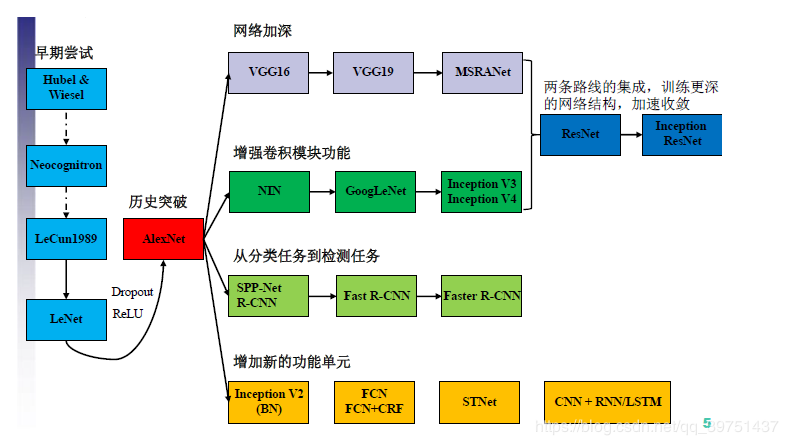
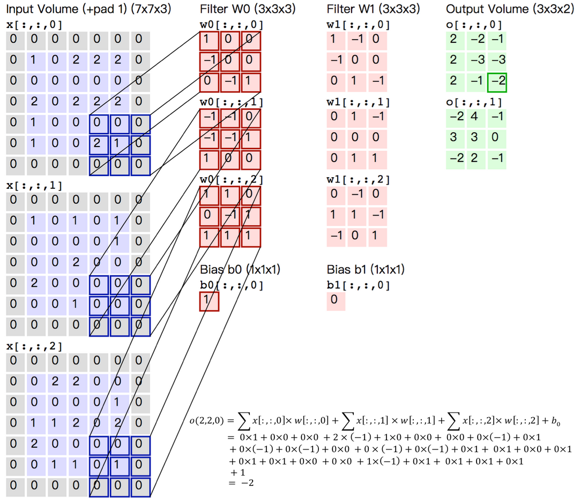
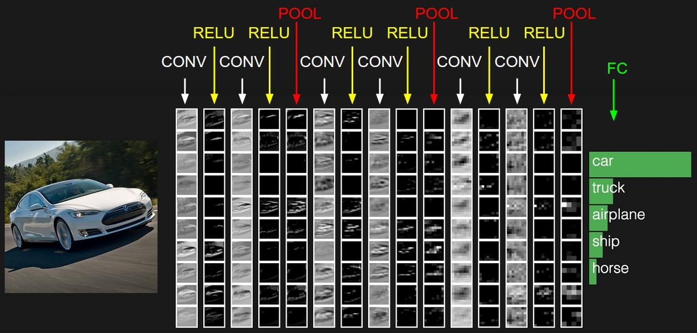
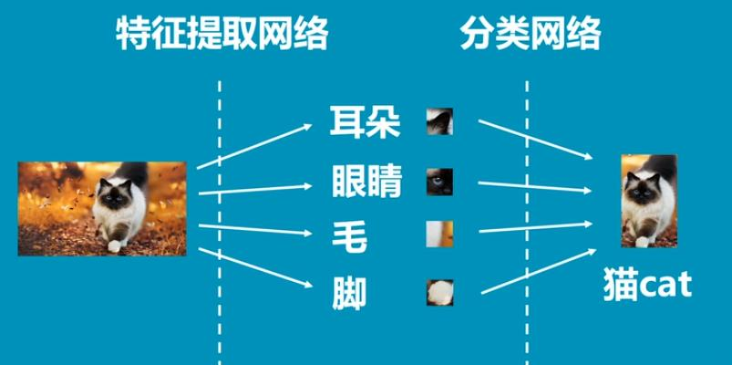
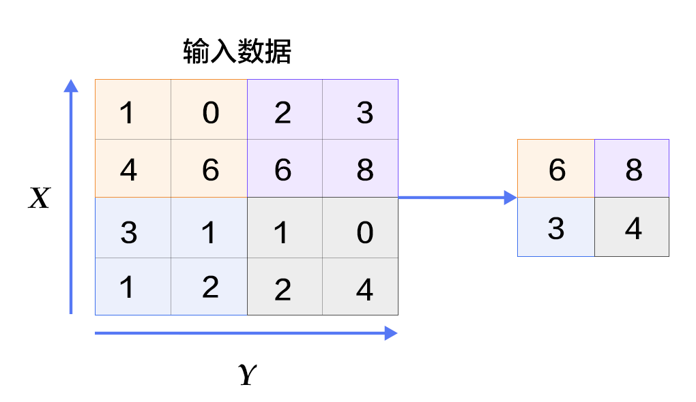
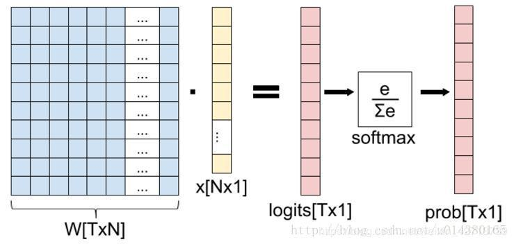
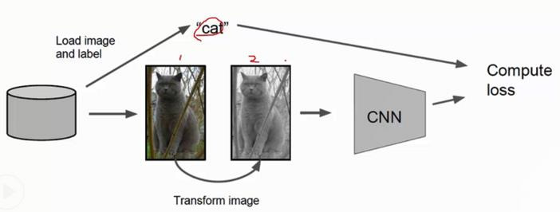

# 卷积神经网络

## 1. 卷积神经网络简介

### 1. 定义

卷积神经网络（Convolutional Neural Networks, CNN）是一类包含卷积计算且具有深度结构的前馈神经网络（Feedforward Neural Networks），是深度学习（deep learning）的代表算法之一 。卷积神经网络具有表征学习（representation learning）能力，能够按其阶层结构对输入信息进行平移不变分类（shift-invariant classification），因此也被称为“平移不变人工神经网络（Shift-Invariant Artificial Neural Networks, SIANN）”  。

### 2. 特点

- 与之前介绍的神经网络相比，传统神经网络只有**线性连接**，而CNN包括**卷积（convolution）**操作、**汇合（pooling）**操作和**非线性激活函数映射（即线性连接）**等等。
- 之前介绍的网络（全连接）只能接收一维向量，而CNN可以**直接接收多维向量**。

### 3. 应用与典型网络

**经典的CNN网络：**

- Alex-Net
- VGG-Nets
- Resnet

**常用应用：**

*深度学习在计算机图像识别上的应用非常成功。利用深度学习，我们能够对图片进行高精度识别，实现这一功能的，主要依靠神经网络中的一种分支，名为卷积网络。*

**典型卷积神经网络发展史：**

## 2. 卷积神经网络中的操作

### 1. 卷积（Convolution）

**卷积的操作：** 

卷积的操作过程即一个卷积核窗口滑动加权求和的过程，左边蓝色部分为输入部分，是一个三通道输入，通过滑动的方式与卷积核进行加权求和，图示例程中的卷积核有两个$W0$ 、$W1$ ，每个卷积核又会有一个偏置$b0$、$b1$。按照图例中的计算，可以计算出原三通道输入和第一个三通道卷积核的加权求和的结果，由于选择的是卷积核$W0$，故而输出是填在第一个输出通道的(2,2)处，如此重复可计算出所有的过程。

**卷积过程的特点：**

- 有几个卷积核，输出通道就有几个

- 输出的通道数与卷积核的通道数要相等

- 卷积后的输出大小计算公式
  $$
  N=\frac{W-F+2P}{S}+1
  $$
  W：输入大小

  F：卷积核大小

  P：填充值大小

  S：步长大小

  例如上图中的过程，输入W=5（5$\times$5图像），F=3（卷积核为3$\times$3），P=1，S=2，则有 N=(5-3+2$\times$1)/2+1=2+1=3，即输出为3$\times$3矩阵，通道数为卷积核的个数，2个，故输出是(3,3,2)的。

  下图为卷积过程中的动态示意图：

**卷积的作用：** *卷积在神经网络中的作用主要是提取局部特征。*

卷积操作的逻辑是将一张图片的信息分解成若干区域，对这些区域进行分别提取特征，所以卷积核比较大的话，所划分的区域就越少越大，卷积核越小的话，所划分的区域就越多越精细。这种做法在图像识别领域非常常用且有效，如下图的图示中，通过一个由卷积、池化（后面会提到）、激活组成的特征提取网络，可以将猫的图片分解成若干的区域（如3$\times$3、5$\times$5），然后分别对这些小区域进行识别，这些小区域可能代表着耳朵、眼睛、毛、脚等特征，然后将这些识别的结果综合起来作为对猫脸的识别。

### 2. 池化（Pool）

**池化的作用：** *池化又叫子采样，由于卷积的操作产生了大量的数据，需要池化这种操作减小数据量，为网络的计算负载减少压力，同时数据量过大也就导致了参数量大，参数冗余容易导致过拟合的发生，简言之池化的作用就是为数据降维减少冗余数据的。*

**池化的常见种类：** 

- Max pooling

  最大池化，顾名思义，即使用一个指定大小的卷积核将数据降维，每个区域的输出取这个邻域的最大值。如下图所示：

  

- Mean Pooling

  平均池化，也即像上图一样，每个区域都取平均数。

## 3. 卷积神经网络的构成

### 1. 层级

卷积神经网络通常有三部分构成，第一部分为**输入层**，接受输入的图像矩阵数据；第二部分**由若干卷积和池化操作层组合**而成，目的在于提取特征；第三部分由一个**全连接**的多层感知机分类器构成。

### 2. 卷积神经网络对比全连接网络的优化思想

此处内容参考了博主yunpiao123456的博文《卷积神经网络概念与原理》，笔者学习借鉴，也很感谢博主的文章使笔者获益匪浅。链接地址https://blog.csdn.net/yunpiao123456/article/details/52437794

- 局部感受野

  由于通常情况下图像中的局部像素点联系的相关性较大，而距离较远的像素的相关性较弱，因此，没有必要用全连接的方式将每一个像素点输入邻层的每一个神经元，也即每个神经元没有必要对全局图像进行感知，应该需要对局部进行感知，将局部信息传递到更高层，更高层将局部的信息综合起来处理就可以得到全局的信息。

  如下所示例图，左图为全连接的连接方式，即每个神经元都对图像整体进行感知，那么参数的数量能够达到$10^3\times10^3\times10^6=10^{12}$之多，而右图中使用神经元进行局部感知的情况下，每个神经元使用$10\times10$的卷积核对全图进行局部感知，那么有$10^6\times10\times10=10^8$个参数，参数量可谓是大大减小。

- 权值共享

  如果仍然感觉参数量过多的话，可以考虑在上面的局部感受野的情况下进行优化，我们可以将每个$10\times10$的卷积核的权值共享，这样做的意义是认为特征提取与图片位置无关，全图拥有共同的特征学习的特征提取方式，图像的一部分统计特性与其他部分是一样的。这也意味着我们在这一部分学习的特征也能用在另一部分上，所以对于这个图像上的所有位置，我们都能使用同样的学习特征。这样参数量变成了$10\times10$个了，参数量更是显著减少。

  如下例中，使用一个$3\times3$的卷积核对整体进行特征提取，图像的每个局部都使用这个$3\times3$的卷积核，将相当于使用权值共享的卷积核在每个局部上提取此类特征，将符合条件（也即激活值大）的部分挑选出来。

  

- 多卷积核

  虽然上述权值共享的方式大大的减少了参数量，但也很明显的由于权值共享，导致用于特征提取的卷积核单一，可以笼统地说是在全局图像分解地每个局部上提取了一种特征，因此，只有们有n个卷积核，就可以学习n个特征，每个卷积核都在全局图像分解的区域上提取特征。

  如下图例，左图为局部感受野的方式，右图为多卷积核的方式，在右图中，每种卷积核以权值共享的方式提取一种特征，我们可以用若干种卷积核以同样的方式提取若干种特征，右图中红色是一种卷积核、黑色是一种卷积核，在例子中我们用了100中卷积核提取100中特征，参数数量为$10\times10\times100=10^4$个参数，也是要比局部感受野参数量少很多的。

  

- Down-pooling

  在通过卷积获得了特征 (features) 之后，下一步我们希望利用这些特征去做分类。理论上讲，人们可以用所有提取得到的特征去训练分类器，例如 softmax 分类器，但这样做面临计算量的挑战。例如：对于一个 96X96 像素的图像，假设我们已经学习得到了400个定义在8X8输入上的特征，每一个特征和图像卷积都会得到一个 (96 − 8 + 1) × (96 − 8 + 1) = 7921 维的卷积特征，由于有 400 个特征，所以每个样例 (example) 都会得到一个 7921 × 400 = 3,168,400 维的卷积特征向量。学习一个拥有超过 3 百万特征输入的分类器十分不便，并且容易出现过拟合 (over-fitting)。

  为了解决这个问题，首先回忆一下，我们之所以决定使用卷积后的特征是因为图像具有一种“静态性”的属性，这也就意味着在一个图像区域有用的特征极有可能在另一个区域同样适用。因此，为了描述大的图像，一个很自然的想法就是对不同位置的特征进行聚合统计，例如，人们可以计算图像一个区域上的某个特定特征的平均值 (或最大值)。这些概要统计特征不仅具有低得多的维度 (相比使用所有提取得到的特征)，同时还会改善结果(不容易过拟合)。这种聚合的操作就叫做池化 (pooling)，有时也称为平均池化或者最大池化 (取决于计算池化的方法)。
  

## 4. 图像增强在卷积神经网络中的作用

### 1. 扩充数据集

由于网络往往对数据集的大小有要求，如果数据集很小的话，无法充分训练得到一个比较好的模型，使用图像增强对原始图像进行处理可以在一定程度上扩充数据集，从而提高模型的准确度，这种图像增强起到了在原始图像的基础上，在不改变数据的标签值的情况下，对数据进行一定的改变从而增加数据样本数量的作用。

### 2.  突出区域

图像增强可以i突出图像中的感兴趣区域以及特征，可以增强感兴趣区域，使感兴趣区域变得更加明显；也可以将不感兴趣得区域削弱，从而相对提升感兴趣区域的程度。

**常用的图像增强方法：**

- 翻转、平移、旋转、缩放
- 分离单个r、g、b三个颜色通道
- 添加噪声
- 直方图均衡化
-  Gamma变换
- 反转图像的灰度
- 增加图像的对比度
- 缩放图像的灰度
- 均值滤波
- 中值滤波
- 高斯滤波
