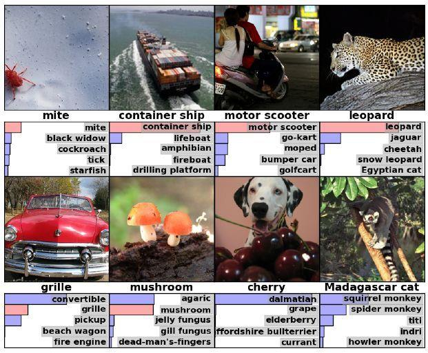
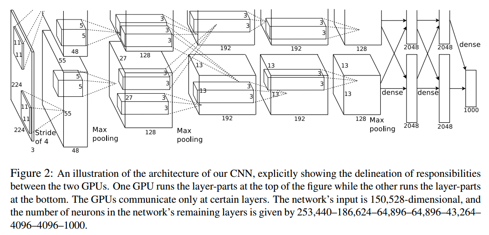
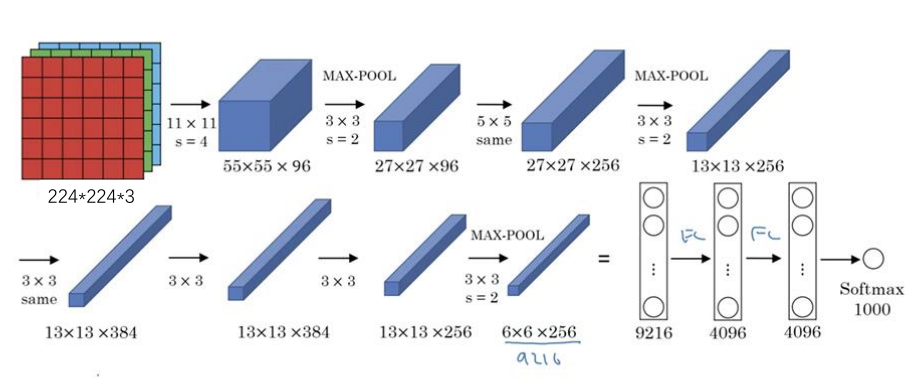

### Alexnet

## 1. 背景

AlexNet是2012年ImageNet竞赛冠军获得者Hinton和他的学生Alex Krizhevsky设计的。也是在那年之后，更多的更深的神经网络被提出。

## 2. 网络结构

**原网络结构：**

这个原述解释的是上面一半与下面一半分别跑在不同的GPU上，所以将原生网络简化成下面结构，来具体看看中间的过程如何计算。

**详解：**

- 输入接收一个三通道的二维224$\times$224矩阵，故而原始输入图片输入网络应当先进行处理，resize到(224,224,3)。

- 使用步长为4$\times$4，大小为11$\times$11的卷积核对图像进行卷积，输出的特征(feature map)为96层（也即输出有96个通道）

  > 详细计算方式在笔者的前一篇文章已有介绍，此处作推演。
  >
  > 输出的通道数与卷积核的个数（3通道，卷积核的通道数与原输入通道数应为一致）一致，所以输出通道数经过卷积操作是可以人为定义的。这里使用了96个11$\times$11卷积核进行了卷积，输出为55$\times$55$\times$96，55怎么算来的呢，使用了公式N=(W-F+2P)/S + 1，W为输入大小，F为卷积核大小，P为填充值大小，S为步长大小，代入公式可得，N=(224-55+2 $\times$ 0)/4 +1=54，很多层都进行了LRN操作，可参考<a href='https://blog.csdn.net/qq_27825451/article/details/88745034'>《深度学习饱受争议的局部响应归一化(LRN)详解》</a>，笔者在这里就不作介绍了

- 然后进入池化操作，池化操作不改变输出通道数，池化的pool_size为3 $ \times$ 3，故而输出大小为(55-3)/2+1=27，故最终输出为$27\times 27\times 96$

- 然后经过same方式padding后，用5 $\times$ 5的卷积核进行了卷积操作，输出通道为256，same方式下经过计算输出为$\lceil \frac{27}{1} \rceil = 27$，输出大小不变，故最终输出为$27 \times 27 \times 256$

  > 一般深度学习框架中的padding填充方式有两种，same和vaild，same方式下，尽量保持输出与输入大小一致（不含通道数），是根据上述计算公式进行反推P值，以决定外围加几圈0，则输出大小为$N =\lceil \frac{W}{S} \rceil$
  >
  > valid方式时指定P=0，则输出大小为$N = \lceil \frac{W-F+1}{S}\rceil$
  >
  > 对比：valid方式表示只进行有效的卷积，对边界数据不处理；same代表保留边界处的卷积结果，通常会导致输出shape与输入shape相同

- 然后使用3 $\times$ 3的窗口，以步长为2 $\times$ 2的窗口进行最大池化操作，池化不改变通道数，输出为(27-3+0)/2 + 1 = 13，故输出大小为$13 \times 13 \times 256$

- 然后再经过same方式加padding，输出为$\lceil \frac{13}{1} \rceil = 13$输出通道指定为384，也即用了384个$3 \times 3$的卷积核（卷积核个数等于输出通道数），最终输出为$13 \times 13 \times 384$

- 然后保持384的输出通道不变，加一圈padding（即P=1），用3 $\times$ 3的卷积核进行卷积，输出为(13-3+2)/1 + 1 = 13，故最终输出为$13 \times 13 \times 384$

- 然后设置输出通道为256，加一圈padding（即P=1），用3 $\times$ 3的卷积核进行卷积，输出为(13-3+2)/1 + 1 = 13，故最终输出为$13 \times 13 \times 256$

- 然后使用3 $\times$ 3的窗口大小、2 $\times$ 2的步长进行最大池化操作，池化不改变通道数，通道数仍为256，输出为(13-3+0)/2 + 1 = 6，故最终输出为$6 \times 6 \times 256$

- 由于FC（全连接层）只接收一维向量，故需要将$6 \times 6 \times 256$ 转换成$1 \times 1 \times 9216$的向量，输入为9216个参数，这个过程形象的成为拍扁的过程，原理是用与原featuremap大小相同的卷积核进行卷积，个数即输出通道数，然后经过三层FC，再通过softmax分类器进行分类，softmax的输出个数即你要分的类别数，FC层中的过程相当于用1 $\times$ 1的卷积核进行卷积的过程。

