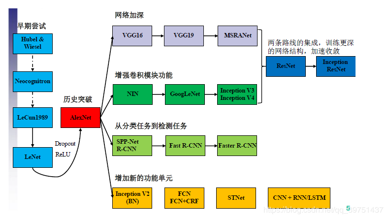
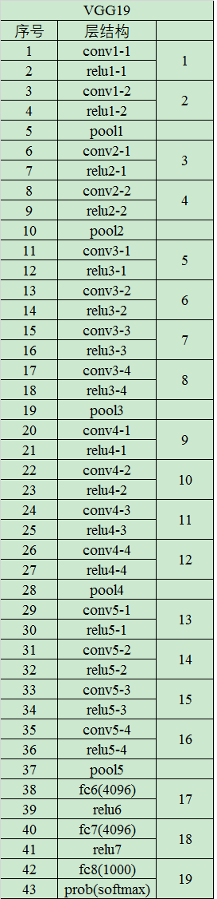
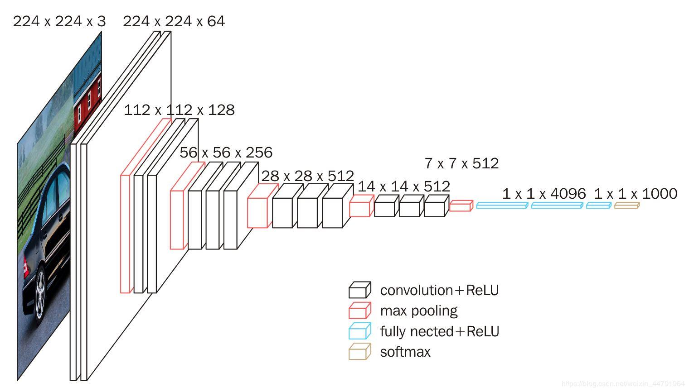

# VGG

## 1. 常见的卷积神经网络



VGG属于一种经典的卷积神经网络结构，其出现在AlexNet之后，由于AlexNet的突破证实了卷积神经网络的可行性，VGG的思路主要是将网络层数加深，从某种意义上说，网络层数的加深可以粗略地认为考虑判定问题的条件增多，导致判定器更加准确，实际上原理应该更加复杂，关于深度学习的可解释性一直以来是个比较难的问题，直观的感受来自于多项式拟合，当不同次数的项越多拟合一个数据集（点）形成的线越准确。

VGG属于对传统卷积神经网络**网络加深**优化思路的典范。

## 2. VGG的网络结构

VGG的网络结构之所以经典，在于其首次将深度学习的层数做的比较“深”，达到了16-19层之多，同时，其卷积核的尺寸也非常的小（3$\times$3），VGG-19的网络结构如下



可以看到，其层数的划分为每次经过激活函数或者最终经过分类器为一层。

以下为VGG-16的网络结构图



> VGG-16的网络结构处理过程
>
> 1. 将输入的原始图片resize到3通道224$\times$224的数据形式
> 2. 经过第一层卷积，使用3$\times$3的卷积核对输入进行两次卷积，经过计算，输出的feature map通道数为64，即输出为224$\times$224$\times$64，再经过2$\times$2的核进行最大池化处理，降采样为112$\times$112$\times$64
> 3. 经过第二层卷积，使用3$\times$3的卷积核对输入进行两次卷积，经过计算，输出的feature map通道数为128，即输出为112$\times$112$\times$128，再经过2$\times$2的核进行最大池化处理，降采样为56$\times$56$\times$128
> 4. 经过第三层卷积，使用3$\times$3的卷积核对输入进行三次卷积，经过计算，输出的feature map通道数为256，即输出为56$\times$56$\times$256，再经过2$\times$2的核进行最大池化处理，降采样为28$\times$28$\times$256
> 5. 经过第四层卷积，使用3$\times$3的卷积核对输入进行三次卷积，经过计算，输出的feature map通道数为512，即输出为28$\times$28$\times$512，再经过2$\times$2的核进行最大池化处理，降采样为14$\times$14$\times$512
> 6. 经过第四层卷积，使用3$\times$3的卷积核对输入进行三次卷积，经过计算，输出的feature map通道数为64，即输出为14$\times$14$\times$512，再经过2$\times$2的核进行最大池化处理，降采样为7$\times$7$\times$512
> 7. 使用卷积的方式等效替代FC全连接层，输出为1$\times$1$\times$4096
> 8. 使用卷积的方式等效替代FC全连接层，输出为1$\times$1$\times$1000（最终输出的1000个通道分别代表的1000种类别的预测）

## 3. 卷积层等效替代全连接层

**操作要点：** 将卷积核的尺寸大小设置为输入空间的大小

**等价分析：** 由于卷积和全连接在实现上均是点乘操作，当卷积核的大小变成与输入的feature map尺寸相同时，卷积与全连接在计算与参数量上均相同，举例说明，在VGG-16中首个全连接层数输入尺寸为7$\times$7$\times$512，其输出为1$\times$1$\times$4096，这个过程完全可以用一个7$\times$7的卷积核来进行，此时设步长为1，填补方式为没有填补，其卷积后输出为1$\times$1$\times$4096，和全连接层等价。

## 4. 1$\times$1卷积的作用

**实际作用：** 实现**特征通道**的升维与降维

> 卷积操作可以对输出的通道数的大小进行改变，而池化操作不改变通道数，只改变尺寸。1$\times$1卷积可以在不改变尺寸的情况下更改通道数。

## 5. 代码实现

### VGG网络部分

```python
# -------------------------------------------------------------#
#   vgg16的网络部分
# -------------------------------------------------------------#
import tensorflow as tf

# 创建slim对象
vgg_slim = tf.contrib.vgg_slim


def vgg_16(inputs,
           num_classes=1000,
           is_training=True,
           dropout_keep_prob=0.5,
           spatial_squeeze=True,
           scope='vgg_16'):
    with tf.variable_scope(scope, 'vgg_16', [inputs]):
        # 建立vgg_16的网络

        # conv1两次[3,3]卷积网络，输出的特征层为64，输出为(224,224,64)
        net = vgg_slim.repeat(inputs, 2, vgg_slim.conv2d, 64, [3, 3], scope='conv1')
        # 2X2最大池化，输出net为(112,112,64)
        net = vgg_slim.max_pool2d(net, [2, 2], scope='pool1')

        # conv2两次[3,3]卷积网络，输出的特征层为128，输出net为(112,112,128)
        net = vgg_slim.repeat(net, 2, vgg_slim.conv2d, 128, [3, 3], scope='conv2')
        # 2X2最大池化，输出net为(56,56,128)
        net = vgg_slim.max_pool2d(net, [2, 2], scope='pool2')

        # conv3三次[3,3]卷积网络，输出的特征层为256，输出net为(56,56,256)
        net = vgg_slim.repeat(net, 3, vgg_slim.conv2d, 256, [3, 3], scope='conv3')
        # 2X2最大池化，输出net为(28,28,256)
        net = vgg_slim.max_pool2d(net, [2, 2], scope='pool3')

        # conv3三次[3,3]卷积网络，输出的特征层为256，输出net为(28,28,512)
        net = vgg_slim.repeat(net, 3, vgg_slim.conv2d, 512, [3, 3], scope='conv4')
        # 2X2最大池化，输出net为(14,14,512)
        net = vgg_slim.max_pool2d(net, [2, 2], scope='pool4')

        # conv3三次[3,3]卷积网络，输出的特征层为256，输出net为(14,14,512)
        net = vgg_slim.repeat(net, 3, vgg_slim.conv2d, 512, [3, 3], scope='conv5')
        # 2X2最大池化，输出net为(7,7,512)
        net = vgg_slim.max_pool2d(net, [2, 2], scope='pool5')

        # 利用卷积的方式模拟全连接层，效果等同，输出net为(1,1,4096)
        net = vgg_slim.conv2d(net, 4096, [7, 7], padding='VALID', scope='fc6')
        net = vgg_slim.dropout(net, dropout_keep_prob, is_training=is_training,
                               scope='dropout6')
        # 利用卷积的方式模拟全连接层，效果等同，输出net为(1,1,4096)
        net = vgg_slim.conv2d(net, 4096, [1, 1], scope='fc7')
        net = vgg_slim.dropout(net, dropout_keep_prob, is_training=is_training,
                               scope='dropout7')
        # 利用卷积的方式模拟全连接层，效果等同，输出net为(1,1,1000)
        net = vgg_slim.conv2d(net, num_classes, [1, 1],
                              activation_fn=None,
                              normalizer_fn=None,
                              scope='fc8')

        # 由于用卷积的方式模拟全连接层，所以输出需要平铺
        if spatial_squeeze:
            net = tf.squeeze(net, [1, 2], name='fc8/squeezed')
        return net
```

### 测试

```python
from nets import vgg16
import tensorflow as tf
import numpy as np
import utils

# 读取图片
img1 = utils.load_image("./test_data/dog.jpg")

# 对输入的图片进行resize，使其shape满足(-1,224,224,3)
inputs = tf.placeholder(tf.float32,[None,None,3])
resized_img = utils.resize_image(inputs, (224, 224))

# 建立网络结构
prediction = vgg16.vgg_16(resized_img)

# 载入模型
sess = tf.Session()
ckpt_filename = './model/vgg_16.ckpt'
sess.run(tf.global_variables_initializer())
saver = tf.train.Saver()
saver.restore(sess, ckpt_filename)

# 最后结果进行softmax预测
pro = tf.nn.softmax(prediction)
pre = sess.run(pro,feed_dict={inputs:img1})

# 打印预测结果
print("result: ")
utils.print_prob(pre[0], './synset.txt')

```


