# Inception

## 目录

[TOC]

## 1. 常见的卷积神经网络

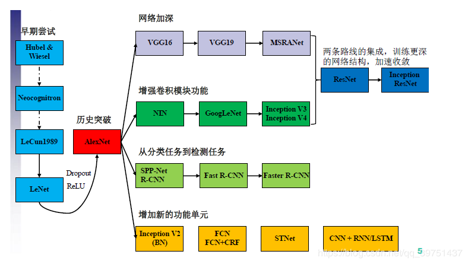

&emsp;&emsp;卷积神经网络的发展历史如上所示，在AlexNet进入大众的视野之后，卷积神经网络的作用与实用性得到了广泛的认可，由此，对于卷积神经网络的优化进入了快速发展的阶段，经典的里程碑式的优化思想大致归为四大类：

- 网络加深

> 表现为在卷积神经网络的网络结构方面，在网络结构上增加卷积激活层，使得网络结构越变越深，深层次的网络在训练学习的过程中所考虑的因素就会更多，理论上会更加准确，但是网络的深度要与实际问题相关，在实践中折衷选取，过深过浅都不利于问题的解决。

- 增强卷积模块功能

> 表现为在一个卷积块中对特征提取的方式做出改变（也即变更传统卷积层的结构以获取更多的滤波作用），一般处于对feature map的尺度以及优化计算量的考量。

- 从分类的目标到检测的目标

> 同样利用CNN，但是设计网络的目标从分类的任务变更为了检测任务，检测任务不仅需要对图片中的区域进行特征提取、对结果进行分类，还要通过相关性的信息将目标框框出。

- 增加新的功能单元

> 丰富网络处理某一层输入或者输出的功能，此处的功能单元指传统卷积(Conv)、激活以及全连接、分类器之外的新增功能模块，例如LSTM增加的遗忘门，能够考虑历史数据，增加神经网络的功能。

## 2. Inception

### (1) Inception提出背景

卷积神经网络(CNN)在发展历程中Inception的出现是具有里程碑式的意义的。此前，主流CNN的优化方式几乎都是堆叠卷积层，致使卷积层数量越来越多，网络深度越来越深，以这种方式优化效果。

以上提到的方式带来了一定的问题：

1. 存在目标尺度差异过大的问题。图像中的边缘等特征在尺度方面差别较大，上图中的狗在图片中的尺寸较大，而下图中的狗明显尺度小于上图。
2. 感受野难以标选。在特征提取的过程中，主要是卷积核的卷积操作完成，卷积核的大小表征了感受野的大小，由于信息位置的差异，选择合适的卷积核尺寸是一个非常困难的问题，对于上图更适用大的卷积核，而下图更适用小的卷积核。
3. 深度过深的网络容易出现过拟合的情况。笔者经常将深度学习的网络比作用不同的次幂项来拟合一个曲线，不同次项项数越多，对于曲线的拟合程度肯定更精确，但是过深的网络相当于项数过多，对于曲线的拟合过于精确，会导致泛化性差的问题，将梯度更新传播到整个网络也是一个很难的问题（偏导数链过长）
4. 计算资源紧张。过深的网络在参数量方面是爆炸增长的，舍去参数的思路会使信息受损，所以，对于计算资源的消耗仍然是一个比较重要的问题。

      

### (2) Inception module 核心思想

- 将网络“深度”转换为“宽度”

  > 在同一层级使用多个尺度的滤波器，将增加深度的思想转换到增加卷积层的宽度上，多尺度的考虑图像信息。

  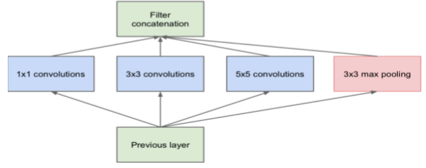

- 使用卷积核的计算特性优化参数量

  > 作者采用增加$1\times 1$卷积的方式限制输入的通道数量。

  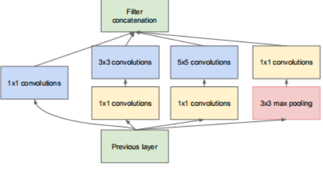

**三通道卷积过程**

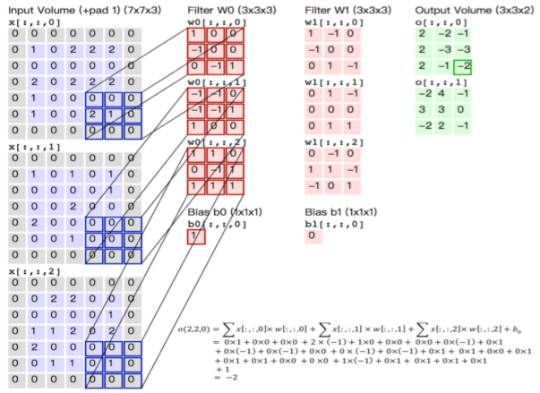

*要点：* ==输入的通道数要与卷积核的通道数相同，输出的通道数等于卷积核的个数==

**$1\times 1$卷积的优化**

考虑下列场景计算

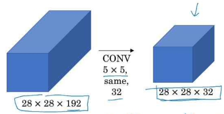

> 计算方式以及公式推导请参照笔者之前的文章[CV学习笔记-卷积神经网络](https://blog.csdn.net/qq_38853759/article/details/122620282)，在此不再赘述。

输入为$28\times 28\times 192$，通过$32$个$5\times 5$的卷积核在same的填补和步长模式下，参数量为
$$
5\times 5\times 192 \times32=153600
$$
用$1\times 1$的卷积优化计算的场景如下：

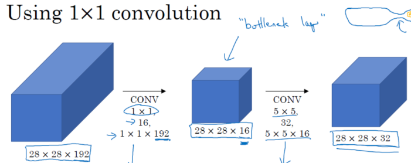

输入为$28\times 28\times 192$的feature map，经过16个$1\times1$卷积得到输出为$28 \times 28\times 16$，再通过32个$5\times 5$的卷积核得到输出为$28\times 28 \times 32$的feature map，可以看出最后的输出尺寸与优化前是一致的，参数量为：
$$
(1\times 1\times 192)+(5\times 5 \times 16)=592
$$
可以看出在优化后，保持输出与输入尺寸不变的情况下，参数量大大减少。

**$1\times 1$卷积在Inception中的主要作用**

- 数据降维
- 引入更多的非线性，提高泛化能力，因为卷积后要经过ReLU激活函数。

## 3. Inception的历史版本

### (1) InceptionV1-GoogleNet

网络结构如下：

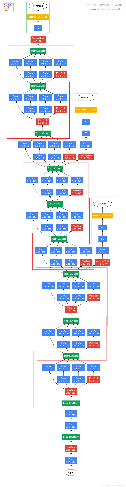

==要点==

- GoogleNet将Inception模块化，网络结构中使用了9个Inception Module，网络结构共22层，上图红色框框出即为Inception模块。
- 上图绿色框中的softmax块是辅助模块，主要作用是向前传播梯度，避免梯度消失，有暂存的理念。

### (2) InceptionV2

**优化1：增加BatchNormalization，也即常说的BN**

在卷积层后假如BN层，BN层依照下列公式进行标准化：
$$
\hat{x}^{(k)}=\frac{x^{k}-E[x^{k}]}{\sqrt{Var[x^{(k)}]}}
$$

- 能够保证所有的输出在0~1之间

- 保证数据服从于标准正态分布，也即均值为0、标准差为1的正态分布$N(0,1)$，使其落入激活函数的敏感区域，避免梯度消失，防止网络陷入饱和

- 提高泛化能力与学习速度，能够设置较大的初始学习率，减少了对参数初始化的依赖

- 减少dropout的使用，降低L2正则约束参数

  > [正则化参考](https://www.jianshu.com/p/5300f630a5e4)

实际的卷积过程中，并不是每个神经元都进行了BN，而是使用了类似**共享权值**的策略，把**一整张feature map当作了一个神经元处理**

对于每个feature map都只有一对可学习的参数$\gamma$、$\beta$，BN的过程相当于求取所有样本所对应的一个特征图的所有神经元的平均值、方差，然后对这个特征图神经元做归一化。
$$
y_i\leftarrow \gamma \hat{x_i}+\beta=BN_{\gamma,\beta}(x_i)
$$
**优化2：使用2个连续的$3\times 3$卷积层（步长为1）组成的结构代替$5\times 5$卷积层**

通过计算，连续的2个$3\times 3$的卷积与一个$5\times 5$的卷积得到的输出尺寸是一致的，但是$5\times 5$的卷积核参数与$3\times 3$的参数量之比为$\frac{25}{9}=2.78$，在feature map比较大时差异尤为明显。

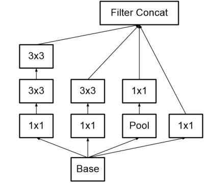

**优化3：使用$1\times n$与$n\times 1$的连续卷积代替$n\times n$的卷积核尺寸**

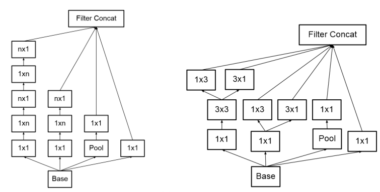

这种处理方式为使用非对称卷积核进行不对称分解，其存在：

- 节约了大量参数
- 增加一层非线性，提高了模型的表达能力
- 可以处理更丰富的空间特征，增加特征的多样性

**InceptionV2网络结构图**

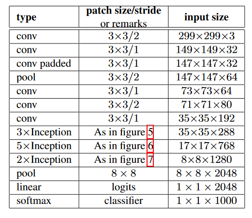

### (3) InceptionV3

**InceptionV3网络结构图**

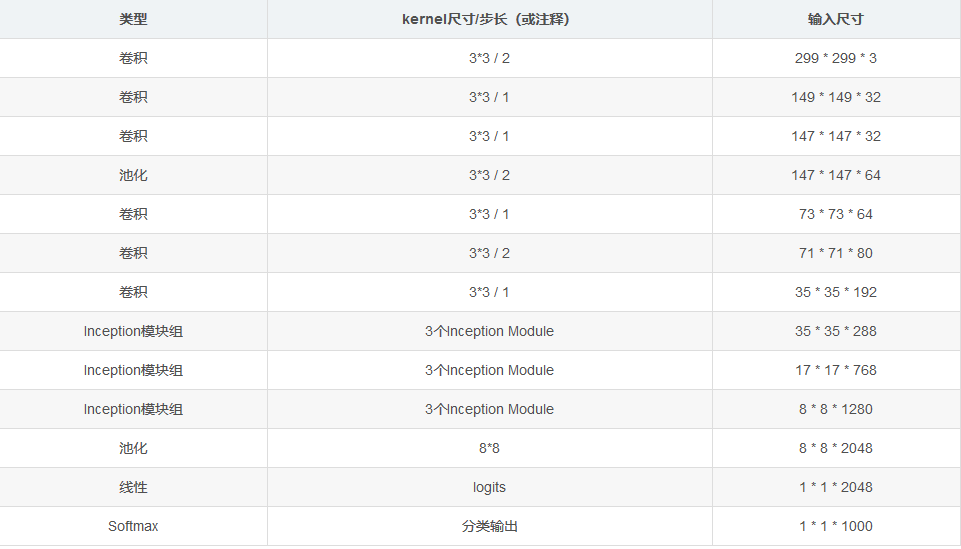

InceptionV3整合了V2中的所有优化手段，同时还使用了$7\times 7$卷积

**设计思想**

- 小卷积核的非对称分解对于降低参数量和减轻过拟合有很大的帮助，同时能够增加网络非线性的表达能力。
- 在CNN的运作中，应该使feature map的尺寸逐渐减少、通道数逐渐增加，这样做可以使得空间结构化，将空间信息转化为高阶抽象的特征信息。
- Inception Module用多个分支提取不同程度的高阶特征的思路，丰富了网络的表达能力

### (4) Inception V4

Inception V4的论文中没有公式，都是网络结构的展示，Inception V4中基本的Inception Module还是沿袭的InceptionV2和InceptionV3的结构，只是做了统一化标准化改进，并且使用了更多的Inception Module，其实验效果表现良好。

**Inception V4的网络结构图**

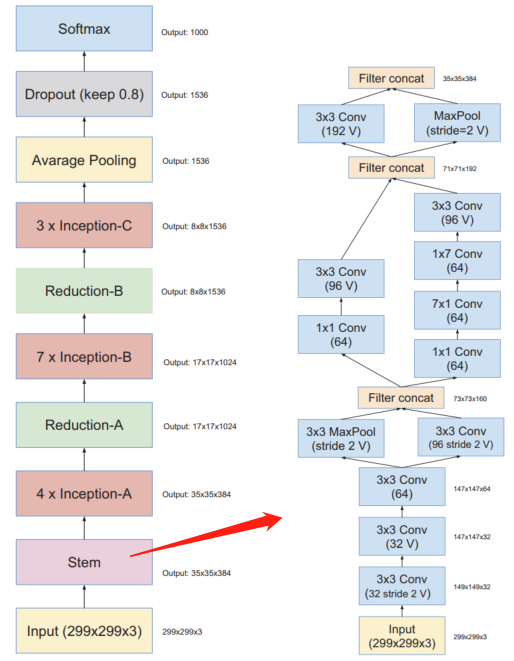

作者在论文中，也提到了与ResNet的结合，总结如下：

- Residual Connection

  ResNet的作者认为残差连接为深度神经网络的标准，而作者认为残差连接并非深度神经网络必须的，残差连接可以提高网络的训练速度

- Residual Inception Block

  $1\times 1$的卷积核有妙用，可以做非线性映射，且拥有极小的参数量，卷积核小到一步一步卷全图，在残差Inception块中有的地方$1\times 1$卷积之后并没有激活，主要是在做维度对齐，保证Concat

- Scaling of the Residual

  当滤波器的数量超过1000个时候，网络会出现“坏死”的情况，在平均池化前都会变成0，此时降低学习率、增加BN层都没有用，这时候在激活函数之前缩小残差可以保持稳定。

  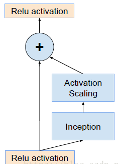

- 网络精度提高的原因

  残差连接只能加速网络收敛，真正提高网络精度还是“更大规模的网络”

> 此处总结借鉴了[inception-v1,v2,v3,v4----论文笔记_ Meng的博客-CSDN博客_inception论文](https://blog.csdn.net/weixin_39953502/article/details/80966046)

## 4. Inception模型的特点总结

1. 采用了$1\times 1$卷积核，既大量节省了参数量，有可以增加一层的特征变换和非线性变换。
2. 提出了**Bacth Normalization**，将神经元的输入归一化到了标准正态分布中，避免梯度弥散，使其落入激活函数的敏感区，加快收敛进程
3. 引入了**Inception Module**，4个分支结合的结构。
