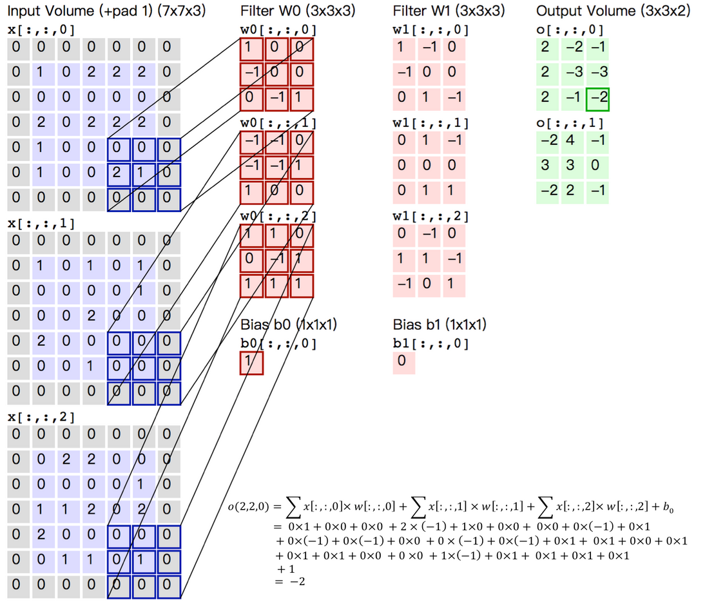
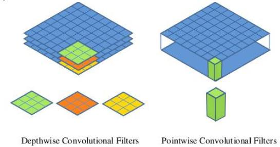
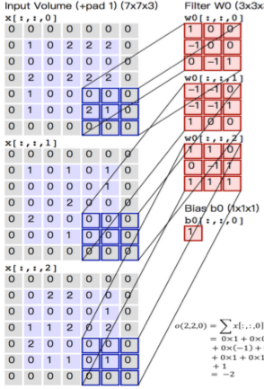
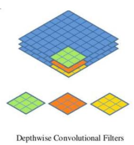
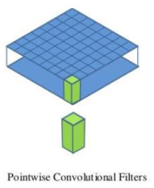
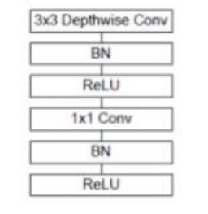
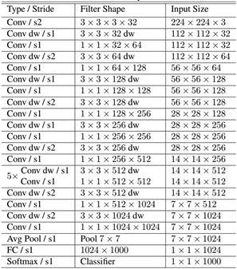
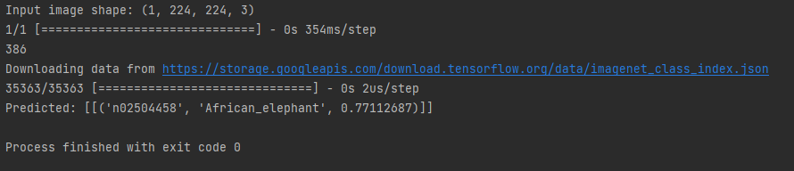

# MobileNet

[TOC]

## 1. MobileNet概述:dancer:

&emsp;&emsp;网络专注于移动端或者嵌入式设备中的轻量级CNN，相比于传统卷积神经网络，在准确率小幅度降低的前提下大大减少模型参数与运算量。

&emsp;&emsp;传统卷积与DW卷积（Depthwise Conv）的差异，在传统卷积中，每个卷积核的channel与输入特征矩阵的channel相等（每个卷积核都会与输入特征矩阵的每一个维度进行卷积运算），输出特征矩阵channel等于卷积核的个数。而在DW卷积中，每个卷积核的channel都是等于1的（每个卷积核只负责输入特征矩阵的一个channel，卷积核的个数=输入特征矩阵的channel数=输出特征矩阵的channel数）

&emsp;&emsp;MobileNet模型是Google针对手机等嵌入式设备提出的一种轻量级的深层神经网络，其使用的核心思想便是深度可分离卷积 **depthwise separable convolution**

## 2. 深度可分离卷积（depthwise separable convolution）:rocket:

### 2.1 深度可分离卷积通俗理解

&emsp;&emsp;传统的三通道卷积过程如下：



&emsp;&emsp;那么深度可分离卷积能用到轻量级的网络中，保证效率减少参数量，其具体是如何巧妙设计优化的，下图为深度可分离卷积的运作过程。



&emsp;&emsp;深度可分离卷积分为两个部分，Depthwise Convolution （深度卷积）、Pointwise Convolution（点卷积），这是两个不同的卷积过程，传统三通道卷积的过程是一个卷积核的厚度有三层，每一层与输入的feature map的每一层做加权求和，从而生成输出的一个通道，故输出通道数取决于卷积核的数量，卷积核的通道数等同于输入feature map的通道数（对齐）



&emsp;&emsp;而Depthwise Convolution不同，其卷积核的厚度只有1，对于输入的feature map（特征图谱）的每一个通道，都有一个不同的厚度为1的卷积核相对应（**卷积核数量与输入通道数对应**），**每个卷积核都只对对应通道的feature map做卷积操作**，这样得到的每一个通道的卷积操作得到一个1通道的feature map，这样深度卷积之后的输出通道数与输入通道数一致。下图中绿色、红色、黄色表示的不同的通道数为1的卷积核。



&emsp;&emsp;点卷积（Pointwise Convolution）是采用1$\times$1大小的卷积核（此时的卷积核是传统卷积核，其通道数与输入通道数相同）分别遍历输入的所有通道，得到的输出通道取决于卷积核的个数，点卷积与传统卷积方式相同，只是卷积核使用1$\times$1，起到一个改变通道数的作用，直观意义上讲就是加厚输出的feature map，其实际的意义在于由于深度卷积的方式对于特征提取不够明显，再通过点卷积进行一些信息补偿，在保证参数量减少的情况下，尽可能的让网络的效果保持一个可观的水平。



### 2.2 深度可分离卷积对于参数的优化

&emsp;&emsp;举例说明优化的效果，由于MobileNet是用于嵌入式设备等受限的设备上的网络，其参数肯定是大幅度降低的。

&emsp;&emsp;有下列场景：
&emsp;&emsp;使用3$\times$3大小的卷积层，输入通道数为16，输出通道数为32.

&emsp;&emsp;使用传统卷积的方式，需要32个3$\times$3的卷积核对16个通道中的每一层数据进行卷积计算，最后得到32个输出通道的feature map，所需要的参数量为：
$$
16\times 32\times 3\times 3=4608
$$
&emsp;&emsp;采用深度可分离卷积，由于输入的通道数为16，那么采用16个3$\times$3大小的卷积核对16个通道的feature map**分别**卷积，得到一个16通道的输出feature map，为了得到所需要的32通道的输出，采用点卷积的方式，使用32个1$\times$1大小的卷积核遍历16个通道的输入feature map，那么参数量为：
$$
16\times 3\times 3+16\times 32\times 1\times 1=656
$$
&emsp;&emsp;通过上述实验对比，参数量确实大大减少。

==注意：深度可分离卷积指的是深度卷积（Depthwise Conv）+点卷积（Pointwise Conv），而并不是一个dw（Depthwise的缩写）就是一个深度可分离卷积，这个概念混淆度很高==

## 3. MobileNet网络结构:bear:

一个深度可分离卷积的结构如下所示：



&emsp;&emsp;首先对输入做深度卷积（Depthwise Conv），深度卷积的特点是是卷积核的个数与处理的输入通道数一致同时每个卷积核通道数都是1，每个1通道卷积核去卷积输入feature map里的一个通道的数据，导致深度卷积处理之后输入与输出的通道数总是不变的。

&emsp;&emsp;深度卷积之后就是BN层，BN层为Batch Normalization，对数据做归一化处理，再通过激活函数，接下来是一个1$\times$1的Conv层，其就是点卷积的层，使用1$\times$1的卷积核进行卷积操作，改变通道数，再进行归一化和激活输出。

> BN的作用以及应用过程已经在笔者的博文[《CV学习笔记-Inception》](https://blog.csdn.net/qq_38853759/article/details/129112624?spm=1001.2014.3001.5501)中详细介绍，不再赘述。

MobileNet的网络结构图如下所示



&emsp;&emsp;在此不进行逐层分析，仅对初始几层进行分析，后面的读者可以自行推导，计算过程一致。

&emsp;&emsp;首先输入为$224\times 224\times 3$，卷积核的shape为$3\times 3\times 3\times 32$，通过卷积核的shape，能够看出本次卷积操作采用的是一个传统的卷积计算，卷积核的通道数为3，个数为32，那么得到的输出为$112\times 112\times 32$（stride步长为2），此处的通道数32与卷积采用的卷积核个数32对应，之后经过Conv dw层，这个是深度卷积层，dw即Depthwise，输入feature map为$112\times 112\times 32$，所用卷积核shape为$3\times 3\times 32$注意与上面一层的卷积层相区别，少了一个维度，因为每一个卷积核的通道数为1，每个1通道卷积核只需要卷积feature map中的一个通道的数据，故经过深度卷积之后的输出通道数不变，输出的feature map为$112\times 112\times 32$，然后通过一个点卷积层，卷积核shape为$1\times 1\times 32\times 64$，即使用64个$1\times 1\times 1 \times 32$的卷积核进行卷积操作，点卷积卷积的方式与传统的卷积相同，只是在尺寸上采用的$1\times 1$的卷积核，用点卷积的方式改变通道数，输出的feature map shape为$112\times 112\times 64$，接下来就可以留给读者推算了，深度可分离卷积部分已经作出了分析。

## 4. 代码实现:computer:

### 4.1 卷积块

&emsp;&emsp;代码按照传统的Conv-BN-Relu组合拳，进行卷积块的定义padding采用same方式

```python
def _conv_block(inputs, filters, kernel=(3, 3), strides=(1, 1)):
    x = Conv2D(filters, kernel,
               padding='same',
               use_bias=False,
               strides=strides,
               name='conv1')(inputs)
    x = BatchNormalization(name='conv1_bn')(x)
    return Activation(relu6, name='conv1_relu')(x)
```

### 4.2 深度可分离卷积块

&emsp;&emsp;深度可分离卷积分为深度卷积和点卷积，`x = DepthwiseConv2D([params])`即为深度卷积块的定义，使用的是`DepthwiseConv2D()`，在深度卷积完成BN+Relu后，紧接着接上了一个点卷积模块，`x = Conv2D(pointwise_conv_filters,(1, 1))`，使用$1\times 1$卷积核来改变通道数。

```python
def _depthwise_conv_block(inputs, pointwise_conv_filters,
                          depth_multiplier=1, strides=(1, 1), block_id=1):

    x = DepthwiseConv2D((3, 3),
                        padding='same',
                        depth_multiplier=depth_multiplier,
                        strides=strides,
                        use_bias=False,
                        name='conv_dw_%d' % block_id)(inputs)

    x = BatchNormalization(name='conv_dw_%d_bn' % block_id)(x)
    x = Activation(relu6, name='conv_dw_%d_relu' % block_id)(x)

    x = Conv2D(pointwise_conv_filters, (1, 1),
               padding='same',
               use_bias=False,
               strides=(1, 1),
               name='conv_pw_%d' % block_id)(x)
    x = BatchNormalization(name='conv_pw_%d_bn' % block_id)(x)
    return Activation(relu6, name='conv_pw_%d_relu' % block_id)(x)
```

### 4.3 MobileNet定义

&emsp;&emsp;按照MobileNet的网络结构，将其复现成python程序，整合的就是上面定义的卷积模块和深度可分离卷积模块。（预训练权重文件可以在网络上下载）

```python
def MobileNet(input_shape=[224,224,3],
              depth_multiplier=1,
              dropout=1e-3,
              classes=1000):


    img_input = Input(shape=input_shape)

    # 224,224,3 -> 112,112,32
    x = _conv_block(img_input, 32, strides=(2, 2))

    # 112,112,32 -> 112,112,64
    x = _depthwise_conv_block(x, 64, depth_multiplier, block_id=1)

    # 112,112,64 -> 56,56,128
    x = _depthwise_conv_block(x, 128, depth_multiplier,
                              strides=(2, 2), block_id=2)
    # 56,56,128 -> 56,56,128
    x = _depthwise_conv_block(x, 128, depth_multiplier, block_id=3)

    # 56,56,128 -> 28,28,256
    x = _depthwise_conv_block(x, 256, depth_multiplier,
                              strides=(2, 2), block_id=4)
    
    # 28,28,256 -> 28,28,256
    x = _depthwise_conv_block(x, 256, depth_multiplier, block_id=5)

    # 28,28,256 -> 14,14,512
    x = _depthwise_conv_block(x, 512, depth_multiplier,
                              strides=(2, 2), block_id=6)
    
    # 14,14,512 -> 14,14,512
    x = _depthwise_conv_block(x, 512, depth_multiplier, block_id=7)
    x = _depthwise_conv_block(x, 512, depth_multiplier, block_id=8)
    x = _depthwise_conv_block(x, 512, depth_multiplier, block_id=9)
    x = _depthwise_conv_block(x, 512, depth_multiplier, block_id=10)
    x = _depthwise_conv_block(x, 512, depth_multiplier, block_id=11)

    # 14,14,512 -> 7,7,1024
    x = _depthwise_conv_block(x, 1024, depth_multiplier,
                              strides=(2, 2), block_id=12)
    x = _depthwise_conv_block(x, 1024, depth_multiplier, block_id=13)

    # 7,7,1024 -> 1,1,1024
    x = GlobalAveragePooling2D()(x)
    x = Reshape((1, 1, 1024), name='reshape_1')(x)
    x = Dropout(dropout, name='dropout')(x)
    x = Conv2D(classes, (1, 1),padding='same', name='conv_preds')(x)
    x = Activation('softmax', name='act_softmax')(x)
    x = Reshape((classes,), name='reshape_2')(x)

    inputs = img_input

    model = Model(inputs, x, name='mobilenet_1_0_224_tf')
    model_name = 'mobilenet_1_0_224_tf.h5'
    model.load_weights(model_name)

    return model
```

### 4.4 完整代码

&emsp;&emsp;本代码完成了一个图片的识别，图片如下，可以重命名为elephant.jpg输入网络运行。


```python
#-------------------------------------------------------------#
#   MobileNet的网络部分
#-------------------------------------------------------------#
import warnings
import numpy as np

# from keras.preprocessing import image

from keras.models import Model
from keras.layers import DepthwiseConv2D,Input,Activation,Dropout,Reshape,BatchNormalization,GlobalAveragePooling2D,GlobalMaxPooling2D,Conv2D
from keras.applications.imagenet_utils import decode_predictions
from keras.utils import image_utils as image
from keras import backend as K


def MobileNet(input_shape=[224,224,3],
              depth_multiplier=1,
              dropout=1e-3,
              classes=1000):


    img_input = Input(shape=input_shape)

    # 224,224,3 -> 112,112,32
    x = _conv_block(img_input, 32, strides=(2, 2))

    # 112,112,32 -> 112,112,64
    x = _depthwise_conv_block(x, 64, depth_multiplier, block_id=1)

    # 112,112,64 -> 56,56,128
    x = _depthwise_conv_block(x, 128, depth_multiplier,
                              strides=(2, 2), block_id=2)
    # 56,56,128 -> 56,56,128
    x = _depthwise_conv_block(x, 128, depth_multiplier, block_id=3)

    # 56,56,128 -> 28,28,256
    x = _depthwise_conv_block(x, 256, depth_multiplier,
                              strides=(2, 2), block_id=4)
    
    # 28,28,256 -> 28,28,256
    x = _depthwise_conv_block(x, 256, depth_multiplier, block_id=5)

    # 28,28,256 -> 14,14,512
    x = _depthwise_conv_block(x, 512, depth_multiplier,
                              strides=(2, 2), block_id=6)
    
    # 14,14,512 -> 14,14,512
    x = _depthwise_conv_block(x, 512, depth_multiplier, block_id=7)
    x = _depthwise_conv_block(x, 512, depth_multiplier, block_id=8)
    x = _depthwise_conv_block(x, 512, depth_multiplier, block_id=9)
    x = _depthwise_conv_block(x, 512, depth_multiplier, block_id=10)
    x = _depthwise_conv_block(x, 512, depth_multiplier, block_id=11)

    # 14,14,512 -> 7,7,1024
    x = _depthwise_conv_block(x, 1024, depth_multiplier,
                              strides=(2, 2), block_id=12)
    x = _depthwise_conv_block(x, 1024, depth_multiplier, block_id=13)

    # 7,7,1024 -> 1,1,1024
    x = GlobalAveragePooling2D()(x)
    x = Reshape((1, 1, 1024), name='reshape_1')(x)
    x = Dropout(dropout, name='dropout')(x)
    x = Conv2D(classes, (1, 1),padding='same', name='conv_preds')(x)
    x = Activation('softmax', name='act_softmax')(x)
    x = Reshape((classes,), name='reshape_2')(x)

    inputs = img_input

    model = Model(inputs, x, name='mobilenet_1_0_224_tf')
    model_name = 'mobilenet_1_0_224_tf.h5'
    model.load_weights(model_name)

    return model

def _conv_block(inputs, filters, kernel=(3, 3), strides=(1, 1)):
    x = Conv2D(filters, kernel,
               padding='same',
               use_bias=False,
               strides=strides,
               name='conv1')(inputs)
    x = BatchNormalization(name='conv1_bn')(x)
    return Activation(relu6, name='conv1_relu')(x)


def _depthwise_conv_block(inputs, pointwise_conv_filters,
                          depth_multiplier=1, strides=(1, 1), block_id=1):

    x = DepthwiseConv2D((3, 3),
                        padding='same',
                        depth_multiplier=depth_multiplier,
                        strides=strides,
                        use_bias=False,
                        name='conv_dw_%d' % block_id)(inputs)

    x = BatchNormalization(name='conv_dw_%d_bn' % block_id)(x)
    x = Activation(relu6, name='conv_dw_%d_relu' % block_id)(x)

    x = Conv2D(pointwise_conv_filters, (1, 1),
               padding='same',
               use_bias=False,
               strides=(1, 1),
               name='conv_pw_%d' % block_id)(x)
    x = BatchNormalization(name='conv_pw_%d_bn' % block_id)(x)
    return Activation(relu6, name='conv_pw_%d_relu' % block_id)(x)

def relu6(x):
    return K.relu(x, max_value=6)

def preprocess_input(x):
    x /= 255.
    x -= 0.5
    x *= 2.
    return x

if __name__ == '__main__':
    model = MobileNet(input_shape=(224, 224, 3))

    img_path = 'elephant.jpg'
    img = image.load_img(img_path, target_size=(224, 224))
    x = image.img_to_array(img)
    x = np.expand_dims(x, axis=0)
    x = preprocess_input(x)
    print('Input image shape:', x.shape)

    preds = model.predict(x)
    print(np.argmax(preds))
    print('Predicted:', decode_predictions(preds,1))  # 只显示top1

```

**实验输出：**

