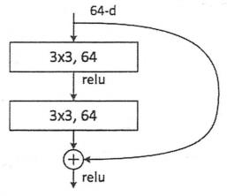

# ResNet

[TOC]

## 1. ResNet概述

### 1.1 常见卷积神经网络


卷积神经网络的发展历史如上所示，在AlexNet进入大众的视野之后，卷积神经网络的作用与实用性得到了广泛的认可，由此，对于卷积神经网络的优化进入了快速发展的阶段，经典的里程碑式的优化思想大致归为四大类：

- 网络加深

> 表现为在卷积神经网络的网络结构方面，在网络结构上增加卷积激活层，使得网络结构越变越深，深层次的网络在训练学习的过程中所考虑的因素就会更多，理论上会更加准确，但是网络的深度要与实际问题相关，在实践中折衷选取，过深过浅都不利于问题的解决。

- 增强卷积模块功能

> 表现为在一个卷积块中对特征提取的方式做出改变（也即变更传统卷积层的结构以获取更多的滤波作用），一般处于对feature map的尺度以及优化计算量的考量。

- 从分类的目标到检测的目标

> 同样利用CNN，但是设计网络的目标从分类的任务变更为了检测任务，检测任务不仅需要对图片中的区域进行特征提取、对结果进行分类，还要通过相关性的信息将目标框框出。

- 增加新的功能单元

> 丰富网络处理某一层输入或者输出的功能，此处的功能单元指传统卷积(Conv)、激活以及全连接、分类器之外的新增功能模块，例如LSTM增加的遗忘门，能够考虑历史数据，增加神经网络的功能。

### 1.2 ResNet提出背景

在ResNet提出之前，卷积神经网络的优化方式往往是通过加深网络的深度，堆叠基本单元，卷积层与池化层越堆积越多，科研工作者们在加深网络深度从而提高网络效果的情况愈演愈烈，学术界普遍认为，卷积层与池化层越多，提取到的图像特征信息越全面，对于分类的拟合度越高，但是随着网络的加深，问题也逐渐暴露出来了：

- 梯度弥散以及梯度爆炸

  > 若每一层的误差梯度小于1，对于深度较深的网络反向转播时会使梯度趋近于0，反而会使得训练的过程难以有效继续。
  >
  > 若每一层的误差梯度大于1，对于深度较深的网络反向传播时会使梯度越来越大，直到“爆炸”（数值极大）

- 结果退化问题

  > 当网络结构深到一定程度之后，对于分类问题的预测差距反而不符合期望，变得越来越差

本文介绍的ResNet卷积神经网络摒弃了一味堆叠卷积层和池化层的方法，并巧妙解决了梯度弥散和梯度爆炸的问题以及结果退化的问题。

## 2. ResNet网络结构

### 2.1 Residual net

**Residual net（残差网络）**



通过上图通俗解释，残差网络即是将前若干层的某一层数据输出直接跳过多层处理模块，直接引入到后面数据层的输入部分。

64维的数据输入到网络之后，一方面经过了卷积层的处理，另一方面跳过了卷积层从而直接与处理过的数据“会和”，这样，经过卷积层处理的数据相当于提取了特征，但是提取特征必然会造成信息的丢失，而未经处理的部分却保留了原始信息，这样做既能够考虑到特征提取不够的问题，又能考虑保留feature map的原始信息。

Residual有两种类型

- 左图残差结构称为BasicBlock
- 右图残差结构称为Bottleneck


### 2.2 残差神经单元

假定某段神经网络的输入是x，期望输出是H(x)，如果我们直接将输入x传到输出作
为初始结果，那么我们需要学习的目标就是F(x) = H(x) - x，这就是一个残差神经单元，相当于将学习目标改变了，不再是学习一个完整的输出H(x)，只是输出和输入的差别 H(x) - x ，即残差。

### 2.3 Shortcut

普通的直连的卷积神经网络和ResNet的最大区别在于，ResNet有很多旁路的支线将输入直接连到后面的层，使得后面的层可以直接学习残差，这种结构也被称为**shortcut**或**skip connections**。


传统的卷积层或全连接层在信息传递时，或多或少会存在信息丢失、损耗等问题。ResNet在某种程度上解决了这个问题，通过直接将输入信息绕道传到输出，保护信息的完整性，整个网络只需要学习输入、输出差别的那一部分，简化了学习目标和难度。

### 2.4 ResNet50网络结构

ResNet50有两个基本的块，分别名为**Conv Block**和**Identity Block**，其中Conv Block输入和输出的维度是不一样的，因为其直接输出一面也采用了一个卷积和一个归一化的BN层，所以不能连续串联，它的作用是改变网络的维度；Identity Block输入维度和输出维度相同，可以串联，用于加深网络的。

由于输出预处理和BN层的引入，解决了梯度弥散和梯度爆炸的问题。

> BN层为Batch Normalization层，此部分的作用在笔者[《CV学习笔记-Inception》](https://blog.csdn.net/qq_38853759/article/details/129112624?spm=1001.2014.3001.5501)中已经详细介绍，此处不再赘述。

由于神经网络的某些层跳过了下一层神经元的连接，隔层相连，这样弱化了每层之间的强联系，Residual结构缓解了退化的问题。

**Conv Block结构**


**Identity Block结构**


**ResNet的网络结构：**

ResNet的网络结构大部分由上面介绍的Conv Block和Identity Block组合构成，在网络的最后接上了平均池化与全连接层，最终输出分类。


## 3. 代码实现

### 3.1 Identity Block

Identity Block的定义实现，完全根据上图中Identity Block的结构定义构造，结构中最经典的就是Conv+BN+Relu的组合拳。

```python
def identity_block(input_tensor, kernel_size, filters, stage, block):

    filters1, filters2, filters3 = filters

    conv_name_base = 'res' + str(stage) + block + '_branch'
    bn_name_base = 'bn' + str(stage) + block + '_branch'

    x = Conv2D(filters1, (1, 1), name=conv_name_base + '2a')(input_tensor)
    x = BatchNormalization(name=bn_name_base + '2a')(x)
    x = Activation('relu')(x)

    x = Conv2D(filters2, kernel_size,padding='same', name=conv_name_base + '2b')(x)

    x = BatchNormalization(name=bn_name_base + '2b')(x)
    x = Activation('relu')(x)

    x = Conv2D(filters3, (1, 1), name=conv_name_base + '2c')(x)
    x = BatchNormalization(name=bn_name_base + '2c')(x)

    x = layers.add([x, input_tensor])
    x = Activation('relu')(x)
    return x
```

### 3.2 Conv Block

Conv Block的定义实现，完全根据上图中Conv Block的结构定义构造，结构中最经典的就是Conv+BN+Relu的组合拳。注意，Conv Block在shortcut的部分多了Conv+BN的操作，此处与Identity Block不同，故`shortcut = Conv2D()`、`shortcut = BatchNormalization()`，在shortcut处理之后，`x = layers.add([x, shortcut])`，对shortcut部分和左边的卷积处理部分进行了整合（加法）。

```python
def conv_block(input_tensor, kernel_size, filters, stage, block, strides=(2, 2)):

    filters1, filters2, filters3 = filters

    conv_name_base = 'res' + str(stage) + block + '_branch'
    bn_name_base = 'bn' + str(stage) + block + '_branch'

    x = Conv2D(filters1, (1, 1), strides=strides,
               name=conv_name_base + '2a')(input_tensor)
    x = BatchNormalization(name=bn_name_base + '2a')(x)
    x = Activation('relu')(x)

    x = Conv2D(filters2, kernel_size, padding='same',
               name=conv_name_base + '2b')(x)
    x = BatchNormalization(name=bn_name_base + '2b')(x)
    x = Activation('relu')(x)

    x = Conv2D(filters3, (1, 1), name=conv_name_base + '2c')(x)
    x = BatchNormalization(name=bn_name_base + '2c')(x)

    shortcut = Conv2D(filters3, (1, 1), strides=strides,
                      name=conv_name_base + '1')(input_tensor)
    shortcut = BatchNormalization(name=bn_name_base + '1')(shortcut)

    x = layers.add([x, shortcut])
    x = Activation('relu')(x)
    return x

```

### 3.3 ResNet网络定义

```python
def ResNet50(input_shape=[224,224,3],classes=1000):

    img_input = Input(shape=input_shape)
    x = ZeroPadding2D((3, 3))(img_input)

    x = Conv2D(64, (7, 7), strides=(2, 2), name='conv1')(x)
    x = BatchNormalization(name='bn_conv1')(x)
    x = Activation('relu')(x)
    x = MaxPooling2D((3, 3), strides=(2, 2))(x)

    x = conv_block(x, 3, [64, 64, 256], stage=2, block='a', strides=(1, 1))
    x = identity_block(x, 3, [64, 64, 256], stage=2, block='b')
    x = identity_block(x, 3, [64, 64, 256], stage=2, block='c')

    x = conv_block(x, 3, [128, 128, 512], stage=3, block='a')
    x = identity_block(x, 3, [128, 128, 512], stage=3, block='b')
    x = identity_block(x, 3, [128, 128, 512], stage=3, block='c')
    x = identity_block(x, 3, [128, 128, 512], stage=3, block='d')

    x = conv_block(x, 3, [256, 256, 1024], stage=4, block='a')
    x = identity_block(x, 3, [256, 256, 1024], stage=4, block='b')
    x = identity_block(x, 3, [256, 256, 1024], stage=4, block='c')
    x = identity_block(x, 3, [256, 256, 1024], stage=4, block='d')
    x = identity_block(x, 3, [256, 256, 1024], stage=4, block='e')
    x = identity_block(x, 3, [256, 256, 1024], stage=4, block='f')

    x = conv_block(x, 3, [512, 512, 2048], stage=5, block='a')
    x = identity_block(x, 3, [512, 512, 2048], stage=5, block='b')
    x = identity_block(x, 3, [512, 512, 2048], stage=5, block='c')

    x = AveragePooling2D((7, 7), name='avg_pool')(x)

    x = Flatten()(x)
    x = Dense(classes, activation='softmax', name='fc1000')(x)

    model = Model(img_input, x, name='resnet50')

    model.load_weights("resnet50_weights_tf_dim_ordering_tf_kernels.h5")

    return model
```

### 3.4 整体代码测试

本主程序使用ResNet50加载模型对美洲象的图片进行了预测输出：


```python
#-------------------------------------------------------------#
#   ResNet50的网络部分
#-------------------------------------------------------------#
from __future__ import print_function

import numpy as np
from keras import layers

from keras.layers import Input
from keras.layers import Dense,Conv2D,MaxPooling2D,ZeroPadding2D,AveragePooling2D
from keras.layers import Activation,BatchNormalization,Flatten
from keras.models import Model

# from keras.preprocessing import image
from keras.utils import image_utils as image
import keras.backend as K
from keras.utils.data_utils import get_file
from keras.applications.imagenet_utils import decode_predictions
from keras.applications.imagenet_utils import preprocess_input


def identity_block(input_tensor, kernel_size, filters, stage, block):

    filters1, filters2, filters3 = filters

    conv_name_base = 'res' + str(stage) + block + '_branch'
    bn_name_base = 'bn' + str(stage) + block + '_branch'

    x = Conv2D(filters1, (1, 1), name=conv_name_base + '2a')(input_tensor)
    x = BatchNormalization(name=bn_name_base + '2a')(x)
    x = Activation('relu')(x)

    x = Conv2D(filters2, kernel_size,padding='same', name=conv_name_base + '2b')(x)

    x = BatchNormalization(name=bn_name_base + '2b')(x)
    x = Activation('relu')(x)

    x = Conv2D(filters3, (1, 1), name=conv_name_base + '2c')(x)
    x = BatchNormalization(name=bn_name_base + '2c')(x)

    x = layers.add([x, input_tensor])
    x = Activation('relu')(x)
    return x


def conv_block(input_tensor, kernel_size, filters, stage, block, strides=(2, 2)):

    filters1, filters2, filters3 = filters

    conv_name_base = 'res' + str(stage) + block + '_branch'
    bn_name_base = 'bn' + str(stage) + block + '_branch'

    x = Conv2D(filters1, (1, 1), strides=strides,
               name=conv_name_base + '2a')(input_tensor)
    x = BatchNormalization(name=bn_name_base + '2a')(x)
    x = Activation('relu')(x)

    x = Conv2D(filters2, kernel_size, padding='same',
               name=conv_name_base + '2b')(x)
    x = BatchNormalization(name=bn_name_base + '2b')(x)
    x = Activation('relu')(x)

    x = Conv2D(filters3, (1, 1), name=conv_name_base + '2c')(x)
    x = BatchNormalization(name=bn_name_base + '2c')(x)

    shortcut = Conv2D(filters3, (1, 1), strides=strides,
                      name=conv_name_base + '1')(input_tensor)
    shortcut = BatchNormalization(name=bn_name_base + '1')(shortcut)

    x = layers.add([x, shortcut])
    x = Activation('relu')(x)
    return x


def ResNet50(input_shape=[224,224,3],classes=1000):

    img_input = Input(shape=input_shape)
    x = ZeroPadding2D((3, 3))(img_input)

    x = Conv2D(64, (7, 7), strides=(2, 2), name='conv1')(x)
    x = BatchNormalization(name='bn_conv1')(x)
    x = Activation('relu')(x)
    x = MaxPooling2D((3, 3), strides=(2, 2))(x)

    x = conv_block(x, 3, [64, 64, 256], stage=2, block='a', strides=(1, 1))
    x = identity_block(x, 3, [64, 64, 256], stage=2, block='b')
    x = identity_block(x, 3, [64, 64, 256], stage=2, block='c')

    x = conv_block(x, 3, [128, 128, 512], stage=3, block='a')
    x = identity_block(x, 3, [128, 128, 512], stage=3, block='b')
    x = identity_block(x, 3, [128, 128, 512], stage=3, block='c')
    x = identity_block(x, 3, [128, 128, 512], stage=3, block='d')

    x = conv_block(x, 3, [256, 256, 1024], stage=4, block='a')
    x = identity_block(x, 3, [256, 256, 1024], stage=4, block='b')
    x = identity_block(x, 3, [256, 256, 1024], stage=4, block='c')
    x = identity_block(x, 3, [256, 256, 1024], stage=4, block='d')
    x = identity_block(x, 3, [256, 256, 1024], stage=4, block='e')
    x = identity_block(x, 3, [256, 256, 1024], stage=4, block='f')

    x = conv_block(x, 3, [512, 512, 2048], stage=5, block='a')
    x = identity_block(x, 3, [512, 512, 2048], stage=5, block='b')
    x = identity_block(x, 3, [512, 512, 2048], stage=5, block='c')

    x = AveragePooling2D((7, 7), name='avg_pool')(x)

    x = Flatten()(x)
    x = Dense(classes, activation='softmax', name='fc1000')(x)

    model = Model(img_input, x, name='resnet50')

    model.load_weights("resnet50_weights_tf_dim_ordering_tf_kernels.h5")

    return model

if __name__ == '__main__':
    model = ResNet50()
    model.summary()
    img_path = 'elephant.jpg'
    # img_path = 'bike.jpg'
    img = image.load_img(img_path, target_size=(224, 224))
    x = image.img_to_array(img)
    x = np.expand_dims(x, axis=0)
    x = preprocess_input(x)

    print('Input image shape:', x.shape)
    preds = model.predict(x)
    print('Predicted:', decode_predictions(preds))

```

**测试结果：**


