# Faster R-CNN

[TOC]

## 1. 目标检测算法

### 1.1 计算机视觉有五大应用

- 图像分类

  > 主要工具：图像分类架构-卷积神经网络（CNN）、卷积、Relu、Pool等

- 目标检测

  > 主要工具：R-CNN

- 目标跟踪

- 语义分割

  > 主要工具：FCN

- 实例分割

  > 主要工具：Mask-R-CNN

### 1.2 目标检测任务

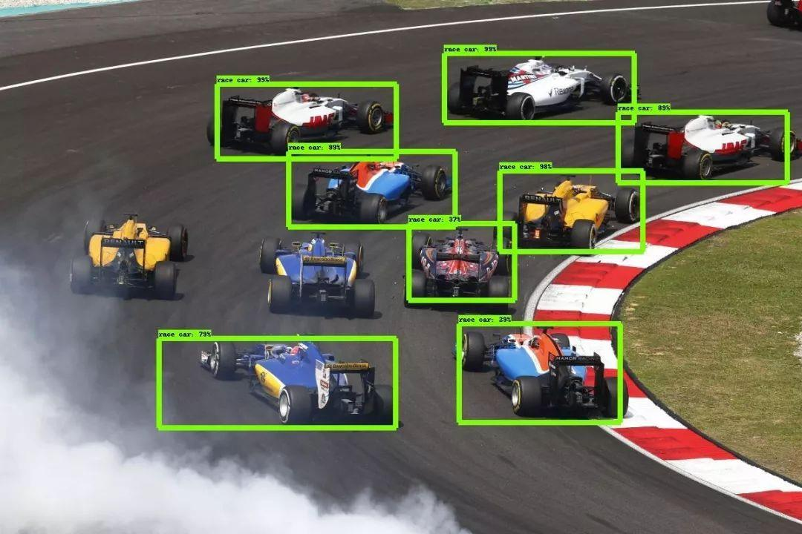

**目标检测与传统分类任务的区别：**

&emsp;&emsp;物体识别分类是提取图片的特征，分辨出图片中有什么物体，是哪一类物体，输入是图片，输出是类别标签和概率；目标检测算法不仅要识别图片中有什么物体，物体是哪一类，还要输出物体的外框`(x, y, width, height)`来表达物体在图像中的位置。

&emsp;&emsp;目标检测（Object Detection），就是在给定的图片中定位目标的位置，同时也做传统分类的任务，标注出目标的类别和概率信息。那么目标检测所要解决的问题就是目标在哪里以及目标是什么一整个完整流程的问题。

**目标检测的难点：**

&emsp;&emsp;物体的尺寸变化范围很大，摆放物体的角度，姿态不定，而且可以出现在图片的任何地方，更何况物体还可以是多个类别。

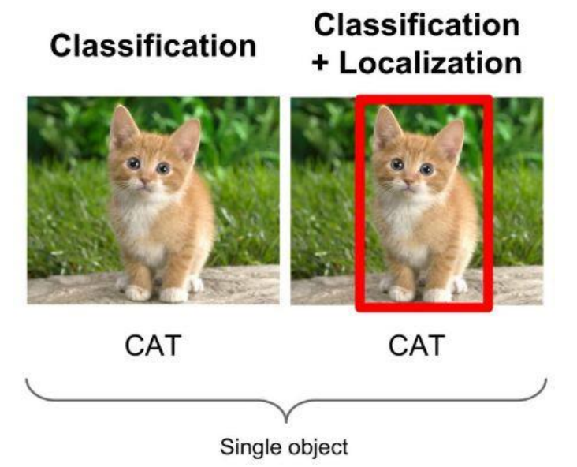

### 1.3 目标检测算法概述

**传统目标检测方式：** Cascade + HOG/DPM + Haar/SVM以及上述方法的诸多改进、优化；

> 此类方法使用级联和哈尔分类器、SVM等统计学相关的模型进行目标检测任务的完成，并未涉及深度学习方法。

**深度学习分类：**通过提取候选区域，并对相应区域进行以深度学习方法为主的
分类的方案

- R-CNN（Selective Search + CNN + SVM）
- SPP-net（ROI Pooling）
- Fast R-CNN（Selective Search + CNN + ROI）
- Faster R-CNN（RPN + CNN + ROI）

**基于深度学习的回归方法：**YOLO/SSD 等方法

## 2. 边框回归（Bounding-Box regression）

### 2.1 IoU

&emsp;&emsp;IoU（Intersection over Union），称为交并比，其为一种测量在特定数据集中检测相应物体准确度的一个标准。

> IoU是一个简单的测量标准，只要是在输出中得出一个预测范围(bounding boxex)的任务都可以用IoU来进行测量。

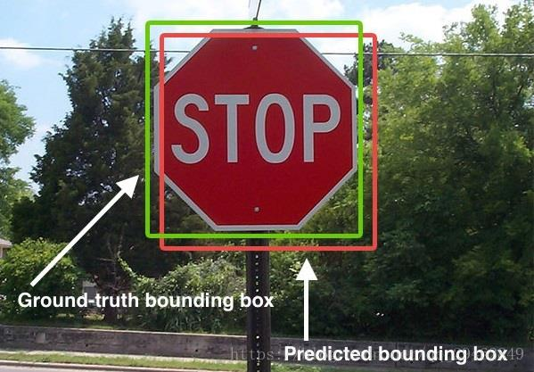

&emsp;&emsp;交并比顾名思义即预测的图形（在目标检测中体现为一个框，上图中的红框）面积与真实区域图形（在目标检测中体现为一个框，上图中的绿框）面积的共同相交部分与并集部分的比值
$$
IoU=\frac{S_{交}}{S_{并}}
$$


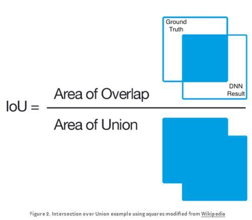

**例子：**

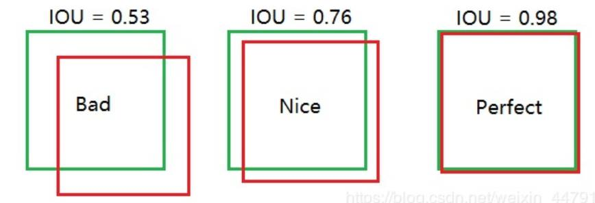

### 2.2 统计学中的指标

**TP TN FP FN**

&emsp;&emsp;TP TN FP FN里面一共出现了4个字母，分别是T F P N。
&emsp;&emsp;T是True；
&emsp;&emsp;F是False；
&emsp;&emsp;P是Positive；
&emsp;&emsp;N是Negative。
&emsp;&emsp;T或者F代表的是该样本 是否被正确分类。
&emsp;&emsp;P或者N代表的是该样本 原本是正样本还是负样本。
&emsp;&emsp;TP（True Positives）意思就是被分为了正样本，而且分对了。
&emsp;&emsp;TN（True Negatives）意思就是被分为了负样本，而且分对了，
&emsp;&emsp;FP（False Positives）意思就是被分为了正样本，但是分错了（事实上这个样本是负样本）。
&emsp;&emsp;FN（False Negatives）意思就是被分为了负样本，但是分错了（事实上这个样本是正样本）。
&emsp;&emsp;在mAP计算的过程中主要用到了，TP、FP、FN这三个概念。

> mAP其中代表P（Precision）精确率。AP（Average precision）单类标签平均（各个召回率中最大精确率的平均数）的精确率，mAP(Mean Average Precision)所有类标签的平均精确率。

**precision（精确度）和recall（召回率）**
$$
Precision=\frac{TP}{TP+FP}
$$

> TP是分类器认为是正样本而且确实是正样本的例子，FP是分类器认为是正样本但实际上不是正样本的例子，Precision翻译成中文就是“分类器认为是正类并且确实是正类的部分占所有分类器认为是正类的比例”。

$$
Recall=\frac{TP}{TP+FN}
$$

> TP是分类器认为是正样本而且确实是正样本的例子，FN是分类器认为是负样本但实际上不是负样本的例子，Recall翻译成中文就是“分类器认为是正类并且确实是正类的部分占所有确实是正类的比例”。

&emsp;&emsp;使用通俗的话说，精准度就是找的对，而召回率就是找的全

**在目标检测中的用途**

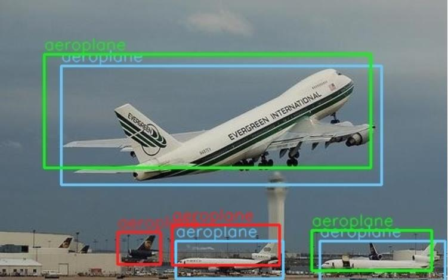

&emsp;&emsp;蓝色的框是真实框。绿色和红色的框是预测框，绿色的框是正样本，红色的框是负样本。一般来讲，当预测框和真实框IOU>=0.5时，被认为是正样本。

### 2.3 边框回归

&emsp;&emsp;首先要解释一个“框”是如何表达的

&emsp;&emsp;一个框一般使用一个四维向量$(x,y,w,h)$表示，分别代表了框的中心点坐标$(x,y)$和宽度$w$以及高度$h$。

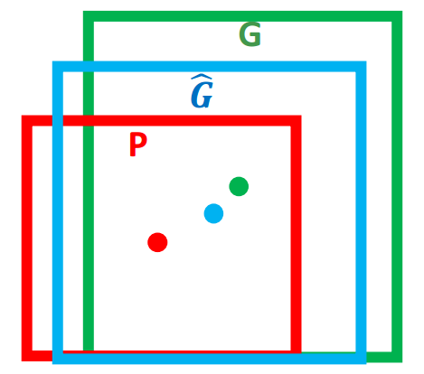

&emsp;&emsp;如上图所示，红色的框P代表了最开始的Proposal（推荐框），而绿色的框G代表了目标Ground Truth（真实框），边框回归的目的是寻找一种映射关系使得P在经过映射后可以得到更接近G的$\hat{G}$。

&emsp;&emsp;即给定$(P_x,P_y,P_w,P_h)$，求映射$f(\cdot)$，使得
$$
f(P_x,P_y,P_w,P_h)=(\hat{G}_x,\hat{G}_y,\hat{G}_w,\hat{G}_h)\quad \quad and\\
(\hat{G}_x,\hat{G}_y,\hat{G}_w,\hat{G}_h)\approx(G_x,G_y,G_w,G_h)
$$


&emsp;&emsp;边框回归通俗来讲就是通过每一次的迭代，将每次产生的边框“修正”，让其渐渐接近正确的框（Groud Truth）。边框的“修正”过程就是边框位置的调动，对于边框的调动，无非就是平移+尺度放缩，平移可以调整框的位置，让其重心不断接近正确框，而尺度的缩放可以调整框的大小，使框的尺寸大小接近真实框的大小。

- 平移$(\Delta x,\Delta y)$
  $\Delta x=P_wd_x(P),\Delta y=P_hd_y(P)$
  $$
  \hat{G}_x=P_wd_x(P)+P_x\\
  \hat{G}_y=P_hd_y(P)+P_y
  $$
  
- 尺度放缩$(S_w,S_h)$
  $S_w=exp(d_w(P)),S_h=exp(d_h(P))$
  $$
  \hat{G}_w=P_wexp(d_w(P))\\
  \hat{G}_h=P_hexp(d_h(P))
  $$

## 3. Faster-RCNN网络

&emsp;&emsp;Faster-RCNN的网络结构如下图所示，其看起来结构复杂，我们拆成4个模块来进行介绍。

- Conv layers
- Region Proposal Network（RPN）
- Roi Pooling
- Classification

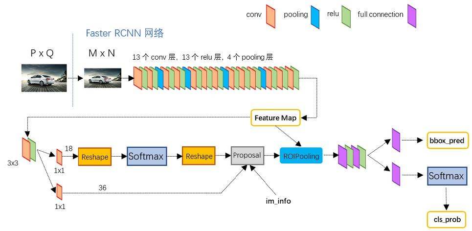

### 3.1 Conv layers

&emsp;&emsp;作为一种卷积神经网络的目标检测方法，Faster-RCNN首先使用一套基conv+relu+pooling层组合拳提取图像的feature maps。该feature maps被共享用于后续RPN层和FC层。

&emsp;&emsp;Conv layers包含了conv，pooling，relu三种层。共有13个conv层，13个relu层，4个pooling层。
在Conv layers中：

- 所有的conv层都是：kernel_size=3，padding=1，stride=1

- 所有的pooling层都是：kernel_size=2，padding=1，stride=2

&emsp;&emsp;在Faster-RCNN Conv layers中对所有的卷积都做了padding处理（ padding=1，即填充一圈0），导致原图变为 (M+2)x(N+2)大小，再做3x3卷积后输出MxN 。正是这种设置，导致Conv layers中的conv层不改变输入和输出矩阵大小。

&emsp;&emsp;这样每个经过pooling层的MxN矩阵，都会变为$(\frac{M}{2}\times\frac{N}{2})$大小。
综上所述，在整个Conv layers中，conv和relu层不改变输入输出大小，只有pooling层使输出长宽都变为输入的$\frac{1}{2}$。
&emsp;&emsp;那么，一个MxN大小的矩阵经过Conv layers固定变为$\frac{M}{16}\times\frac{N}{16}$。这样Conv layers生成的feature map都可以和原图对应起来。

> 读者可以自己通过公式计算，这是一种典型的对齐输入输出的方式

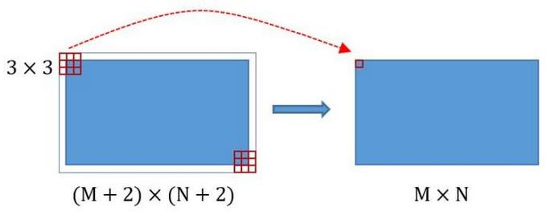

### 3.2 Region Proposal Network（RPN）

&emsp;&emsp;RPN网络用于生成region proposals。通过softmax判断anchors属于positive或者negative，再利用bounding box regression修正anchors获得精确的proposals。

> positive代表是有积极作用的框，应该被保留，negative代表是否定框，应该被剔除。

Region Proposal Network（区域生成网络）

&emsp;&emsp;经典的检测方法生成检测框都非常耗时。直接使用RPN生成检测框，是Faster R-CNN的巨大优势，能极大提升检测框的生成速度。

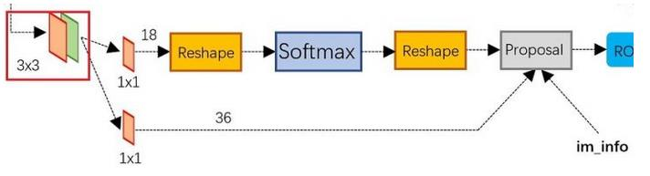

&emsp;&emsp;可以看到RPN网络实际分为2条线：

- 上面一条通过softmax分类anchors，获得positive和negative分类；
- 下面一条用于计算对于anchors的bounding box regression偏移量，以获得精确的proposal。

&emsp;&emsp;而最后的Proposal层则负责综合positive anchors和对应bounding box regression偏移量获取proposals，同时剔除太小和超出边界的proposals。

&emsp;&emsp;其实整个网络到了Proposal Layer这里，就完成了相当于目标定位的功能。

**anchors的构成**

&emsp;&emsp;RPN网络在卷积后，对每个像素点，上采样映射到原始图像一个区域，找到这
个区域的中心位置，然后基于这个中心位置按规则选取9种anchor box。

&emsp;&emsp;9个矩形共有3种面积：128,256,512; 3种形状：长宽比大约为1:1, 1:2, 2:1。(不是固定比例，可调)

&emsp;&emsp;每行的4个值表示矩形左上和右下角点坐标。

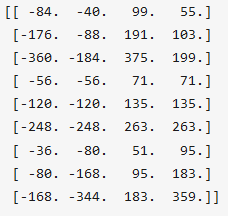

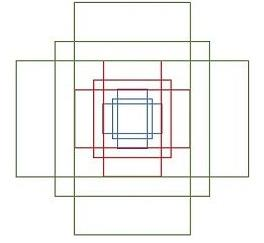

&emsp;&emsp;遍历Conv layers获得的feature map，为feature maop中的每一个点位都设置这9种anchors作为初始的检测框。

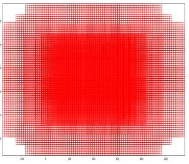

**softmax判定postive与negative anchors 的方式：**

&emsp;&emsp;我们将RPN部分分成上下两个部分来分析：

&emsp;&emsp;RPN的上半部分如下图所示，RPN是在原图尺度上，在每个像素点上置了密密麻麻的候选Anchor。然后用卷积神经网络去判断哪些Anchor是里面有目标的positive anchor，哪些是没目标的negative anchor。所以softmax在此处的作用并没有什么不同，就是个二分类器。

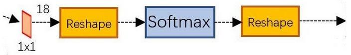

&emsp;&emsp;conv的输出通道为18，也就是经过该卷积的输出图像为$W\times H\times18$大小。
这也就刚好对应了feature map中每一个数据点位都有9个anchors，同时每个anchors又有可能是positive和negative，所有这些信息都保存在$W\times H\times(9\times2)$大小的矩阵。在后面接softmax分类器获得positive anchors，也就相当于初步提取了检测目标候选区域box（一般认为目标在positive anchors中）。

&emsp;&emsp;在softmax前后都接一个reshape layer其实只是为了便于softmax分类。前面的positive/negative anchors的矩阵，其在caffe中的存储形式为$[1, 18, H, W]$。而在softmax分类时需要进行positive/negative二分类，所以reshape layer会将其变为$[1, 2, 9\times H, W]$大小，即单独“腾空”出来一个维度以便softmax分类，之后再reshape回复原状。

&emsp;&emsp;**RPN网络实际上就是通过对anchors的处理和softmax的分类提取出positive anchors作为后续处理的候选区域。**

&emsp;&emsp;RPN的下半部分如下图所示，这部分的作用主要是对推荐框（proposals）进行**边框回归（bounding box regression）**

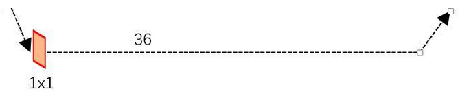

&emsp;&emsp;conv的输出通道为36，即经过该卷积输出图像为$W\times H\times36$。这里相当于feature maps每个点都有9个anchors，每个anchors又都有4个用于回归的变换量：
$$
[d_x(A),d_y(A),d_w(A),d_h(A)]
$$
&emsp;&emsp;在RPN的结构上下分支处理完之后，共同经过了Proposal Layer，如下图部分：

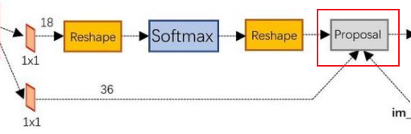

&emsp;&emsp;Proposal Layer的功能是综合所有变换量和positive anchors，进一步计算出精准的proposal anchor，送入后续RoI Pooling Layer进行后续处理。其输入包括：

- positive vs negative anchors分类器结果rpn_cls_prob_reshape
-  对应的bbox reg的变换量rpn_bbox_pred
-  im_info
- 参数feature_stride=16

> im_info对于一副任意大小PxQ图像，传入Faster RCNN前首先reshape到固定$M\times N$，$im_info=[M,N,scale\_factor]$则保存了此次缩放的所有信息。
> 输入图像经过Conv Layers，经过4次pooling变为$W\times H=\frac{M}{16}\times \frac{N}{16}$大小，其中feature_stride=16则保存了该信息，用于计算anchor偏移量。

Proposal Layer的处理步骤

- 根据变换量$[d_x(A),d_y(A),d_w(A),d_h(A)]$对所有的anchors进行边框回归。
- 将anchors根据输入的positive softmax scores降序排序，取前pre_nms_topN(e.g. 6000)个anchors，即提取修正位置后的positive anchors。
- 剔除尺寸非常小的positive anchors。
- 对剩余的positive anchors进行NMS（non-maximum suppression 非极大值抑制）。
- 输出proposal推荐框。

**RPN网络的总结：**

1. 生成anchors
2. 使用softmax提取positive anchors
3. 边框回归调整positive anchors
4. Proposal Layer生成proposals

### 3.3 Roi Pooling

&emsp;&emsp;该层收集输入的feature maps和proposals，综合这些信息后提取proposal feature maps，送入后续全连接层判定目标类别。

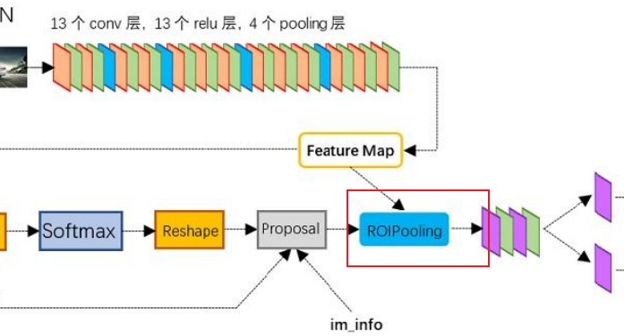

&emsp;&emsp;RoI pooling层的输入分为两个来源，从图中也可以看出

- 来自于Conv层提取特征后的feature map
- 上述的RPN最终输出的proposal boxes（推荐框，注意，其包含大小不一）

**RoI pooling的必要性：**

&emsp;&emsp;对于传统的卷积神经网络，限定了输入图像的尺寸，同时网络输出也是固定大小的vector or matrix。如果输入图像尺寸大小不定，则会难以处理。对于这个问题，一般有两种处理方式：

1. 裁剪（左图）
2. wrap（右图）

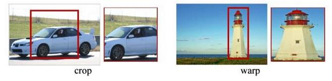

&emsp;&emsp;裁剪的方式总是破坏图像的完整结构，而warp会破坏图像的原始信息，例如右图中的灯塔明显有拉伸感。

**RoI Pooling的处理方式：**

- 由于proposal是对应M*N尺度的，所以首先使用spatial_scale参数（采用典型值$\frac{1}{16}$）将其映射回$(\frac{M}{16}\times \frac{N}{16})$大小的feature map尺度；
- 再将每个proposal对应的feature map区域水平分为pooled_w * pooled_h的网格；
  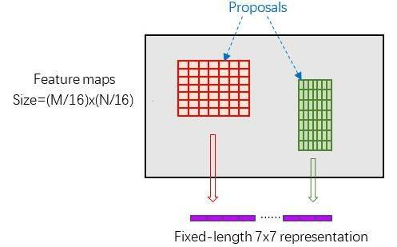
- 对网格的每一份都进行max pooling处理。

&emsp;&emsp;经过这样的方式处理之后即使大小不同的proposal输出结果都是pooled_w * pooled_h固定大小，实现了固定长度输出。

### 3.4 Classification

&emsp;&emsp;利用proposal feature maps计算proposal的类别，同时再次bounding box regression获得检测框最终的精确位置。

&emsp;&emsp;Classification部分利用前面步骤所得的proposal feature maps，通过FC层与softmax计算每个proposal具体属于那个类别（如人，车，电视等），输出cls_prob概率向量；同时再次利用边框回归（bounding box regression）获得每个推荐框（proposal box）的位置偏移量bbox_pred，用于回归更加精确的目标检测框。

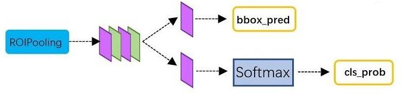

&emsp;&emsp;RoI Pooling处理后的proposal 的 feature map之后走了两个分支，上面分支进行bounding box regression，使得proposal box更加精确；另外一个分支是通过全连接和softmax对proposal推荐框进行分类，这里体现的就是识别的作用。

**InnerProduct layers全连接层**
$$
\begin{pmatrix}
x_1&x_2&x_3
\end{pmatrix}
\begin{pmatrix}
w_{11}&w_{12}\\w_{21}&w_{22}\\w_{31}&w_{32}
\end{pmatrix}+
\begin{pmatrix}
b_1&b_2
\end{pmatrix}=
\begin{pmatrix}
y_1&y_2
\end{pmatrix}
$$
&emsp;&emsp;全连接层的输入X和输出Y都是固定大小，故而RoI Pooling的必要性就体现在它为了它在输入softmax之前就已经将输入的尺寸固定了。

**目标检测的速度对比图：**

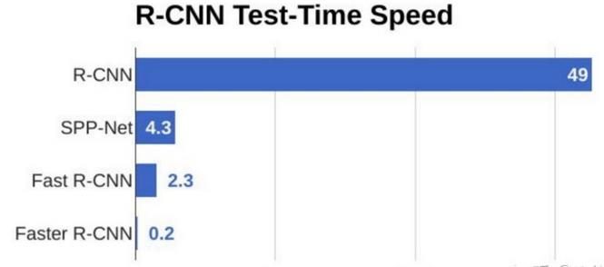

## 4. 代码实践

&emsp;&emsp;以下为基于keras的实现方案，主要体现编程思路，整个工程有时间放到资源区。

```python
import cv2
import keras
import numpy as np
import colorsys
import pickle
import os
import nets.frcnn as frcnn
from nets.frcnn_training import get_new_img_size
from keras import backend as K
from keras.layers import Input
from keras.applications.imagenet_utils import preprocess_input
from PIL import Image,ImageFont, ImageDraw
from utils.utils import BBoxUtility
from utils.anchors import get_anchors
from utils.config import Config
import copy
import math
class FRCNN(object):
    _defaults = {
        "model_path": 'model_data/voc_weights.h5',
        "classes_path": 'model_data/voc_classes.txt',
        "confidence": 0.7,
    }

    @classmethod
    def get_defaults(cls, n):
        if n in cls._defaults:
            return cls._defaults[n]
        else:
            return "Unrecognized attribute name '" + n + "'"

    #---------------------------------------------------#
    #   初始化faster RCNN
    #---------------------------------------------------#
    def __init__(self, **kwargs):
        self.__dict__.update(self._defaults)
        self.class_names = self._get_class()
        self.sess = K.get_session()
        self.config = Config()
        self.generate()
        self.bbox_util = BBoxUtility()
    #---------------------------------------------------#
    #   获得所有的分类
    #---------------------------------------------------#
    def _get_class(self):
        classes_path = os.path.expanduser(self.classes_path)
        with open(classes_path) as f:
            class_names = f.readlines()
        class_names = [c.strip() for c in class_names]
        return class_names

    #---------------------------------------------------#
    #   获得所有的分类
    #---------------------------------------------------#
    def generate(self):
        model_path = os.path.expanduser(self.model_path)
        assert model_path.endswith('.h5'), 'Keras model or weights must be a .h5 file.'
        
        # 计算总的种类
        self.num_classes = len(self.class_names)+1

        # 载入模型，如果原来的模型里已经包括了模型结构则直接载入。
        # 否则先构建模型再载入
        self.model_rpn,self.model_classifier = frcnn.get_predict_model(self.config,self.num_classes)
        self.model_rpn.load_weights(self.model_path,by_name=True)
        self.model_classifier.load_weights(self.model_path,by_name=True,skip_mismatch=True)
                
        print('{} model, anchors, and classes loaded.'.format(model_path))

        # 画框设置不同的颜色
        hsv_tuples = [(x / len(self.class_names), 1., 1.)
                      for x in range(len(self.class_names))]
        self.colors = list(map(lambda x: colorsys.hsv_to_rgb(*x), hsv_tuples))
        self.colors = list(
            map(lambda x: (int(x[0] * 255), int(x[1] * 255), int(x[2] * 255)),
                self.colors))
    
    def get_img_output_length(self, width, height):
        def get_output_length(input_length):
            # input_length += 6
            filter_sizes = [7, 3, 1, 1]
            padding = [3,1,0,0]
            stride = 2
            for i in range(4):
                # input_length = (input_length - filter_size + stride) // stride
                input_length = (input_length+2*padding[i]-filter_sizes[i]) // stride + 1
            return input_length
        return get_output_length(width), get_output_length(height) 
    
    #---------------------------------------------------#
    #   检测图片
    #---------------------------------------------------#
    def detect_image(self, image):
        image_shape = np.array(np.shape(image)[0:2])
        old_width = image_shape[1]
        old_height = image_shape[0]
        old_image = copy.deepcopy(image)
        width,height = get_new_img_size(old_width,old_height)


        image = image.resize([width,height])
        photo = np.array(image,dtype = np.float64)

        # 图片预处理，归一化
        photo = preprocess_input(np.expand_dims(photo,0))
        preds = self.model_rpn.predict(photo)
        # 将预测结果进行解码
        anchors = get_anchors(self.get_img_output_length(width,height),width,height)

        rpn_results = self.bbox_util.detection_out(preds,anchors,1,confidence_threshold=0)
        R = rpn_results[0][:, 2:]
        
        R[:,0] = np.array(np.round(R[:, 0]*width/self.config.rpn_stride),dtype=np.int32)
        R[:,1] = np.array(np.round(R[:, 1]*height/self.config.rpn_stride),dtype=np.int32)
        R[:,2] = np.array(np.round(R[:, 2]*width/self.config.rpn_stride),dtype=np.int32)
        R[:,3] = np.array(np.round(R[:, 3]*height/self.config.rpn_stride),dtype=np.int32)
        
        R[:, 2] -= R[:, 0]
        R[:, 3] -= R[:, 1]
        base_layer = preds[2]
        
        delete_line = []
        for i,r in enumerate(R):
            if r[2] < 1 or r[3] < 1:
                delete_line.append(i)
        R = np.delete(R,delete_line,axis=0)
        
        bboxes = []
        probs = []
        labels = []
        for jk in range(R.shape[0]//self.config.num_rois + 1):
            ROIs = np.expand_dims(R[self.config.num_rois*jk:self.config.num_rois*(jk+1), :], axis=0)
            
            if ROIs.shape[1] == 0:
                break

            if jk == R.shape[0]//self.config.num_rois:
                #pad R
                curr_shape = ROIs.shape
                target_shape = (curr_shape[0],self.config.num_rois,curr_shape[2])
                ROIs_padded = np.zeros(target_shape).astype(ROIs.dtype)
                ROIs_padded[:, :curr_shape[1], :] = ROIs
                ROIs_padded[0, curr_shape[1]:, :] = ROIs[0, 0, :]
                ROIs = ROIs_padded
            
            [P_cls, P_regr] = self.model_classifier.predict([base_layer,ROIs])

            for ii in range(P_cls.shape[1]):
                if np.max(P_cls[0, ii, :]) < self.confidence or np.argmax(P_cls[0, ii, :]) == (P_cls.shape[2] - 1):
                    continue

                label = np.argmax(P_cls[0, ii, :])

                (x, y, w, h) = ROIs[0, ii, :]

                cls_num = np.argmax(P_cls[0, ii, :])

                (tx, ty, tw, th) = P_regr[0, ii, 4*cls_num:4*(cls_num+1)]
                tx /= self.config.classifier_regr_std[0]
                ty /= self.config.classifier_regr_std[1]
                tw /= self.config.classifier_regr_std[2]
                th /= self.config.classifier_regr_std[3]

                cx = x + w/2.
                cy = y + h/2.
                cx1 = tx * w + cx
                cy1 = ty * h + cy
                w1 = math.exp(tw) * w
                h1 = math.exp(th) * h

                x1 = cx1 - w1/2.
                y1 = cy1 - h1/2.

                x2 = cx1 + w1/2
                y2 = cy1 + h1/2

                x1 = int(round(x1))
                y1 = int(round(y1))
                x2 = int(round(x2))
                y2 = int(round(y2))

                bboxes.append([x1,y1,x2,y2])
                probs.append(np.max(P_cls[0, ii, :]))
                labels.append(label)

        if len(bboxes)==0:
            return old_image
        
        # 筛选出其中得分高于confidence的框
        labels = np.array(labels)
        probs = np.array(probs)
        boxes = np.array(bboxes,dtype=np.float32)
        boxes[:,0] = boxes[:,0]*self.config.rpn_stride/width
        boxes[:,1] = boxes[:,1]*self.config.rpn_stride/height
        boxes[:,2] = boxes[:,2]*self.config.rpn_stride/width
        boxes[:,3] = boxes[:,3]*self.config.rpn_stride/height
        results = np.array(self.bbox_util.nms_for_out(np.array(labels),np.array(probs),np.array(boxes),self.num_classes-1,0.4))
        
        top_label_indices = results[:,0]
        top_conf = results[:,1]
        boxes = results[:,2:]
        boxes[:,0] = boxes[:,0]*old_width
        boxes[:,1] = boxes[:,1]*old_height
        boxes[:,2] = boxes[:,2]*old_width
        boxes[:,3] = boxes[:,3]*old_height

        font = ImageFont.truetype(font='model_data/simhei.ttf',size=np.floor(3e-2 * np.shape(image)[1] + 0.5).astype('int32'))
        
        thickness = (np.shape(old_image)[0] + np.shape(old_image)[1]) // width
        image = old_image
        for i, c in enumerate(top_label_indices):
            predicted_class = self.class_names[int(c)]
            score = top_conf[i]

            left, top, right, bottom = boxes[i]
            top = top - 5
            left = left - 5
            bottom = bottom + 5
            right = right + 5

            top = max(0, np.floor(top + 0.5).astype('int32'))
            left = max(0, np.floor(left + 0.5).astype('int32'))
            bottom = min(np.shape(image)[0], np.floor(bottom + 0.5).astype('int32'))
            right = min(np.shape(image)[1], np.floor(right + 0.5).astype('int32'))

            # 画框框
            label = '{} {:.2f}'.format(predicted_class, score)
            draw = ImageDraw.Draw(image)
            label_size = draw.textsize(label, font)
            label = label.encode('utf-8')
            print(label)
            
            if top - label_size[1] >= 0:
                text_origin = np.array([left, top - label_size[1]])
            else:
                text_origin = np.array([left, top + 1])

            for i in range(thickness):
                draw.rectangle(
                    [left + i, top + i, right - i, bottom - i],
                    outline=self.colors[int(c)])
            draw.rectangle(
                [tuple(text_origin), tuple(text_origin + label_size)],
                fill=self.colors[int(c)])
            draw.text(text_origin, str(label,'UTF-8'), fill=(0, 0, 0), font=font)
            del draw
        return image

    def close_session(self):
        self.sess.close()

```

