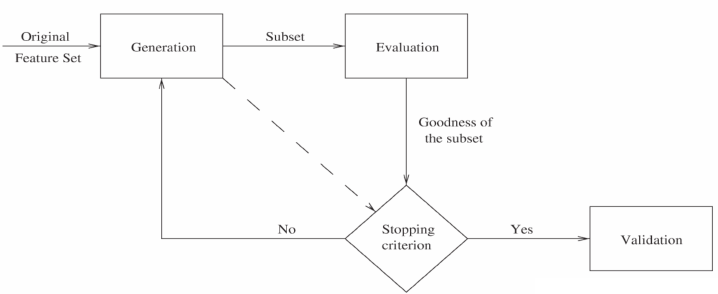

# 特征选择

## 1. 特征概述

*类比显示生活中特征的意义，一只羊的毛稀疏、眼睛大、有角.....，我们可以用羊的特征去表示它，（毛=稀疏，眼睛=大，角=有，......），这样的就属于特征，可以表征一类事物的特点，进而我们可以通过特征来猜测事物之间的不同以及所属类。*

## 2.特征选择的目的

*在现实生活中，一个对象往往具有很多属性（特征），特征可以分为以下三类：*

- **相关特征：** *对于学习任务有帮助，可以提升学习算法的效果；*
- **无关特征：** *对于我们的算法没有任何帮助，不会给算法的效果带来任何提升；*
- **冗余特征：** *不会对算法带来新的信息，或者说这种特征的信息可以由其他的特征推断出。*

> 对于一个特定的算法来说，哪一个特征是有效的属于未知待定的问题，**特征选择** 就是要从所有的特征中选择出对于学习算法有积极作用的特征。

**特征选择的目的：**

- 降维
- 降低学习任务的难度
- 提升模型的效率

## 3.特征选择概述

**定义：**

*从N个特征中选择其中M(M<=N)个子特征，并且在M个子特征中，准则函数可以达到最优解。*

**原则：**

*选择尽可能少的子特征，模型的效果不会显著下降，并且结果的类别分布尽可能地接近真实地类别分布。*

## 4.特征选择的四个过程

- **生成过程：** *生成候选的特征子集；*
- **评价函数：** *评价特征子集的好坏；*
- **停止条件：** *决定什么时候该停止；*
- **验证过程：** *特征子集是否有效；*

### 1. 生成过程

> 生成过程是一个搜索过程，这个过程主要有三种策略：

- **完全搜索：** *根据评价函数做完全搜索。完全搜索主要有两种：穷举搜索和非穷举搜索；*

  1. 广度优先搜索（BFS）：广度优先遍历所有的特征子集进行特征选择；
  2. 主要采用完全搜索和距离度量：完全搜索的过程中每次迭代去掉一个特征，若一个特征使得评价函数的值小于每次迭代设定的限制条件，就删除此特征；
  3. 定向搜索（Beam Search）：主要采用完全搜索策略和误分类率作为评价函数。选择得分最高的特征作为特征子集，加入队列，之后每一轮加入一个特征做子集，将得分高的加入队列；
  4. 最优优先搜索（Best First Search）：和定向搜索类似，但定向搜索限定队列长度，最优优先则不；

- **启发式搜索（简单迅速）：** *根据一些启发式规则在每次迭代时，决定剩下的特征是应该被选择还是被拒绝。*

  	1. 序列前向选择（SFS , Sequential Forward Selection）
   	2. 广义序列前向选择（GSFS ，Generalized Sequential Forward Selection）
   	3. 序列后向选择（SBS , Sequential Backward Selection）
   	4. 广义序列后向选择（GSBS，Generalized Sequential Backward Selection）
   	5. 双向搜索（BDS , Bi-directional Search）
   	6. 增L去R选择算法（LRS , Plus L Minus R Selection）
   	7. 序列浮动选择（Sequential Floating Selection）
   	8. 序列浮动前向选择（SFFS , Sequential Floating Forward Selection）
   	9. 序列浮动后向选择（SFBS , Sequential Floating Backward Selection）
   	10. 决策树算法（DTM , Decision Tree Method）

- **随机搜索：** *每次迭代时会设置一些参数（如最大迭代次数），参数的选择会影响特征选择的效果。*

  ​	LVF（Las Vegas Filter）

### 2. 停止条件

> 停止条件用来决定迭代过程什么时候停止，生成过程和评价函数可能会对于怎么选择停止条件产生影响。停止条件有以下四种选择：

- 达到预设的最大迭代次数；
- 达到预设的最大特征数；
- 增删任何特征不会产生更好的特征子集；
- 根据评价函数，产生最优特征子集；

### 3. 评价函数

> 用以评价选取的特征子集的优劣，**一个最优特征子集一般都是对于一个特定的评价函数来说的。** 评价函数是用来度量一个特征（或者特征子集）可以区分不同类别的能力。

- **过滤式（filter）：** *先进行特征选择，然后去训练学习器，所以特征选择的过程与学习器无关。相当于先对于特征进行过滤操作，然后用特征子集来训练分类器。对每一维的特征“打分”，即给每一维的特征赋予权重，这样的权重就代表着该维特征的重要性，然后依据权重排序。* 
- **包裹式（wrapper）：** *直接把最后要使用的分类器作为特征选择的评价函数，对于特定的分类器选择最优的特征子集。将子集的选择看作是一个搜索寻优问题，生成不同的组合，对组合进行评价，再与其他的组合进行比较。这样就将子集的选择看作是一个优化问题。*
- **嵌入式（embedding）：** *把特征选择的过程与分类器学习的过程融合一起，在学习的过程中进行特征选择。其主要思想是：在模型既定的情况下学习出对提高模型准确性最好的属性。这句话并不是很好理解，其实是讲在确定模型的过程中，挑选出那些对模型的训练有重要意义的属性。*

**常见评价函数：**

- **距离度量：** *若A在不同类别中能产生比B大的差异，则判断A要优于B;*
- **信息度量：** *主要是计算一个特征的信息增益（度量先验不确定性和期望，后验不确定性之间的差异）；*
- **依赖度量：** *主要用来度量从一个变量的值预测另一个变量值的能力。最常见的是相关系
  数：用来发现一个特征和一个类别的相关性。如果 X 和类别的相关性高于 Y与类别的相关
  性，那么X优于Y。对相关系数做一点改变，用来计算两个特征之间的依赖性，值代表着两
  个特征之间的冗余度。*
- **一致性度量：** *对于两个样本，如果它们的类别不同，但是特征值是相同的，那么它们是
  不一致的；否则是一致的。找到与全集具有同样区分能力的最小子集。严重依赖于特定的
  训练集和 最小特征偏见（Min-Feature bias）的用法；找到满足可接受的不一致率（用户
  指定的参数）的最小规模的特征子集。*
- **误分类度量（主要用于Wrapper式的评价方法）：** *使用特定的分类器，利用选择的特
  征子集来预测测试集的类别，用分类器的准确率来作为指标。这种方法准确率很高，但是
  计算开销较大。*

## 4. 特征提取的算法集合

