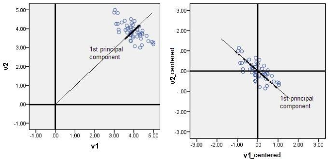
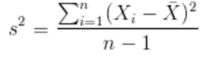
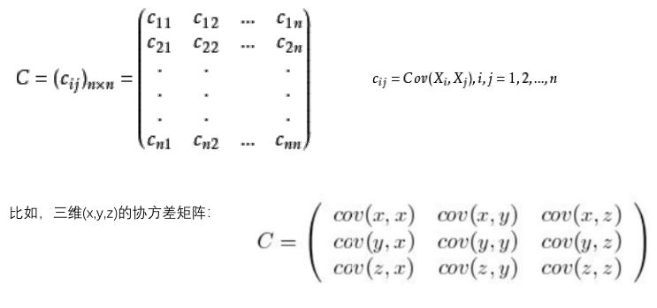
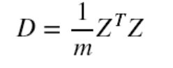
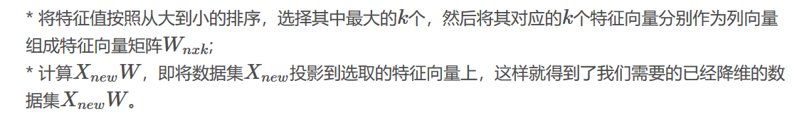
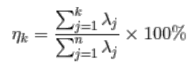

# 特征提取

## 1. 概述

> 图像中常见的特征有边缘、角、区域等。通过各属性间的关系，改变原有的特征空间，例如组合不同的属性得到新的属性，这样的处理叫做特征提取。

*注意**特征选择**是从原始的特征数据集中选择出子集，是一种包含关系，并没有造成原始特征空间的变动，而特征提取不同，这是一个重要的区别点。*

## 2. 主要方法

**特征提取的主要方法：** *主成分分析（PCA）*

**特征提取的主要目的：** *降维，排除信息量小的特征进而减少计算量等。*

## 3. PCA

### 1. PCA算法的实现

> 根据向量的空间变换理论，我们可以把一个三维向量(x1,y1,z1)变换到(x2,y2,z2)，因为我们特征提取后，特征空间发生了变化，假定原本特征空间中的基底为(x,y,z)，新空间的基底为(a,b,c)，若在新的特征空间中，某一维在新基底下的投影都接近于0，可以忽略，那么，我们可以直接用(a,b,c)的降维基底来表示数据（如(x2,y2,z2)在c分量上的投影均接近0，那么(a,b)就可以表示这个特征空间），这样数据就从三维空间降维到了二维空间。

*重点是如何求解新的基底(a,b,c)*

**求解步骤：**

- 对原始数据零均值化（中心化）
- 求协方差矩阵
- 对协方差矩阵求特征向量和特征值，使用这些特征向量组成新的特征空间。

### 2. 零均值化（中心化）

**过程：** *中心化就是将样本集的中心平移到坐标系的原点O上，使得所有数据的中心为(0,0)，即将变量减去它的均值，使均值为0.*

**目的：** *使得样本集的数据中心变为(0,0)，中心化数据之后，计算得到的方向才能比较好的反映原来的数据。*

**降维的几何意义：**

> 对于一组数据，如果其在某一基底方向上的方差越大，则说明点的分布越分散，表明这个方向上所代表的属性（特征）可以越好地反映源空间数据集。所以在降维地时候，主要目的是找到一个超平面能够使得数据点地分布方差呈最大，这样数据表现在新的坐标轴上的时候已经足够分散了。

*方差的定义：*

**PCA算法的优化目标就是：**

- 降维后同一维度的方差最大
- 不同维度之间的相关性为0

### 3. 协方差矩阵的定义

**定义：**

**意义：** *衡量两个属性之间的关系*

`当Cov(X, Y) >(<)(=) 0时，X与Y正(负)(不)相关`

**特点：** 

- 协方差矩阵计算的是不同维度之间的协方差，而不是不同样本之间的。
- 样本矩阵的每一行是一个样本，每列为一个维度，所以样本集要按列计算均值。
- 协方差矩阵的对角线就是各个维度的方差，也即（Cov(X,X) = D(X)）

**特别地**，数据中心化后的协方差矩阵，也即中心化矩阵的协方差矩阵公式：

### 4.对协方差矩阵求特征值与特征矩阵

*其实对于特征值与特征向量的求法，在大学数学中已经是一个很熟练通用的方法了，那么它在图像中到底有何种意义呢？*

**特征向量：** *即为对于图像矩阵做特征值分解后在图像中提取的特征。*

**特征值：** *其对应的特征（特征向量）在图像中的重要程度。*

> 对数字图像矩阵做特征值分解，其实是在提取这个图像的特征，提取出来的向量即为特征向量，而对应的特征值就是这个特征在图像中的重要程度。在线性代数中，一个矩阵就是一个线性变换，向量在通常情况下做一个随机的线性变换后会变得与变换前的向量失去通常意义上可见关系，特征向量在使用原始矩阵做线性变换后，与变换前的特征向量仅仅是有了倍乘关系，也就是说，特征向量在原始矩阵的变换下仍然“保持原样”，那么这些向量（特征向量）就可以作为矩阵的核心代表了。所以，一个矩阵（线性变换）可以由其特征值和特征向量完全表述，这是因为从数学上看，这个矩阵的所有特征向量组成了这个向量空间的一组基底，而矩阵作为变换的本质其实就是把一个基底下的东西变换到另一个基底表示的空间中。

**举例：**

*比如一个100x100的图像矩阵A分解之后，会得到一个100x100的特征向量组成的矩阵Q，以及一个100x100的只有对角线上的元素不为0的矩阵E，这个矩阵E对角线上的元素就是特征值，而且还是按照从大到小排列的（取模，对于单个数来说，其实就是取绝对值），也就是说这个图像A提取出来了100个特征，这100个特征的重要性由100个数字来表示，这100个数字存放在对角矩阵E中。*

### 5. 对特征值进行排序

**方法：**

**评价模型的好坏，K值的确定：**

*通过特征值的计算我们可以得到主成分所占的百分比，用来衡量模型的好坏。*

*对于前K个特征值所保留的信息量计算方法如下：*

### 6. PCA算法优缺点

**优点：**

- 完全无参数限制。在PCA的计算过程中完全不需要认为的设定参数或是根据任何经验模型对计算进行干预，最后的结果只与数据相关，与用户是独立的。
- 用PCA技术可以对数据进行降维，同时对新求出的“主元”向量的重要性进行排序，根据需要取前面最重要的部分，将后面的维数省去，可以达到降维从而简化模型或是对数据进行压缩的效果。同时最大程度地保持了原有数据地信息。
- 各主成分之间正交，可消除原始数据成分之间的相互影响。
- 计算方法简单，易于在计算机上实现。

**缺点：**

- 如果用户对观测对象有一定的先验知识，掌握了数据的一些特征，却无法通过参数化等方法对处理过程进行干预，可能会得不到预期的效果，效率也不高。
- 贡献率小的主成分往往可能含有对样本差异的重要信息。
