# 边缘提取

## 1.概述

### 1.边缘

**定义：** *图像的边缘是指图像局部区域亮度变化显著的部分，该区域的灰度剖面一般可以看作是一个阶跃，即从一个灰度值在很小的缓冲区域内急剧变化到另一个灰度相差较大的灰度值。*

**特点：** *边缘有正负之分，由暗到亮为正，由亮到暗为负。*

**求边缘幅度的算法：** *sobel、Roberts、prewitt、Laplacian、Canny算子* **(Canny算子的效果优于其他，但较为复杂)**

### 2. 边缘提取的定义

> 边缘检测主要是图像的灰度变化的度量、检测和定位

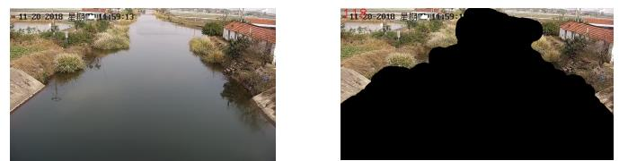

### 3. 边缘提取的应用

例如语义分割、实例分割

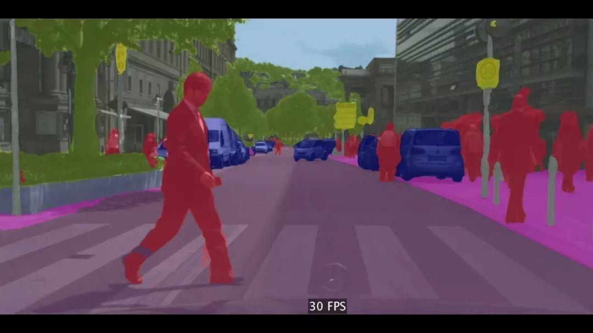

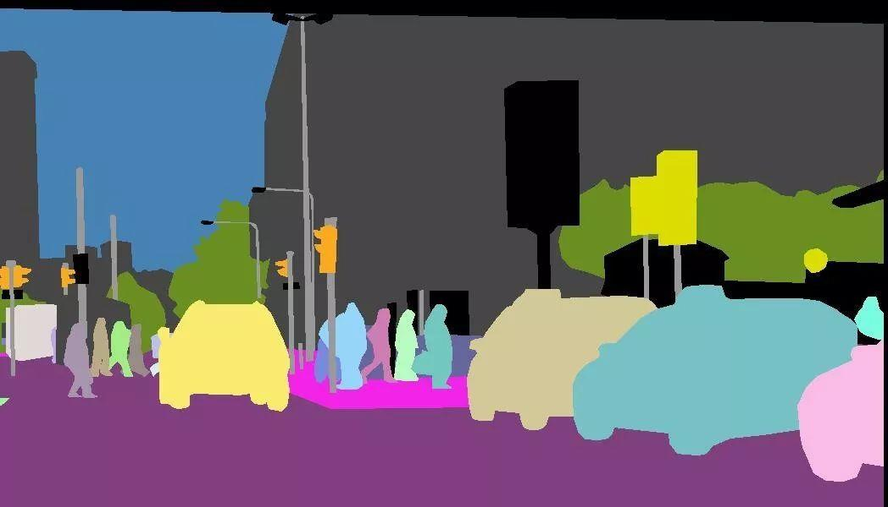

## 2.原理

### 1. 高频&低频信号

> 图像中的低频和高频信号也称为低频分量和高频分量。高频分量在图像意义上指图像强度（亮度/灰度）变化剧烈的地方，也就是边缘（轮廓）；图像中的低频分量在图像的意义上指图像强度（亮度/灰度）变化平缓的地方，特点是大片色块的区域。

*注：人眼对于高频信号的区域更为敏感*

### 2. 边缘检测的原理和步骤

**原理：** *在边缘部分，像素值出现”跳跃“或者较大的变化。如果在此边缘部分求一阶导数，就会看到极值的出现，而在一阶导数为极值的地方，二阶导数为0，基于这个原理，就可以进行边缘检测。而在图像中，属于二维空间，二维空间下需要在两个方向求导，可以通过定位梯度值大于邻域的像素的方法寻找极值（或者推广到大于一个阈值）。*

## 3. 常用滤波算子

- **图像锐化：** *（拉普拉斯变换核函数），图像锐化是补偿图像的轮廓，增强图像的边缘及灰度跳变的部分，使图像变得清晰。图像锐化是为了突出图像上的物的边缘、轮廓、或某些线性目标要素的特征。这种滤波方法提高了物边缘与周围像元之间的反差，因此也被称为边缘增强。*

  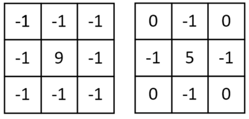

- **图像平滑：** *图像平滑指用于突出图像的宽大区域、低频成分、主干成分或抑制图像噪声和干扰高频成分的图像处理方法，目的是使图像亮度平缓渐变，减小突变梯度，改善图像质量。*

- **Sobel算子：** 

  **定义：** *包含两组3\*3的矩阵，分别为横向及纵向模板，将之与图像做平面卷积，即可分别得出横向及纵向的亮度差分近似值。实际使用中，常用如下两个模板来检测图像边缘：*

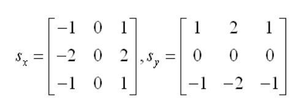

​	**优点：** *Sobel算子是典型的一阶导数的边缘检测算子，由于该算子中引入了类似局部平均的运算，因此对噪声具有平滑作用，能很好的消除噪声的影响，对于像素的位置的影响做了加权，因此与Prewitt算子相比效果更好。*

​	**缺点：** *Sobel算子没有基于图像灰度进行处理，所以并不能将图像的主题与背景严格地区分开来，由于Sobel算子并没有严格地模拟人的视觉生理特征，所以提取的图像轮廓有时并不能令人满意。*

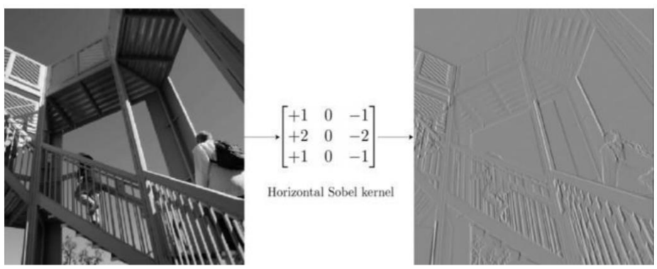

- Prewitt算子

  > Prewitt算子是一种一阶微分算子的边缘检测，利用像素点上下、左右邻点的灰度差，在边缘处达到极值检测边缘，去掉部分伪边缘，对噪声具有平滑作用。其原理是在图像空间利用两个方向模板与图像进行邻域卷积来完成的，这两个方向模板一个检测水平边缘，一个检测垂直边缘。

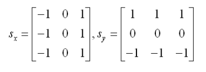

## 4. Canny边缘检测算法

### 1. 对图像进行灰度化

> 将图像处理成灰度图像。

### 2. 对图像进行高斯滤波

> 根据待滤波的像素点及其邻域点的灰度值按照一定的参数规则进行加权平均。这样可以有效滤去理想图像中叠加的高频噪声。

*高斯平滑水平和垂直方向呈现高斯分布（二维），相比于均值滤波有更好的平滑效果。*

*一维、二维高斯分布概率密度函数：*

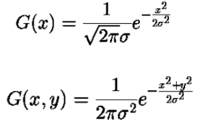

**高斯卷积核大小的选择将影响Canny检测器的性能：** *尺寸越大，检测器对噪声的敏感度越低，但是边缘检测的定位误差也将略有增加。*

*注：一般实际选择5\*5，在大部分场景下综合效果最优。*

**例**

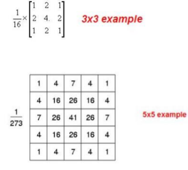

### 3. 检测图像中的水平、垂直和对角边缘（如Prewitt、Sobel算子等）

`见上节“常见的滤波算子”`

### 4. 对梯度幅度值进行非极大值抑制

**非极大值抑制（NMS）：** *搜索局部的最大值，抑制非极大值。*

**目的：** *消除冗余框*

**方法：** *对于重叠的候选框，计算他们的重叠部分，若大于规定阈值，则删除；低于阈值则保留。对于无重叠的候选框，都保留。*

- 将当前像素的梯度强度与沿正负梯度方向上的两个像素进行比较。
- 如果当前像素的梯度强度与另外两个像素相比最大，则该像素点保留为边缘点，否则该像素点将被抑制（灰度值置为0）。

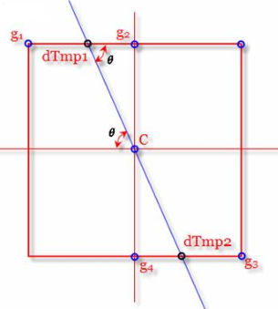

**示例：** *以目标检测为例：目标检测过程中在同一目标的位置上很有可能会产生一些重叠的候选框，此时需要找到最合适的目标边界框，非极大值抑制就是一个很好的解决方案来消除冗余边界框。*

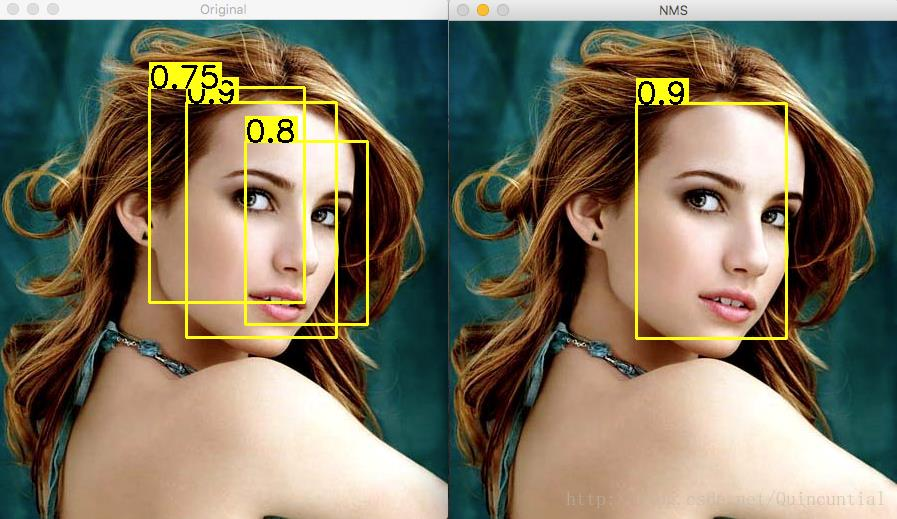

### 5.用双阈值算法检测和连接边缘  

**背景：** *非极大值抑制处理后图像的输出结果是一个非边缘点灰度值为0，可能为边缘的局部灰度极大值点为非零（通常取128）的二值图像。结果中保留了很多由于噪声或者其他原因而产生的伪边缘。基于这个问题背景，提出了双阈值检测。*

**双阈值检测：**

- 如果边缘像素的梯度值高于阈值，则将其标记为强边缘像素；
- 如果边缘像素的梯度值低于高阈值高于低阈值，则将其标记为弱边缘像素；
- 如果边缘像素的梯度值低于低阈值，则会被抑制。

*双阈值检测法中的思想：高阈值之上为强边缘，低于低阈值不是边缘，介于中间为弱边缘。*

*注：阈值的选择取决于特定图像的内容，没有放之四海而皆准的阈值。*

**抑制孤立阈值点：**

> 对于弱边缘，它既可能是真实边缘又可能是噪声或者颜色变化等保留的，所以，应该抑制后者的情况引入的弱边缘，基于下面两个理论步骤抑制不合适的弱边缘。

- 一般情况下，由真实边缘引入的弱边缘将连接到强边缘像素，而噪声响应未连接
- 为了跟踪边缘连接，通过查看弱边缘像素及其8个邻域像素，只要其中一个为强边缘像素，则该弱边缘点就可以保留为真实的边缘。

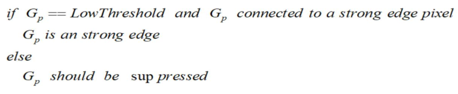

