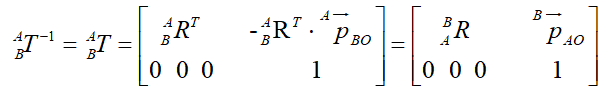
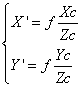
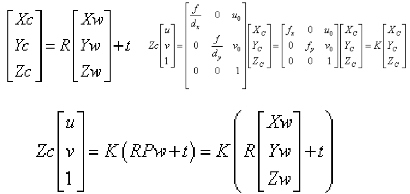
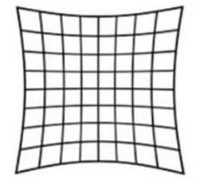

# 相机模型

## 1.相机模型原理

### 1. 相机成像

> 相机成像是一个小孔成像模型，将现实生活中的三维空间物体映射到二维的成像平面上，进而生成二维的图像。


**相机模型中的坐标系：** 

- **世界坐标系Pw(Xw, Yw, Zw)：** *对应真实客观三维世界的坐标系，也称为客观坐标系，表征物体在真实世界中的位置坐标。世界坐标系是随着物体的大小和位置变化的，单位一般是长度单位。*
- **摄像机坐标系PO(x, y, z)：** *对应以相机的光心为原点的坐标系，其以平行于图像的x和y方向为x轴y轴，z轴与光轴平行，单位也为长度单位。*
- **图像物理坐标系P'(x', y')：** *对应以主光轴和图像平面交点为坐标原点的坐标系，单位仍为长度单位。*
- **图像像素坐标系P(u, v)：** *对应以图像的顶点为坐标原点的坐标系，u和v的方向平行于x'和y'方向，* **单位是像素** 


**相机成像流程：**

```flow
st=>start: 外部实体
op1=>operation: 世界坐标系
op2=>operation: 相机坐标系
op3=>operation: 图像物理坐标系
op4=>operation: 像素坐标系
st->op1->op2->op3->op4
```

### 2. 坐标变换


**欧式变换：** *在任何的三维空间的物体，都可以以三维坐标系表示，也即在现实空间中的物体的点，在不同的坐标系下的坐标是不一样的，因为基底不同，那么一个固定的点，在一个坐标系下的坐标，如果转换到另一个坐标系下，使得另外一个坐标系能够确定这个位置，就需要用到欧式变换。* **任何一个坐标系到另一个坐标系的转换可以通过旋转和平移完成。**

 **平移变换&旋转变换&齐次坐标：** 

> **平移变换**是指转换双方坐标系经过有限次**平移**可以**重合**，情形例如高帽在人脸的正上方的情况，这样人脸的中心坐标系转换到高帽中心坐标系，仅需将坐标原点向上平移变换即可，没有坐标轴的旋转偏移，在线性代数里的平移变换是在空间坐标系中所在位置的转换，习惯用坐标系中的O的向量表示，通过向量的加常量即可实现，多次平移变换直接进行向量相加即可实现。平移变换比较简单易懂，而旋转变换较为复杂，可以通过二维坐标旋转变换推广到三维笛卡尔坐标系下，对于空间里的刚体来说，是有六个自由度的，绕xyz的转动自由度有三个，而在二维平面中，只能绕垂直平面的轴旋转，即只能有一个自由度，那么对于三维坐标系来说能够写出3×3的R矩阵，记为旋转矩阵


> 上式表示从B坐标系转换到A坐标系的旋转矩阵中的每一列子向量，等价为B坐标系的坐标轴单位向量在A坐标系中的表示。不难发现这个旋转矩阵是正交单位阵，故有以下推论：


> 上式说明，矩阵的每一行就是A坐标系的坐标轴在B坐标系中的表示。旋转变换的公式如下：


> 连续的旋转变换只要矩阵相乘即可。当旋转平移变换同时出现的时候，引入齐次坐标变换的概念；


> 由上面的结论不难推出此变换过程，这个过程如果用一个矩阵表示，会简洁很多，齐次坐标变换矩阵也应运而生，上图的变换过程等效于以下表达：


> T矩阵就是该变换中的齐次坐标变换矩阵，齐次坐标变换矩阵T是一个四阶方阵，可以同时表示旋转变换和平移变换，齐次坐标变换矩阵公式表达如下：



*将上面推导过程的角标简化，举个例子：*

> 若将向量a进行两次欧式变换，旋转和平移分别为R1，t1和R2，t2，分别得到：
>
> `b = R1*a + t1; c = R2*b + t2; c = R2*(R1*a + t1) + t2`


**世界坐标系到相机坐标系：**

*世界坐标系到相机坐标系的变换中也不例外的存在旋转矩阵R和平移矩阵t，关系表示为：*


**相机坐标系到图像物理坐标系：**

- 原理：相似三角形




- 矩阵表示为：*f为焦距*


**图像物理坐标系到图像像素坐标系：**

- 原理：坐标偏移(*dx、dy表示x和y方向上的一个像素分别占多少个长度单位，dx、dy可能为小数*)


- 齐次坐标表示：


**相机坐标系到图像像素坐标系的连续欧式变换：**


**世界坐标系到图像像素坐标系：**

- 推导过程：




- 结论：


## 2. 镜头畸变

### 1. 镜头畸变

> 由于制造精度以及组装工艺的偏差，透镜的成品往往会产生畸变，导致原始图像失真。镜头畸变分为径向畸变和切向畸变。


### 2. 径向畸变

- **原因 ：** *由于透镜的形状产生的畸变称为径向畸变，透镜径向畸变后点位的偏移示意图：*


**枕形畸变**



**桶形畸变**


### 3. 切向畸变

- **原因：** *切向畸变是由于透镜本身与相机传感器平面（成像平面）或图像平面不平行而产生的。（大多是由于透镜被粘贴到镜头模组上的安装偏差导致）*


### 4. 畸变矫正

**方法：**

- 径向畸变和切向畸变模型中一共有5个畸变参数，在Opencv中他们被排列成一个5*1的矩阵，依次包含k1、k2、p1、p2、k3（这5个参数就是相机标定中需要确定的相机的5个畸变系数），经常被定义为Mat矩阵的形式

  ```c++
  Mat distCoeffs = Mat(1.5, CV_32FC1, Scalar::all(0));
  ```

- 求得这5个参数后，就可以校正由于镜头畸变引起的图像的变形失真。


## 3. 透视变换

### 1.定义

> 透视变换又称投影映射(Projective Mapping)，是将一个图片从原有平面投影到一个新的视平面(Viewing Plane)的过程。

### 2. 目的

*现实中的物体为直线的棱等在图片中可能是斜线，通过透视变换可以把这条斜线变换成直线。*

### 3. 与仿射变换的区别

*仿射变换是透视变换的一个特例，仿射变换（Affine Transformation 或 Affine Map）是指在几何中图像从一个向量空间进行一次线性变换和一次平移，变换到另一个向量空间的过程。*


### 4. 变换过程

- **变换公式：**


​	*下式中的X,Y是原始图片坐标（上式的x,y），对应得到变换后的图片坐标（X';Y';Z'）其中Z'=1：*


*一般地，我们令a33=1，展开上面公式，得到一个点的情况：*


