# 立体视觉

## 1. 立体视觉概述

**概述：** *立体视觉是一种计算机视觉技术，其目的是从两幅或两幅以上的图像中推理出图像中的每个像素点的深度信息。*

**原理：** *在二维图像中，只有宽高两个维度的信息，而如何辨识远近的深度信息，则是仿生模拟了人眼的“视差”的原理，由于我们的左眼和右眼观察真实的物体时，成像是不同的，大脑利用了左右眼之间的图像差异，辨识了物体的远近。*

## 2. 立体视觉的实现

**传统单目系统：** *生成真实世界的映像，缺乏深度信息。*

**双目系统：** *借鉴人眼的“视差”原理，能够获得深度信息。*

- 极平面：O1 ,O2,P三个点确定的平面
- 极点：O1O2连线与像平面l1、l2的交点e1、e2；
- 基线(baseline)：O1O2
- 极线：极平面与两个像平面之间的交线l1、l2。

**推算过程：** *相似三角形 ：△Ppp'~△POROT*

> f为焦距，B为基线，XR与XT也是可以获取的值，w为双目镜头宽度，也为已知量。

**视差图像的意义：** “视差即为XR-XT，记为D”

> 视差图像就是模拟人眼，将左眼与右眼所看到的不同信息整合对应起来，以试图获取深度信息。

## 3. 三维信息点云模型

### 1. 点云概述

**概念：** *点云是在同一空间参考系下表达目标空间分布和目标表面特性的海量点集合，在获取物
体表面每个采样点的空间坐标后，得到的是点的集合，称之为“点云”（Point Cloud）。*

**内容：** *根据激光测量原理得到的点云，包括三维坐标（XYZ）和激光反射强度（Intensity），
强度信息与目标的表面材质、粗糙度、入射角方向，以及仪器的发射能量，激光波长有关。
根据摄影测量原理得到的点云，包括三维坐标（XYZ）和颜色信息（RGB）。
结合激光测量和摄影测量原理得到点云，包括三维坐标（XYZ）、激光反射强度（Intensity）和颜色
信息（RGB）。*

**与三维图像的联系：** *点云数据是一种三维模型，是三维图像信息的一种表现形式，可以用来表达三维图像；而三维图像是一种特殊的信息表达，特征是表达的空间中有三个维度的数据，三维图像是对一类信息的统称，信息还需要有具体的表现形式，其表现形式包括：深度图（以灰度表达物体与相机的距离），几何模型（由CAD软件建立），点云模型（所有逆向工程设备都将物体采样成点云）。*

### 2. 点云模型处理方法

**低层次处理方法：**

- **滤波：** *双边滤波、高斯滤波、条件滤波、直通滤波、随机采样一致性滤波。*
- **关键点：** *ISS3D、Harris3D、NARF、SIFT3D*

**中层次滤波方法：**

- **特征描述：** *法线和曲率的计算、特征值分析、SHOT、PFH、FPFH、3D Shape、Context、Spin Image*
- **分割与分类：** 

​		*分割：区域生长、Ransac线面提取、全局优化平面提取、K-Means、Normalize Cut（Context based、3D Hough Transform（线面提取）、连通分析）*

​		*分类：基于点的分类、基于分割的分类、基于深度学习的分类（PointNet、OctNet）* 

**高层次处理方法：**

- *配准：分为粗配准和精配准两个阶段*
- *SLAM图优化*
- *三维重建*
- *点云数据管理*

### 3. 三维点云降维表示Spin Image

> Spin image是基于点云空间分布的经典特征描述方法。Spin image的核心思想是将一定区域的点云分布转换成二维的spin image，然后对场景和模型的spin images进行相似性度量。

**生成Spin Image的步骤：**

- **1. 定义一个Oriented point（定向点），以Oriented point为轴生成一个圆柱坐标系**

如下图，P为三维网格某顶点p的切面，n为p点的单位法向量，x是p附近的三维网格上的另外一个顶点，α为x点在切面P上的投影与点p的距离，β为点x与切面P的垂直距离，则取点p与n的方法组合为一个定向点(Oriented point)。

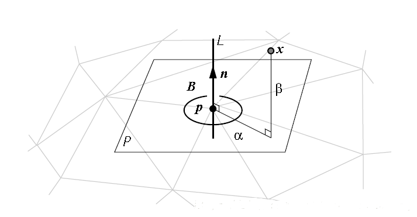

- **2. 定义Spin image的参数，Spin image是一个具有一定大小（行数列数）、分辨率（二维网格大小）的二维图像（或者说网格）。**

​	**分辨率：** *指的是二维网格也即二维图像像素的实际尺寸，使用和三维网格相近的尺寸比较合适，因此通常是取三维网格所有边的平均值来作为spin image的每个网格的尺寸，通常会把网格的长和宽定义成相等，即边长。边长的计算公式如下：*
$$
r=\frac{1}{N}\sum_{i=1}^{N}|e_i|
$$
​	**大小：** *也即spin image的行数和列数，两者一般也相等。可以参考的大小为10\*10或20\*20等。*

​	**support angle：** *即法向量夹角的大小限制。空间中顶点的法向量与创建圆柱坐标系所选点法向量之间的夹角。*

- **3. 将圆柱体内的三维坐标投影到二维Spin image，这一过程可以理解为一个Spin image绕着法向量n旋转360度，spin image扫到的三维空间的点会落到spin image的网格中。**

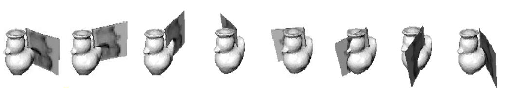

> 可以想象小鸭身上涂有颜料，spin image就像一个纸板，旋转去粘这些颜料，当然，粘到的点会有重叠

- **4. 根据spin image中的网格中落入的点不同，计算每个网格的强度I，显示spin image时以每个网格（也就是像素）的I（强度）为依据。最直接的方法时直接计算每个网格中落入的点的个数，然而为了降低对位置的敏感度、降低噪音的影响、增加稳定性，Johnson论文中用双线性插值的方法将一个点分布到了4个像素中。**

​	*当一个点落入网格(i,j)中时会被双线性插值分散到(i,j)、(i,j+1)、(i+1,j)、(i+1,j+1)四个网格中*

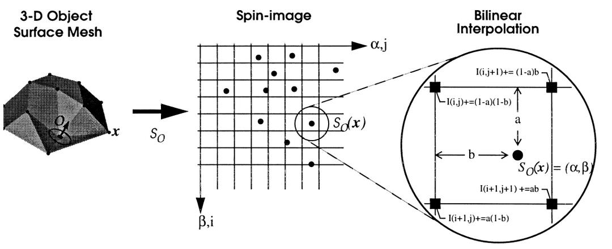

> 上式的i，j的求法，

$$
i = \lfloor\frac{\frac{W}{2} - \beta}{b}\rfloor
$$

$$
j=\lfloor\frac{\alpha}{b}\rfloor
$$

*经过以上步骤，就获得了spin image*

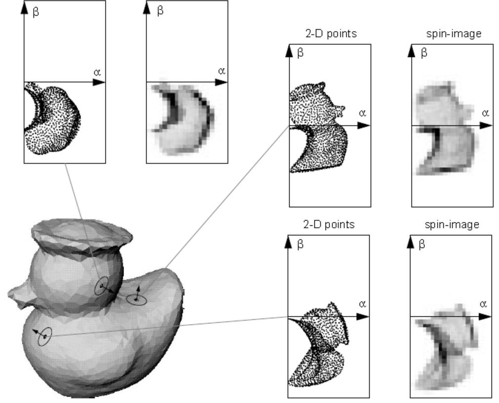

**support angle参数作用：**

*这个参数指的是空间中的顶点（小节首的x点）的法向量与创建圆柱坐标系所选点（小节首的p点）法向量之间的夹角，大于此角度的不参与spin image的生成。*

> 意义：对角度限制之后，那些相当于切面的“凹点（大于90°）”被剔除，保留了主要信息，简化了后续的计算量。一般设置为60~90°，根据需要设置，提取自己想要的主要信息，主要特征。

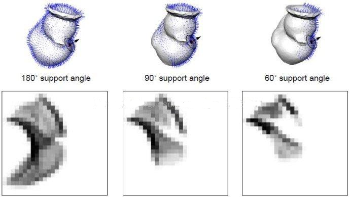

## 4. 三维重建

### 1. 概述

> 三维重建包含三个方面，基于SFM的运动恢复结构，基于Deep learning的深度估计和结构重建，以及基于RGB-D深度摄像头的三维重建。

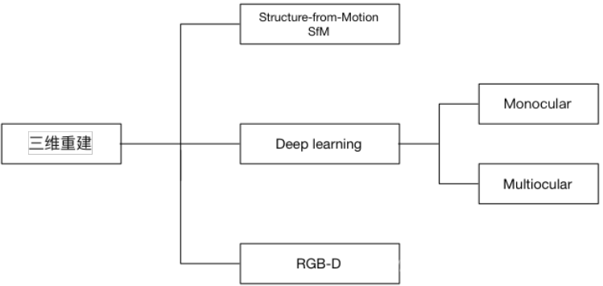

### 2.SfM

**概述：**

> SfM（Structure From Motion），**是一个估计相机参数及三维点位置的问题**。主要基于多视觉几何原理，用于从运动中实现3D重建，也就是从无时间序列的2D图像中推算三维信息，是计算机视觉学科的重要分支。广泛应用于AR/VR，自动驾驶等领域。虽然SFM主要基于多视觉几何原理，随着CNN的在二维图像的积累，很多基于CNN的2D深度估计取得一定效果，用CNN探索三维重建也是不断深入的课题。

**发展：**

> 深度学习方法呈现上升趋势，但是传统基于多视几何方法热情不减，实际应用以多视几何为主，深度学习的方法离实用还有一定的距离。从二维图像中恢复三维场景结构是计算机视觉的基本任务，广泛应用于3D导航、3D打印、虚拟游戏等

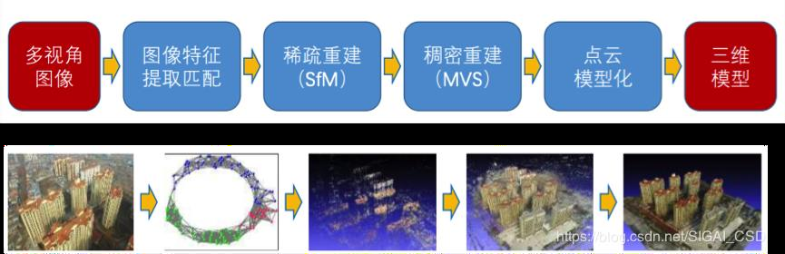

**一个基本的SfM pipeline描述：**

- 对每张2维图片检测特征点（feature point），对每对图片中的特征点进行匹配，只保留满足几何约束的匹配。
-  执行一个迭代式的、鲁棒的SfM方法来恢复摄像机的内参（intrinsic parameter）和外参(extrinsic parameter)。
- 并由三角化得到三维点坐标。

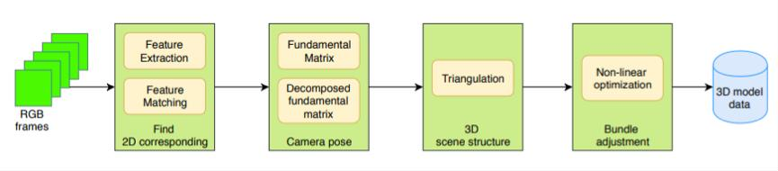

### 3. SfM方法的种类

> 根据SfM过程中图像添加顺序的拓扑结构，SfM方法可以分为:

- 增量式（incremental/sequential SfM）
- 全局式（global SfM）

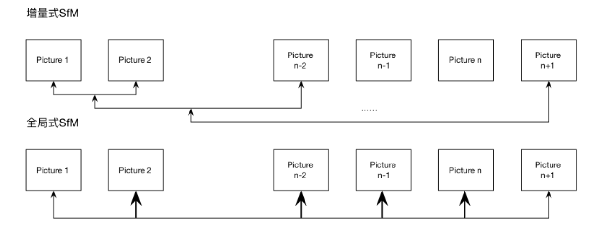

- 混合式（hybrid SfM）

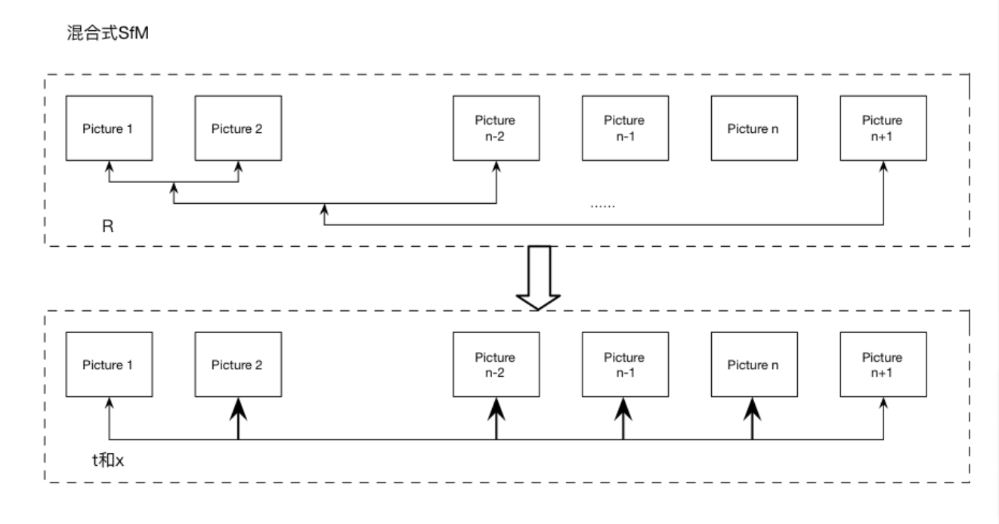

- 层次式（hierarchica SfM)

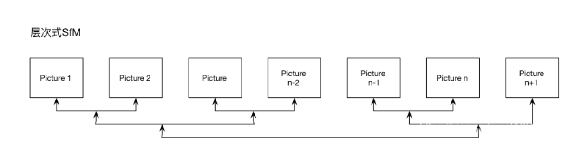

- 基于语义的SfM(Semantic SfM)
- 基于Deep learning的SfM

### 4. SfM的局限

- 尽管SfM在计算机视觉取得显著成果并应用，但是大多数SfM基于周围环境是静止这一假设，既相机是运动的，但是目标是静止的。当面对移动物体时，整体系统重建效果显著降低。
- 传统SfM基于目标为刚体的假设。

## 5. 三维计算机视觉的发展趋势

- **多视觉几何与Deep learning方法融合：** *在深度学习一统天下的计算机视觉领域，三维视觉方向主导算法仍然是传统的多视角几何方法，但是深度学习方法也是一种重要而有效的辅助。*
- **多传感器融合：** *目前基于普通摄像头的视觉传感器仍然是主导，但是工业界对算法的鲁棒性要求比较高，纯视觉方法很难保证在复杂的环境下保持鲁棒的效果。所以，用廉价的激光传感器、IMU（惯性测量单元）等与视觉传感器进行融合，是一种比较靠谱的方法。比如在移动端目前基于摄像头+IMU方法越来越多。*
- **算法与硬件的结合：** *比如深度相机厂商在尽力把一些视觉算法嵌入到相机前端，提升相机的本地处理能力。*
- **算法与具体应用的结合能够更快地推动算法进步：** *三维视觉算法目前比较好的商业应用主要集中在无人驾驶、无人搬运车（Automatic Guided Vehicle，简称AGV）、AR（教育、影音游戏）、机器人等领域。
