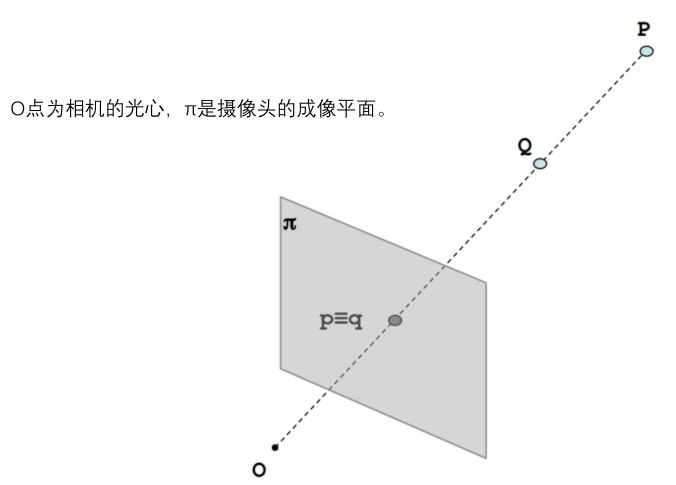
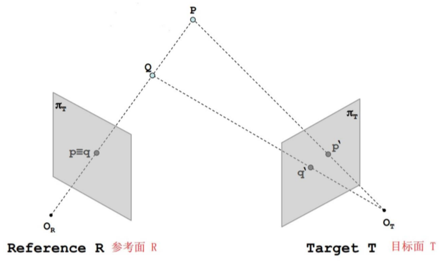
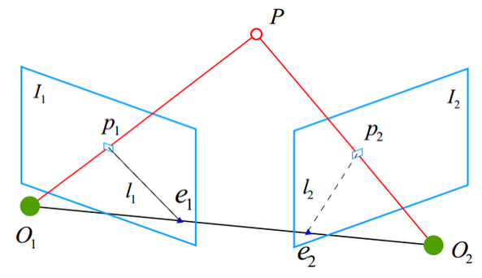
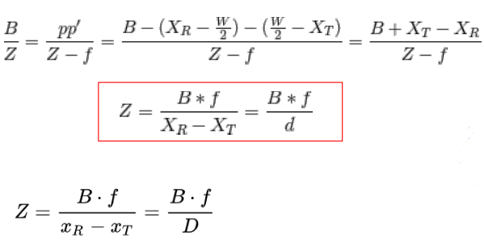
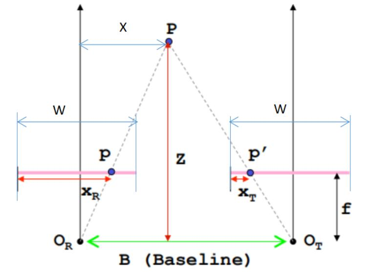
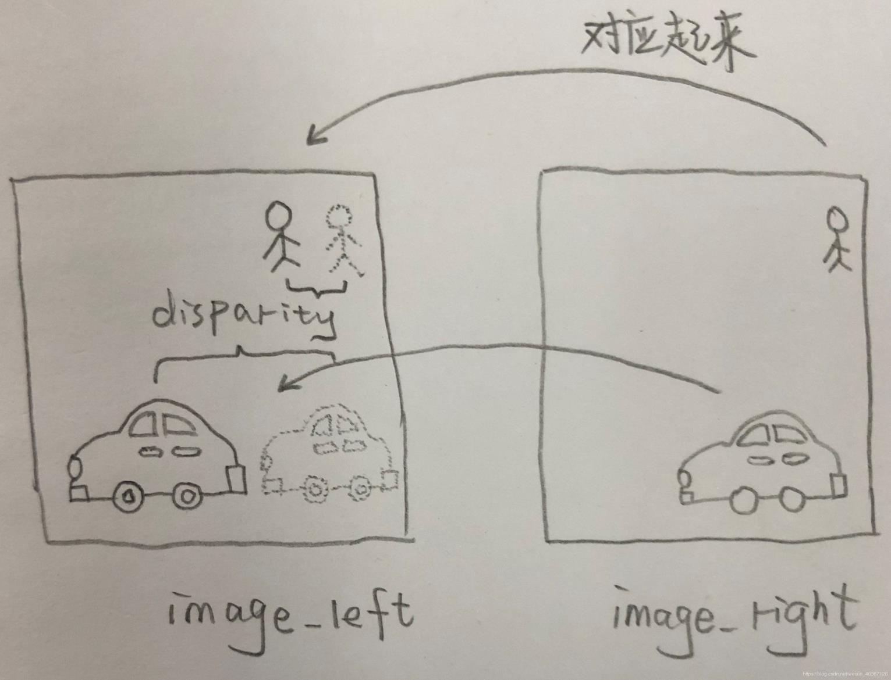
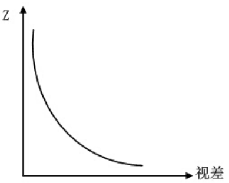

# 立体视觉

## 1. 立体视觉概述

**概述：** *立体视觉是一种计算机视觉技术，其目的是从两幅或两幅以上的图像中推理出图像中的每个像素点的深度信息。*

**原理：** *在二维图像中，只有宽高两个维度的信息，而如何辨识远近的深度信息，则是仿生模拟了人眼的“视差”的原理，由于我们的左眼和右眼观察真实的物体时，成像是不同的，大脑利用了左右眼之间的图像差异，辨识了物体的远近。*

## 2. 立体视觉的实现

**传统单目系统：** *生成真实世界的映像，缺乏深度信息。*

**双目系统：** *借鉴人眼的“视差”原理，能够获得深度信息。*

- 极平面：O1 ,O2,P三个点确定的平面
- 极点：O1O2连线与像平面l1、l2的交点e1、e2；
- 基线(baseline)：O1O2
- 极线：极平面与两个像平面之间的交线l1、l2。

**推算过程：** *相似三角形 ：△Ppp'~△POROT*

> f为焦距，B为基线，XR与XT也是可以获取的值，w为双目镜头宽度，也为已知量。

**视差图像的意义：** “视差即为XR-XT，记为D”

> 视差图像就是模拟人眼，将左眼与右眼所看到的不同信息整合对应起来，以试图获取深度信息。

## 3. 三维信息点云模型

### 1. 点云概述

**概念：** *点云是在同一空间参考系下表达目标空间分布和目标表面特性的海量点集合，在获取物
体表面每个采样点的空间坐标后，得到的是点的集合，称之为“点云”（Point Cloud）。*

**内容：** *根据激光测量原理得到的点云，包括三维坐标（XYZ）和激光反射强度（Intensity），
强度信息与目标的表面材质、粗糙度、入射角方向，以及仪器的发射能量，激光波长有关。
根据摄影测量原理得到的点云，包括三维坐标（XYZ）和颜色信息（RGB）。
结合激光测量和摄影测量原理得到点云，包括三维坐标（XYZ）、激光反射强度（Intensity）和颜色
信息（RGB）。*

**与三维图像的联系：** *点云数据是一种三维模型，是三维图像信息的一种表现形式，可以用来表达三维图像；而三维图像是一种特殊的信息表达，特征是表达的空间中有三个维度的数据，三维图像是对一类信息的统称，信息还需要有具体的表现形式，其表现形式包括：深度图（以灰度表达物体与相机的距离），几何模型（由CAD软件建立），点云模型（所有逆向工程设备都将物体采样成点云）。*

### 2. 点云模型处理方法

**低层次处理方法：**

- **滤波：** *双边滤波、高斯滤波、条件滤波、直通滤波、随机采样一致性滤波。*
- **关键点：** *ISS3D、Harris3D、NARF、SIFT3D*

**中层次滤波方法：**

- **特征描述：** *法线和曲率的计算、特征值分析、SHOT、PFH、FPFH、3D Shape、Context、Spin Image*
- **分割与分类：** 

​		*分割：区域生长、Ransac线面提取、全局优化平面提取、K-Means、Normalize Cut（Context based、3D Hough Transform（线面提取）、连通分析）*

​		*分类：基于点的分类、基于分割的分类、基于深度学习的分类（PointNet、OctNet）* 

**高层次处理方法：**

- *配准：分为粗配准和精配准两个阶段*
- *SLAM图优化*
- *三维重建*
- *点云数据管理*

### 3. Spin Image

