# 图像聚类

## 1. 概述

### 1. 分类与聚类

**分类：** *分类解决的问题是从特定的数据集中挖掘模式，并作出判断的过程。*

> 分类学习的主要过程：
>
> (1) 给定训练数据集，数据集中存在一个类似标记作用的标记号，依据标记号来判断这个数据集是对于需要起积极作用的数据集（正向数据集）还是对需要起抑制作用的数据集（负向数据集），例如需要是分类水果是否是葡萄，那么都是葡萄的数据集就是正向数据集，非葡萄的数据集就是负向数据集。
>
> (2)构建训练的模型，并使用数据集进行学习训练。
>
> (3)通过训练的模型对预测数据集进行预测，并计算其结果的性能。

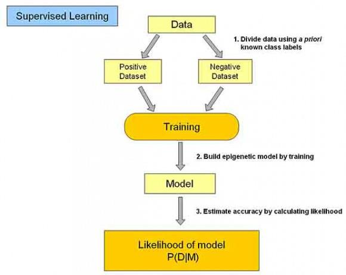

**聚类：** *一个聚类就是一些数据实例的集合，其中处于相同聚类中的数据元素彼此相似，但是处于不同聚类中的元素彼此不同，顾名思义，聚类就是将数据集中在某些方面相似的数据成员放在一起。聚类样本间的属性分为有序属性（例如浓度0.45、0.89）和无序属性（好瓜、坏瓜）两种。*

> 由于在聚类中那些表示数据类别的分类或分组信息是没有的，**即这些数据是没有标签的**，所以聚类通常被归为**无监督学习(Unsupervised Learning)。**

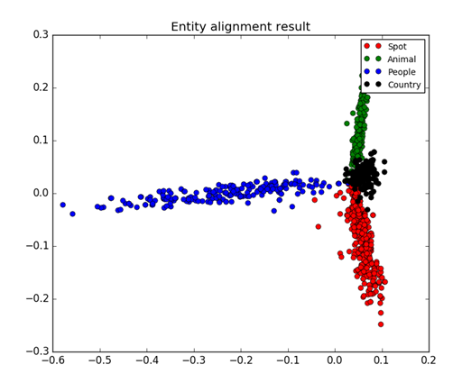

**分类与聚类任务的不同：**

- 聚类的结果是根据数据的相似性将相似的数据聚集在一个区域，而具体这一类有什么相似点，需要人为的去判断。
- 分类学习是根据已有类别的数据集进行学习构建模型，再用模型去预测新数据集的过程。
- 分类所用的数据集是有标签的，而聚类所用的数据集是无标签的，聚类只是将数据分开，具体相似点是什么需要认为判定。

**常见聚类算法：**

- 原型聚类（典型：*K均值聚类算法*）
- 层次聚类
- 密度聚类

## 2. 原型聚类算法

### 1. 概述

> 原型聚类算法即一类假设聚类结构可以通过一组原型（样本空间中具有代表性的点）刻画的算法。是一类在现实任务中极为常见的算法。

### 2.K-Means聚类

**简介：** *K-Means聚类是最常用的聚类算法，最初起源于信号处理，其目标是将数据点划分为K个类簇。该算法的最大优点是简单、便于理解，运算速度较快，**缺点是要在聚类前指定聚集的类簇数。**
*k-means算法是一种原型聚类算法。*

**K-Means聚类算法流程**

- 确定K（也即类簇的数量）值
- 从数据集中随机选择K个数据点作为质心（Centroid）或数据中心。
- 分别计算每个点到每个质心的距离，并将每个点划分到离最近质心的小组。
- 当每个质心都聚集了一些点后，重新定义算法选出新的质心。（对于每个簇，计算其均值，即得到新的K个质心点）
- 迭代执行第三步到第四步，直到迭代终止条件满足为止（聚类结果不再变化，结果收敛）

**算法举例：**

数据集：

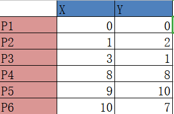

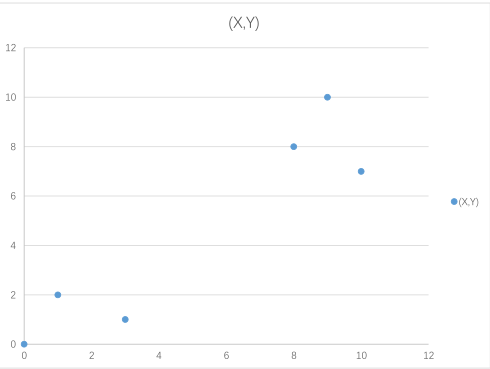

*第一轮：* 设定K为2，即我们要将数据集分为两类，随机选择两个点作为质心，这里选择P1 P2，那么计算每个点到质心的距离，例如P3到P1的距离为$\sqrt{10} = 3.16$，计算P3到P2的距离为$\sqrt{(3-1)^2+(1-2)^2}=2.24$，P3离P2更近，故而P3加入P2的簇，其他点的计算同理。

一轮计算后的结果为

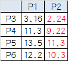

组1：P1				组2：P2、P3、P4、P5、P6

*第二轮：*由于组1只有一个点，无需处理，直接选择P1为质心，组2中将所有组2中的点的x、y坐标求均值后构造一个新的不存在的点作为新质心（本身不划分到某分组，只用作质心作用），构造Q（$\frac{1+3+8+9+10}{5}$,$\frac{2+1+8+10+7}{5}$）也即Q(6.2,5.6)和P1(0,0)作为新质心，重新计算每个点到质心的距离进行划分。

一轮计算后的结果为

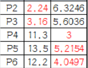

组1：P1、P2、P3		组2：P4、P5、P6

*第三轮：*仍然按照上面的方法计算，略过过程，新质心R(1.33,1)、T(9,8.33)。

三轮计算后的结果为

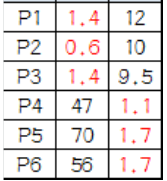

组1：P1、P2、P3		组2：P4、P5、P6

对比发现与上一轮的结果相同，说明结果收敛，结束聚类算法。

**K-Means聚类算法的优点：**

- 是解决聚类问题的一种经典算法，简单、快速
- 对处理大数据集，该算法保持高效率
- 当结果簇是密集的，它的效果较好

**K-Means聚类算法的缺点：**

- 必须事先给出k（要生成的簇的数目）
- 对躁声和孤立点数据敏感

**K-Means算法的应用举例：**

- 图像分割
- 图像聚类
- 图像识别

> 我们通过K-Means可以将这些像素点聚类成K个簇，然后使用每个簇内的质心点来替换簇内所有
> 的像素点，这样就能实现在**不改变分辨率**的情况下量化压缩图像颜色，实现图像颜色层级分割。

## 3. 层次聚类

### 1. 方法&类别

**方法：** *首先对所有的样本进行样本间的距离计算，每次将距离最近的点合并到同一个类。优点类似哈夫曼树的构造，分类结束后，计算类与类之间的距离，将距离最近的类再合并成为一个大类。循环往复直到合并成为一个大类。*

> 类与类之间的距离计算方法：最短距离法、最长距离法、中间距离法、类平均法等。

**种类：** *层次聚类算法根据层次分解的顺序分为：自下而上（bottom-up）和自上而下（top-down），也分别称为<b>凝聚的（agglomerative）层次聚类算法</b>>和<b>分裂的（divisive）层次聚类算法。</b>>*

### 2.凝聚层次聚类算法的流程

> 凝聚型层次聚类的策略是先将每个对象作为一个簇，然后合并这些原子簇为越来越大的簇，直到所有对
> 象都在一个簇中，或者某个终结条件被满足。绝大多数层次聚类属于凝聚型层次聚类，它们只是在簇间
> 相似度的定义上有所不同。

- 将每个对象看作一个类，计算对象之间的最小距离；
- 将距离最小的两个类合并一个新类；
- 重新计算新类与所有类之间的距离；
- 重复第二步到第三步，直到所有类都合并成为一个大类。

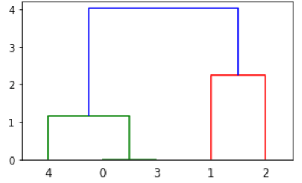

*上图中的计算过程矩阵为：*
$$
\left[
\begin{matrix}
选中合并类别A&选中合并类别B&类间最小距离&新类中元素个数\\
0&3&0&2\\
4&5&1.15470054&3\\
1&2&2.23606798&2\\
6&7&4.00832467&5
\end{matrix}
\right]
$$
*注意：0和3合并后的新类用5编号，原类中号为0~4，其他遵循此规律。*

**树状图分类判断：** *上面的聚类过程，所聚集的类别按不同的阶段有不同的组合，所以如何进行类别判断，现实任务中往往要给定将数据集分为几类。*

> 想分为两类时，就从上往下数有两根竖线时进行切割，那么所对应的竖线下面所连接的为一类

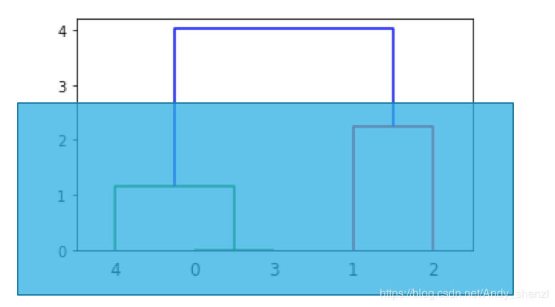

> 想分三类时，就从上往下数有三根竖线时进行切割，那么所对应的竖线下面所连接的为一类

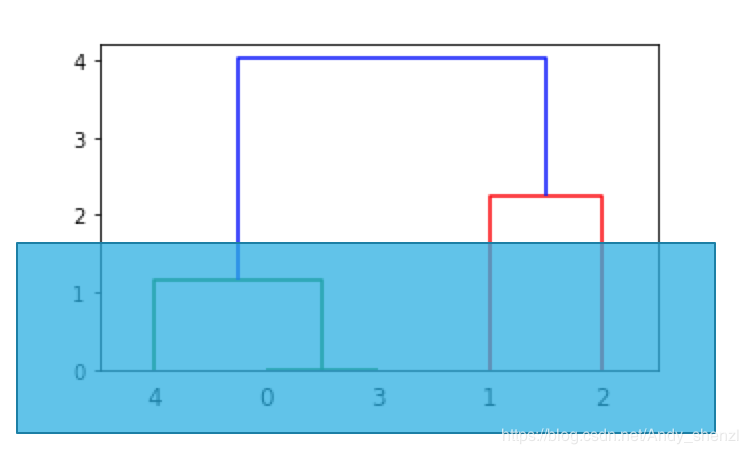

### 3. 凝聚层次聚类的特点

- 不像K-Means那样需要考虑选取初始点，也没有局部极小的问题（K-Means有可能收敛于局部极小），凝聚的层次聚类并没有类似K均值的全局目标函数。
- 合并操作不可撤销，从一而终
- **计算存储成本很高** *（\*）*

### 4. 层次聚类的优缺点

**优点：**

- 距离和规则的相似度容易定义，限制少；
- 不需要预先制定聚类数；
- 可以发现类的层次关系；
- 可以聚类成其它形状

**缺点：**

- **计算复杂度太高；**
- 奇异值也能产生很大影响；
- 算法很可能聚类成链状

## 4. 密度聚类

### 1. 算法描述

**密度聚类（DBSCAN）**

需要两个参数：ε (eps) 和形成高密度区域所需要的最少点数 (minPts)

- 它由一个任意未被访问的点开始，然后探索这个点的 ε-邻域，如果 ε-邻域里有足够的点，则建立一个新的聚类，否则这个点被标签为杂音。
- 注意，这个杂音点之后可能被发现在其它点的 ε-邻域里，而该 ε-邻域可能有足够的点，届时这个点会被加入该聚类中。

### 2. 密度聚类的优缺点

**优点：**

- 对噪声不敏感；
- 能发现任意形状的聚类

**缺点：**

-  但是聚类的结果与参数有很大的关系；
-  用固定参数识别聚类，但当聚类的稀疏程度不同时，相同的判定标准可能会破坏聚类的自然结构，即较稀的聚类会被划分为多个类或密度较大且离得较近的类会被合并成一个聚类。

## 5. 谱聚类

### 1. 算法流程描述

- 根据数据构造一个 图结构（Graph） ，Graph 的每一个节点对应一个数据点，将相
  似的点连接起来，并且边的权重用于表示数据之间的相似度。把这个 Graph 用邻接矩
  阵的形式表示出来，记为 W 。
- 把 W 的每一列元素加起来得到 N 个数，把它们放在对角线上（其他地方都是零），
  组成一个 N * N的矩阵，记为 D 。并令 L = D-W 。
- 求出 L 的前 k 个特征值，以及对应的特征向量。
- 把这 k 个特征（列）向量排列在一起组成一个 N * k 的矩阵，将其中每一行看作 k
  维空间中的一个向量，并使用 K-means 算法进行聚类。聚类的结果中每一行所属的类
  别就是原来 Graph 中的节点亦即最初的N 个数据点分别所属的类别。

**简单抽象谱聚类过程，主要有两步：**

- 构图，将采样点数据构造成一张网图。
-  切图，即将第一步构造出来的按照一定的切边准则，切分成不同的图，而不同的子图，即我们对
  应的聚类结果。

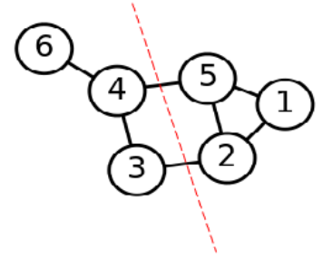
