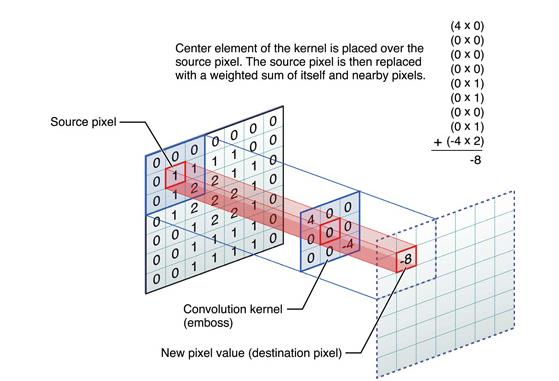
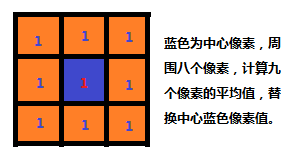
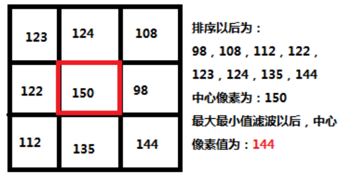
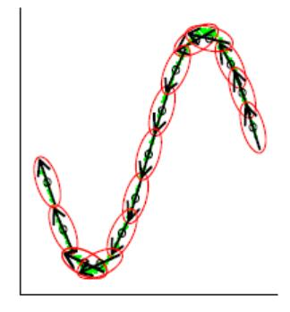
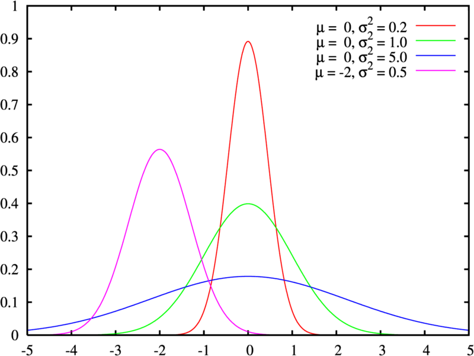
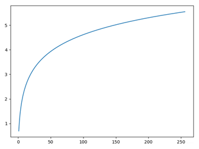
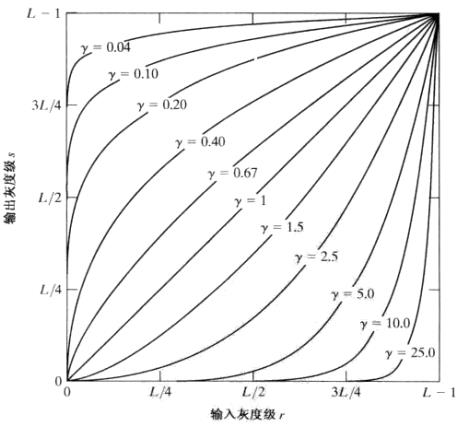

# 图像滤波器

### 1. 图像滤波

### 1. 图像滤波&滤波器

**图像滤波：** *即在尽可能保留图像细节特征的条件下对目标图像的噪声进行抑制，是图像预处理中不可不可缺少的操作，其处理效果的好坏将直接影响到后续图像处理和分析的有效性和可靠性。*

**滤波器：** *可以把滤波器想象成一个包含加权系数的透镜，当使用这个滤波器平滑处理图像时，就是把这块透镜放到图像之上，透过透镜来看我们得到的图像。*

### 2. 图像滤波的目的&要求

**滤波目的：** 

- 消除图像中混入的噪声。
- 为图像识别抽取出图像特征。

**滤波要求：**

- 不能损坏图像轮廓及边缘。
- 图像视觉效果应当更好。

### 3. 滤波种类

- **线性滤波**

​	*线性滤波是图像处理最基本的方法，直接使用滤波器对图像进行处理，根据滤波器矩阵元素的不同，能够产生很多不同的效果。*



- **均值滤波**

​	*理想的均值滤波是用每个像素和它周围像素计算出来的平均值替换图像中的每个像素。在图像处理中非常常用，用频率域的观点来看均值滤波是一种低通滤波器，高频信号在处理后会被过滤消除，由于这个特性，均值滤波经常用于消除图像尖锐噪声，实现图像平滑、模糊等功能。*
$$
g(x,y)=\frac{1}{M}\sum_{f\in{s}}f(x,y)
$$
​	**算法流程：**

```c++
1. 从左到右从上到下计算图像中的每个像素，最终得到处理后的图像。
2. 均值滤波可以加上两个参数，即迭代次数，Kernel数据大小。
3. 一个相同的Kernel，但是多次迭代就会效果越来越好。
4. 同样，迭代次数相同，Kernel矩阵越大，均值滤波的效果就越明显。
```



​	**优点：** *算法简单，计算速度快。*

​	**缺点：** *降低噪声的同时使图像产生模糊，特别是景物的边缘和细节部分。*

- **中值滤波**

​	中值滤波使用周围像素和中心像素排序之后的中值来替换中心像素，中值滤波的效果往往比均值滤波要好，特别是消除椒盐噪声。


**优点：** *抑制效果很好，画面的清析度基本保持；*

**缺点：** *对高斯噪声的抑制效果不是很好。*

- **最大最小值滤波**

​	最大最小值滤波使用周围像素排序后的最大值与最小值和中心像素进行比较来决定中心替换的像素，若中心像素比最大值大，中心像素替换为最大值；若中心像素比最小值小，则中心像素替换为最小值。是一种保守的图像处理手段。



- **引导滤波**

​	*（引）* **局部线性模型**

​		某函数上一点与其邻近部分的点成线性关系，一个复杂的函数就可以用很多局部的线性函数来表示，当需要求该函数上的某一点的值时，只需计算所有包含该点的线性函数的值并做平均即可。局部线性模型在表示非解析函数方面有很大的帮助。



​		可以将二维图像视为一个没有确切解析表达式的二维线性函数，假设函数的输出与输入在一个二维窗口内 满足线性关系：
$$
q_i=a_kI_i+b_k,对于全体i\in\omega_k
$$

​		其中，q是输出像素的值，I是输入图像的值，i和k是像素索引，a和b是当窗口中心位于k时该线性函数的系数。其实，输入图像不一定是待滤波的图像本身也可以是其他图像的引导图像，这也是为何称为引导滤波的原因。对于上式两边取梯度，可以得到：
$$
\nabla q=a\nabla I
$$
​		即当输入图像I有梯度时，输出q也有类似的梯度，这也是引导滤波有边缘保持特性的原因。

​		下一步是求出线性函数的稀疏，也就是线性回归，即希望拟合出输出值与真实值p之间的差距最小，也就是让下式最小：
$$
E(a_k,b_k)=\sum_{i\in \omega_k}((a_kI_i+b_k-p_i)^2+\epsilon a^2_k)
$$
​		这里的p只能是待滤波图像，并不能像I那样可以是其他图像，同时a之前的系数（记为e）用于防止求得的a过大，也是调节滤波器滤波效果的重要参数。通过最小二乘法，我们可以得到：
$$
a_k=\frac{\frac{1}{|\omega|}\sum_{i\in \omega_k}I_ip_I-\mu_k\overline{p}_k}{\sigma^2_k+\epsilon}\\
b_k=\overline{p}_k-a_k\mu_k
$$
​		其中，$\mu_k$是I在窗口$\omega_k$中的平均值，$\sigma^2_k$是I在窗口$\omega_k$中的方差，$|\omega|$是窗口$\omega _k$中的像素数量，$\overline{p}_k$是待滤波的图像p在窗口$\omega _k$中的均值。

​		在计算每个窗口的线性系数时，我们可以发现一个像素会被多个窗口包含，也就是说，每个像素都由多个线性函数所描述。因此，如之前所说，要具体要求某一点的输出值时，只需将所有包含该点的线性函数值平均即可：
$$
\begin{aligned}
q_i&=\frac{1}{|\omega|}\sum_{k:i\in\omega _k}a_kI_k+b_k\\&=\overline{a}_iI_i+\overline{b}_i
\end{aligned}
$$
​		这里，$\omega_k$时所有包含像素i的窗口，k是其中心位置。

​		当把引导滤波用作边缘保持滤波器时，往往有 $I=p$，如果$e=0$，显然$a=1$, $b=0$是$E(a,b)$为最小值的解，从上式可以看出，这时的滤波器没有任何作用，将输入原封不动的输出。如果e>0，在像素强度变化小的区域（或单色区域），有$a$近似于（或等于）0，而$b$近似于（或等于），即做了一个加权均值滤波；而在变化大的区域，$a$近似于1，$b$近似于0，对图像的滤波效果很弱，有助于保持边缘。而$e$的作用就是界定什么是变化大，什么是变化小。在窗口大小不变的情况下，随着$e$的增大，滤波效果越明显。

## 2. 图像噪声

### 1.概述

> 图像噪声是图像在获取或是传输过程中受到的随机信号干扰，妨碍人们对图像理解及分析处理的信号。

*图像噪声的产生来自图像获取中的环境条件和传感器件自身的质量，图像在传输过程中产生图像噪声的主要因素是所用的传输信道受到了噪声的污染。*

### 2. 高斯噪声

**定义：** *高斯噪声（Gaussian noise）是指它的概率密度服从高斯分布的一类噪声。*



**高斯白噪声：** *幅度服从高斯分布的噪声在任意两个采样样本之间不相关的噪声。*

**白噪声：** *任意两个采样样本之间不相关的噪声。*

**产生的原因：** 

- 图像传感器在拍摄时不够明亮、亮度不够均匀；
- 电路各元器件自身噪声和互相影响；
- 图像传感器长期工作，温度过高；

**添加高斯分布：**

- 输入参数sigma和mean
- 生成高斯随机数
- 根据输入像素计算出输出像素
- 重新将所有像素值放缩在[0~255]之间
- 循环所有像素
- 输出图像

> 一个正常的高斯采样分布公式，得到输出像素Pout
>
> `Pout = Pin + random.gauss`
>
> 其中random.gauss是通过sigma和mean来生成符合高斯分布的随机数。

### 3. 椒盐噪声

**定义：** *椒盐噪声又称脉冲噪声，是一种随机出现的白点或黑点。*

**椒噪声&盐噪声：** *椒噪声 （pepper noise）+ 盐噪声（salt noise）。 椒盐噪声的值为0(椒)或者255(盐)。前者是低灰度噪声，后者属于高灰度噪声。一般两种噪声同时出现，呈现在图像上就是黑白杂点。对于彩色图像，也有可能表现为在单个像素BGR三个通道随机出现的255或0。*

**产生原因：** *如果通信时出错，部分像素的值在传输时丢失，就会发生这种噪声。椒盐噪声的成因可能是影像讯号受到突如其来的强烈干扰而产生等。例如失效的感应器导致像素值为最小值，饱和的感应器导致像素值为最大值。*

**添加椒盐噪声：**

- 指定信噪比 SNR（信号和噪声所占比例） ，其取值范围在[0, 1]之间
- 计算总像素数目 SP， 得到要加噪的像素数目 NP = SP * SNR
- 随机获取要加噪的每个像素位置P（i, j）
- 指定像素值为255或者0。
- 重复3, 4两个步骤完成所有NP个像素的加噪

### 4. 其他噪声

**泊松噪声：** *符合泊松分布的噪声模型，泊松分布适合于描述单位时间内随机事件发生的次数的概率分布。如某一服务设施在一定时间内受到的服务请求的次数，电话交换机接到呼叫的次数、汽车站台的候客人数、机器出现的故障数、自然灾害发生的次数、DNA序列的变异数、放射性原子核的衰变数等等。*

*特点：*

- 时间越长，事件发生的可能越大，且不同时间内发生该事件的概率是相互独立的
- 对于非常短的一段时间来说，出现该时间两次的概率几乎为零
- 一开始的时候事件没有发生过

$$
P\{(N(t+\tau)-N(t))\}=\frac{e^{-\lambda\tau}(\lambda\tau)^k}{k!}\quad k=0,1...
$$


**乘性噪声：** *一般由信道不理想引起，它们与信号的关系是相乘，信号在它在，信号不在他也就不在。*

**瑞利噪声：** *相比高斯噪声而言，其形状向右歪斜，这对于拟合某些歪斜直方图噪声很有用。瑞利噪声的实现可以借由平均噪声来实现。*

**伽马噪声：** *其分布服从了伽马曲线的分布。伽马噪声的实现，需要使用b个服从指数分布的噪声叠加而来。指数分布的噪声，可以使用均匀分布来实现。（b=1时为指数噪声，b>1时通过若干个指数噪声叠加，得到伽马噪声）*

## 3. 图像增强

### 1. 概述

> 有目的地强调图像的整体或局部特性，将原来不清晰的图像变得清晰或强调某些感兴趣的特
> 征，扩大图像中不同物体特征之间的差别，抑制不感兴趣的特征，使之改善图像质量、丰富
> 信息量，加强图像判读和识别效果，满足某些特殊分析的需要。

图像增强可以分为两种：

- 点处理技术。只对单个像素进行处理。
- 邻域处理技术。对像素点及其周围的点进行处理，即使用卷积核。

### 2. 点处理

#### 1. 线性变换

**作用：** *图像增强线性变换主要是对图像的对比度和亮度进行调整：*
$$
y=ax+b
$$
参数$a$影响图像的对比度，参数b影响图像的亮度，具体可以分为以下几种情况：

- $a>1$：增强了图像的对比度，图像看起来更加清晰。
- $a<1$：减小了图像的对比度，图像看起来变模糊
- $a=1\&\&b\neq0$：图像整体的灰度值上移或者下移，也就是图像整体变亮或者变暗，不会改变图像的对比度，$b>0$时图像变亮，$b<0$时图像变暗。

#### 2. 分段线性变换

**作用：** *在给定区间x内，作线性变换，调整对比度系数，增大或减小区域内的对比度。*
$$
\left\{
\begin{aligned}
y&=a_1x+b\quad x<x_1\\
y&=a_2x+b\quad x_1<x<x_2\\
y&=a_1x+b\quad x_2<x
\end{aligned}
\right.
$$

#### 3. 对数变换

**作用：** *对数变换将图像的低灰度值部分扩展，将其高灰度值部分压缩，以达到强调图像低灰度部分的目的；同时可以很好的压缩像素值变化较大的图像的动态范围，目的是突出我们需要的细节。*
$$
y=c*log(1+x)
$$


#### 4. 幂律变换/伽马变换

**作用：** *幂律变换主要用于图像的校正，对漂白的图片或者是过黑的图片进行修正。*
$$
y=c*x^\gamma
$$
根据$\gamma$的大小，主要可分为以下两种情况：

- $\gamma >1$：处理漂白的图片，进行灰度级压缩
- $\gamma<1$：处理过黑的图片，对比度增强，使得细节看的更加清楚



### 3. 邻域处理

输出的像素值由包括当前像素的一个邻域中的几个像素的像素值决定。卷积后图像中(x,y)处的像素g(x,y)是原图像(x,y)处的像素f(x,y)的一个邻域$\Omega$中像素值根据某种卷积算子模板的线性组合
$$
g(x,y)=\sum_{(m,n)\in\Omega}\sum Mask(x-m,y-n)f(m,n)
$$
邻域$\Omega$中像素对输出值的贡献用二维卷积模板矩阵Mask\[][]来加权

**应用：**直方图均衡化、图像滤波

### 4. 常用方法

> 有目的地强调图像的整体或局部特性，将原来不清晰的图像变得清晰或强调某些感兴趣的特征，扩大图像中不同物体特征之间的差别，抑制不感兴趣的特征，使之改善图像质量、丰富信息量，加强图像判读和识别效果，满足某些特殊分析的需要。

- 翻转、平移、旋转、缩放

- 分离单个r、g、b三个颜色通道

- 添加噪声

- 直方图均衡化

- Gamma变换

- 反转图像的灰度

- 增加图像的对比度

- 缩放图像的灰度

- 均值滤波

- 中值滤波

- 高斯滤波